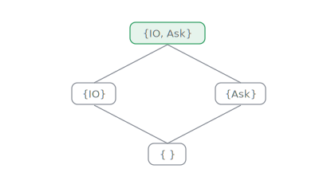
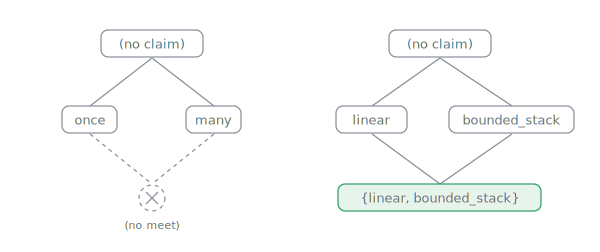
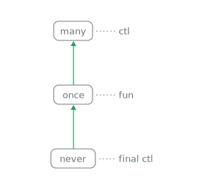
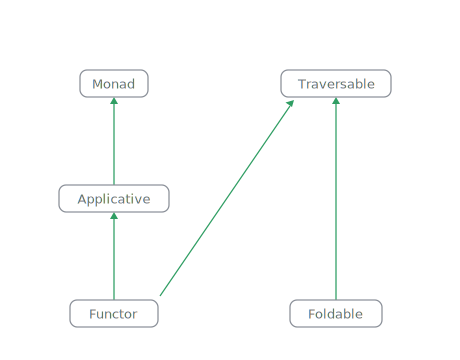
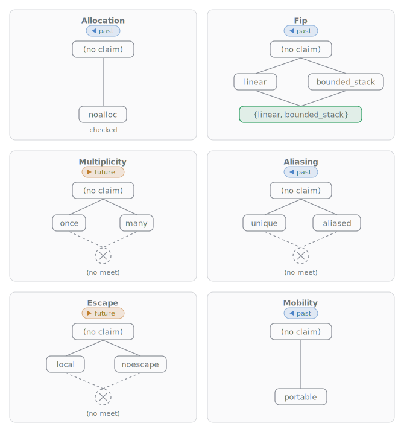

# The Prism Language Specification {#the-prism-language-specification}

Prism is a strict, impure functional language in the ML family whose type system tracks side effects. This document is a modest proposal of the surface language as the `prism` compiler accepts it: its lexical structure, grammar, type system, and evaluation.

## 0. Goals {#goal}

1. Take deterministic simulation testing down to the language level: a deterministic core, typed effects, content-addressed identity, and replayable observations make every output an accountable artifact that can be mechanically rebuilt, moved, cached, diffed, audited, and explained using modern type-system methods.
2. Lineage is the user-facing form of determinism: given an output, Prism should be able to precisely describe and check what code, packages, inputs, effects, handlers, and compiler artifacts produced it.
3. The so-called real world meets Prism only at effect boundaries: every nondeterministic observation is named, typed, handled, and therefore available to record, replay, sandbox, or audit. The unfortunate existence of the physical world should be constrained by types.
4. Obtain pure functional language purity by being completely inaccessible and having zero users, but having fun!

## 1. Introduction {#introduction}

A Prism program is a set of modules, each a file of declarations. The surface language elaborates to a strict, **call-by-push-value** core ([Levy, 2004](bibliography.md#levy-2004)) in **A-normal form** (the companion [Compiler](./compiler.md) document), compiles to native code through LLVM, and is managed by **deterministic reference counting** rather than a garbage collector.

Three things distinguish Prism from its ML and Haskell ancestors. It is **strict**, with laziness opt-in through thunks over a [call-by-push-value](./compiler.md#the-core-calculus) core, so evaluation and effect order are left to right and explicit. Side effects are inferred, extensible **effect rows** ([effects and handlers](#effects-and-handlers)) that combine structurally across calls instead of through **monads** and track both observability and **capability effects** ([capability effects and IO](#capability-effects-and-io)): an operation handled inside a function does not appear in its type, so internally effectful code is reused as pure, and a function that reads the outside world names the part it reads (`Console`, `FileSystem`, `Random`, `Env`) rather than a blanket `IO`. The same reference-count discipline both frees memory and performs **fully-in-place (FBIP) update** ([declarations and programs](#declarations-and-programs)), compiling record updates and derived setters to in-place writes on uniquely owned values (those that a reference count proves have no other live reference; see [reference counting and FBIP reuse](./compiler.md#reference-counting-and-fbip-reuse)). Beyond these, the language provides isolated **fibers** through handlers, failure as ordinary typed control flow, record and replay of a program's interaction with the world over the capability effects ([record and replay](#record-and-replay)), derived lenses and use-site **optic paths** for deeply nested structure traversal and update ([optic paths](#optic-paths)), fusing stream combinators ([streams](#streams)), **unboxed types** ([unboxed products](#unboxed-products)), and checked **usage contracts** on closures ([coeffects](#usage-and-resource-annotations)).

The deterministic core gives programs a stable identity: a definition is named by the hash of its **canonical Core form**, after alpha-normalizing binders so alpha-equivalent definitions share an identity and behavior-visible Core changes do not ([content-addressed core](./compiler.md#content-addressed-core)).[^alpha-identity] The same rule extends to execution: a suspended continuation is a **`kont` envelope** whose **bundle digest** names the code it may resume against ([the kont envelope](./compiler.md#the-kont-envelope)), and replayability supplies the byte-identical observable contract ([suspend and resume](#suspend-and-resume)).

[^alpha-identity]: Ergo the compiler is serenely uninterested in what you named your variables: two functions that reduce to the same normal form are the same function, whatever their authors privately felt while writing them. This is a liberation if you are not attached to your variable names and a quiet bereavement if you are.

The browser teleport demo deliberately stops at same-origin migration: two contexts served by the same bundle exchange a `kont` envelope over `BroadcastChannel`, and the receiver checks the bundle digest before resuming. Cross-origin or cross-stranger mobility is not part of this release. That needs a typed `Mobile` envelope, receiver capability checks, and a distribution trust model; until those exist, content addressing proves identity of the moved computation, not authority to run code from an untrusted peer.

This specification proceeds in dependency order: notation, lexical structure, grammar, types, then the constructs the grammar describes.

## 2. Notation {#notation}

Grammar is given in the following **EBNF**. A _terminal_ is a literal token written in double quotes; a _nonterminal_ is a lower-case name. The character classes are the ASCII letters (`letter`), the two cases (`lower`, `upper`), the decimal digits (`digit`), any printable character (`graphic`), and any character other than `"`, `\`, or a newline (`strchar`). These are primitives, not grammar nonterminals.

```text
{{#include ../../models/grammar.ebnf:notation}}
```

Identifiers in productions name the tokens defined in the [lexical structure](#lexical-structure) (`varid`, `conid`, `qualid`, `integer`, `float`, `char`, `string`) and the character classes defined just above. The [layout](#layout) algorithm inserts block delimiters that the grammar then treats as ordinary terminals.

## 3. Lexical Structure {#lexical-structure}

Source text is UTF-8. Tokens are lexed by longest match, then the stream is rewritten by the [layout algorithm](#layout). Whitespace and comments separate tokens and are otherwise insignificant except as layout boundaries.

```text
{{#include ../../models/grammar.ebnf:lexical}}
```

### 3.1 Identifiers {#identifiers}

Prism distinguishes identifiers by initial case. A `varid` begins with a lower-case letter or underscore and names a variable, function, parameter, or record field. A `conid` begins with an upper-case letter and names a type, data constructor, type class, or effect. A `qualid` is a dotted path such as `Data.Map` or `Map.insert`; it is lexed as a single token so that a module path never collides with field access.

### 3.2 Keywords {#keywords}

The following are reserved and may not be used as identifiers.

|            |            |            |             |              |
| ---------- | ---------- | ---------- | ----------- | ------------ |
| `fn`       | `fip`      | `fbip`     | `pub`       | `import`     |
| `as`       | `type`     | `newtype`  | `opaque`    | `alias`      |
| `effect`   | `error`    | `throw`    | `try`       | `catch`      |
| `transact` | `class`    | `instance` | `pattern`   | `deriving`   |
| `where`    | `given`    | `handle`   | `with`      | `handler`    |
| `mask`     | `val`      | `return`   | `let`       | `var`        |
| `borrow`   | `in`       | `for`      | `do`        | `if`         |
| `then`     | `else`     | `elif`     | `match`     | `of`         |
| `forall`   | `true`     | `false`    | `while`     | `loop`       |
| `break`    | `continue` | `using`    | `canonical` | `replayable` |
| `without`  | `alloc`    | `probe`    |             |              |

The grade words `never`, `once`, and `many` are contextual: they name a resumption grade only in operation-declaration or handler-clause prefix position, and stay usable as ordinary identifiers everywhere else.

The built-in type names `Int`, `I64`, `U64`, `Bool`, `Unit`, `Float`, `Char`, and `String` are also reserved. The prelude effect names `Console`, `FileSystem`, `Random`, and `Env`, the [capability effects](#capability-effects-and-io), are reserved as well.

### 3.3 Operators and Punctuation {#operators-and-punctuation}

The operator set is fixed; the language has no user-defined operators. Arithmetic and comparison use one plain spelling per operation across the numeric lanes; the older floating-point dot forms remain as deprecated aliases during the migration window. Exponentiation `^` is a single operator over both `Int` and `Float` ([exponentiation](#exponentiation)).

| Class      | Operators                                                                          |
| ---------- | ---------------------------------------------------------------------------------- |
| Arithmetic | `+` `-` `*` `/` `%` `^`                                                            |
| Comparison | `==` `/=` `<` `<=` `>` `>=` and deprecated float `==.` `/=.` `<.` `<=.` `>.` `>=.` |
| Logical    | `&&` `\|\|`                                                                        |
| Pipeline   | `\|>` `>>` `<<`                                                                    |
| Failure    | `??` `?.` `?`                                                                      |
| Arrows     | `->` `<-` `=>`                                                                     |
| Binding    | `=` `:=` `:` and compound `+=` `-=` `*=` `%=`                                      |
| Effect     | `!`                                                                                |
| Brackets   | `(` `)` `{` `}` `[` `]`                                                            |
| Other      | `,` `.` `..` `\|` `\`                                                              |

### 3.4 Literals {#literals}

An `integer` is a run of decimal digits, optionally grouped by underscore separators (`1_000_000`) that are cosmetic and carry no value. A value that fits in a machine word is an immediate; a larger literal is an arbitrary-precision integer (bignum). The suffix `i64` or `u64` selects a fixed-width 64-bit lane that wraps on overflow. A `float` is an IEEE-754 double, written with a fractional part (`1.5`), an exponent (`1e25`, `1.5e3`), or both; the exponent may be signed (`1e-25`, `1E25`) and separators are admitted in its mantissa and exponent on the same rule. Exponent notation always denotes a `Float`. A separator is valid only between two digits, so a leading, trailing, doubled, or `.`/`e`-adjacent underscore is a lexical error. A `char` is a single Unicode scalar in single quotes. A `string` is double-quoted UTF-8.

There are no negative literals at the lexical level: a leading minus is the unary-minus operator ([operator precedence](#operator-precedence)), so `-5`, `-5i64`, and `-1.5` are `-` applied to the literal. `-5u64` is rejected because negation is undefined on the unsigned lane, and the exponent sign lives inside the `float` token, so it never collides with that operator.[^i64-min-literal] The formatter preserves a writer's separator grouping verbatim.

[^i64-min-literal]: The lexical minimum of the signed fixed-width lane is written by folding the sign into the literal: `-9223372036854775808i64` is `I64` min, one past the magnitude the bare positive literal admits.

The escape sequences `\n`, `\t`, `\r`, `\\`, `\"`, `\{`, and `\}` are recognized in both character and string literals; a character literal additionally accepts `\'`.

### 3.5 String Interpolation {#string-interpolation}

Within a string, an unescaped `{ expr }` is an interpolation hole. The hole text is re-lexed at its source position and elaborated as an expression whose type-directed display is spliced into the string; a top-level string is spliced in raw, not quoted the way the `Show` method renders it. A hole runs to its matching `}`, balancing nested braces and string literals, so a hole may itself contain a string with braces. A literal brace outside a hole is written `\{` or `\}`. An empty hole, an unterminated hole, and an unterminated string are each lexical errors. The catch arms of the error example under [errors and failure](#errors-and-failure) use interpolation, as in `"no such key: {k}"`.

### 3.6 Layout {#layout}

Prism uses the **offside rule**: indentation, not explicit braces, delimits a block. A layout block opens after any of the keywords or symbols `=`, `then`, `else`, `=>`, `of`, `with`, `handler`, `do`, `where`, `try`, `catch`, `transact`, `loop`, and after `fn` (a `while` block opens at its `do`). A `class`, `instance`, or `effect` body opens the same way, but after the head rather than a keyword: the head ends the line and the members follow as its indented block. The first token after such an opener sets the block's indentation column; a later line at that column starts a new item in the block, and a line indented less closes the block. Explicit `{` `}` override layout for expression blocks and may be used in place of an implicit one, as in the brace-delimited handler arms of the [masking](#masking) example. The three declaration bodies are the exception: they are layout-only, and a brace opening one is a parse error that names the layout rewrite.

## 4. Surface Grammar {#surface-grammar}

A program is a layout-delimited sequence of top-level declarations.

```text
{{#include ../../models/grammar.ebnf:program}}
```

```text
{{#include ../../models/grammar.ebnf:decls}}
```

Type syntax. A function type carries an optional effect _row_ on its codomain ([effects and handlers](#effects-and-handlers)); the row binds to a function type only.

```text
{{#include ../../models/grammar.ebnf:types}}
```

Expressions, patterns, and the handler block of `handle`/`try` (used in [effects and handlers](#effects-and-handlers)).

```text
{{#include ../../models/grammar.ebnf:expr}}
```

```text
{{#include ../../models/grammar.ebnf:pattern}}
```

```text
{{#include ../../models/grammar.ebnf:handler}}
```

### 4.1 Operator Precedence {#operator-precedence}

The table gives the binding of each operator, loosest to tightest. Levels 1 to 9 are the `binop` operators of the grammar; level 10 is the prefix unary minus; level 11 is application, field access, and the postfix failure operators, which bind tighter than every `binop`. Unary minus is a _tight prefix_: it binds looser than application and projection but tighter than every binary operator, so `-f(x)` is `-(f(x))`, `-x * y` is `(-x) * y`, `-x ^ y` is `(-x) ^ y`, and a leading `f -x` is the binary `f - x` (there is no juxtaposition application; write `f(-x)`).

| Level | Operators                                     | Associativity |
| ----- | --------------------------------------------- | ------------- |
| 1     | `??`                                          | right         |
| 2     | `\|>`                                         | left          |
| 3     | `>>` `<<`                                     | left          |
| 4     | `\|\|`                                        | left          |
| 5     | `&&`                                          | left          |
| 6     | `==` `/=` `<` `<=` `>` `>=` (and float forms) | none          |
| 7     | `+` `-` (and float forms)                     | left          |
| 8     | `*` `/` `%`, and float `*.` `/.`              | left          |
| 9     | `^`                                           | right         |
| 10    | prefix `-` (unary minus)                      | prefix        |
| 11    | `f(...)` `a[i]` `.field` `?.field` `?`        | left          |

## 5. Types and Kinds {#types-and-kinds}

Prism infers types by the **bidirectional, higher-rank inference** algorithm of [Dunfield & Krishnaswami (2013)](bibliography.md#dunfield-krishnaswami-2013). An unannotated declaration infers its **principal type**; an annotated one is checked against the annotation. Annotations are required for **rank-N polymorphism**, since a nested `forall` cannot be inferred.

Quantification is **predicative**: a type-constructor argument and an inferred type variable range over monomorphic types, so a `forall` may not be written directly as a type argument (`List(forall a. (a) -> a)` is rejected as **impredicative**). **Higher-rank types** are allowed wherever they are not a type argument, namely as a function parameter, a function result, and a declared data field; a polymorphic value can be carried through a generic container by wrapping it in a data type with a polymorphic field.

### 5.1 Three Posets {#three-posets}

A **poset** (partially ordered set) is a set equipped with a reflexive, antisymmetric, and transitive order. A **lattice** is a poset in which every pair has both a least upper bound (a join) and a greatest lower bound (a meet). A Prism signature carries three posets: what a computation may do (the effect row, after `!`), how its values may be used (the usage row, after `@`), and how a handler may consume a continuation (the operation grade). Effect rows and operation grades are lattices: effect rows have union and intersection, while grades form a total chain. Coeffect axes are not lattices in general because some conflicting facts have no meet.

**Effect rows: joins always exist.** The carrier is a set of effect names, the order is inclusion, the join is union:

<p align="center"></p>

Sequencing takes the join; handling subtracts back toward the pure bottom:

```prism
effect Ask
  once ask(Unit) : Int

fn f() : Unit ! {IO} = println("f")

fn g() : Int ! {Ask} = ask(())

fn foo() : Int ! {IO, Ask} =
  f()
  g()

fn bar() : Int ! {IO} =
  handle foo() with
    once ask(u) => 7

fn main() = println(bar())
```

`foo` sequences `f` and `g`, so its row is their join; `bar` handles `Ask`, so its row steps back down to `{IO}`.

**Coeffect axes: meets sometimes missing.** Each axis ([coeffects](#usage-and-resource-annotations)) has silence at the top, the mode of all unannotated code. An exclusive axis has no meet below its points; the fip axis is a product of chains, so its meet exists:

<p align="center"></p>

Descending is a strengthening someone must prove; ascending, forgetting a claim, is always free; and holding two claims at once is exactly having a point below both:

```prism
fn f() : Int @ noalloc = 1  -- a proven claim: f's call tree allocates nothing

fn g() : Int = f()          -- ok: forgetting the claim moves up, always free

-- fn foo() : Int @ noalloc = g()
--   rejected, descent needs proof: in `foo`, call to `g` may
--   allocate (`g` has no zero-allocation certificate)

-- h : ((Int) -> Int) @ {linear, bounded_stack}
--   a legal row: the meet exists, the claims compose (reserved today)

-- h : ((Int) -> Int) @ {once, many}
--   never parses: usage facts `once` and `many` contradict each other (same axis)

fn main() = println(g())
```

**Operation grades: a total chain.** Continuation use is a quantity, so its lattice is a total order:

<p align="center"></p>

The whole discipline is one comparison at one boundary: a clause's grade at most its operation's declared grade ([effects and handlers](#effects-and-handlers)):

```prism
effect E
  never quit(Unit) : Int  -- never: a clause must drop the continuation
  once ask(Unit) : Int    -- once:  a clause resumes exactly once, in tail
  coin(Unit) : Bool       -- many:  a clause may capture k, resume freely (default)

fn foo() : Int ! {E} =
  let x = ask(())
  if coin(()) then x else quit(())

fn run() : Int =
  handle foo() with
    never quit(u) => 0        -- never <= never  ok
    once ask(u) => 42         -- once  <= once   ok
    coin(u) resume k => k(true)     -- once  <= many   ok: below the grade is allowed

-- ask(u) resume k => k(1) + k(2) would be rejected: the clause for `ask`
-- exceeds its declared grade `once`, resuming more than once

fn main() = println(run())
```

One signature exercises all three at once:

```text
fn spawn(f : (() -> a ! e) @ {once, portable}) : Fiber(a) ! {Async(a), e}
```

`spawn` takes a portable thunk `f` that it may call at most once, starts it as a fiber producing an `a`, and may perform both the thunk's effects `e` and the asynchronous effect `Async(a)`.

- **Row, joined**: whatever `f` performs is unioned into the caller's row alongside `Async`; the handler that later runs the fiber subtracts `Async` back out.
- **Axes, met**: `@ {once, portable}` is one point on each of two axes, their meet in the product: `spawn` promises to call the thunk at most once and may carry it to another fiber.
- **Grade, bounded**: the `Async` operations are `many`, the top of the chain, so a scheduler may hold the continuation and resume it later; `once` would have pinned every handler to immediate single resumption.

The design is the three properties side by side. Effects always have joins: doing more must always be expressible. Coeffects sometimes lack meets: some promises genuinely contradict. Continuation use is a total order: it is a quantity, not a set.

None of this should be surprising. An effect is just a coeffect on its own continuation; what's the problem?[^coeffect-k]

[^coeffect-k]: A nod to "a monad is just a monoid in the category of endofunctors, what's the problem?", and like the original it is deadpan and true. Performing an operation reifies the rest of the program as a value, the continuation `k`, and the whole zoo of control effects is a usage contract on that one value: `never` discards `k`, `once` spends it exactly once, `many` spends it freely. That is the `@` lattice landing on a continuation instead of a closure, so `!` (what a computation may do) and `@` (how a value may be used) were never two systems, just one lattice read from both ends. The continuation was the first value in the language to carry a coeffect.

### 5.2 Types {#types}

The scalar types are `Int` (arbitrary precision), `I64`, `U64`, `Float`, `Bool`, `Char`, `String`, and `Unit`. A type constructor applied to arguments is written `Con(t, ...)`; the list type has the sugar `[t]` for `List(t)`. A tuple type is `(t, ...)`. A function type is `(t, ...) -> u`, optionally carrying an effect row on `u`. A universally quantified type is `forall a. t`. Type variables are `varid`s.

### 5.3 Kinds {#kinds}

A type has **kind** `*` (a type of values) or `* -> *` (a type constructor awaiting one argument), and so on; `List` has kind `* -> *`, since `List(Int)` is a type only once `Int` is supplied. A class parameter may range over a constructor of kind `* -> *`, applied as `f(a)` in method signatures; see [type classes](#type-classes). Each constructor's parameter kinds form an arrow `k1 -> ... -> *`, and an applied head is checked argument by argument against that arrow: too many arguments, or an argument whose kind does not match the parameter's, is a kind mismatch reported at the annotation. There is no separate global kind-checking phase; the remaining well-kindedness obligations are discharged during **unification**, which requires a constructor and its arguments to agree in arity.

Besides `*` and its arrows there is one further kind, **`Row`**, inhabited by effect rows rather than types. A type parameter annotated `: Row` ranges over rows, so a data type can carry an effect row as a parameter and thereby store an effectful computation in a field: in `type Cmd(a, e : Row)` a field may name `e` as `! {e}` (or in a tail, `! {IO | e}`), the constructor quantifies `e` with a row-level `forall`, and the applied head `Cmd(a, e)` carries the row in that position. A `Row`-kinded argument is an effect row, written either as a row variable (`Cmd(a, e)`) or a `{ .. }` row literal (`Cmd(Int, {IO})`); supplying a type where a row is expected, or a row where a type is expected, is a kind mismatch reported at the annotation. An unannotated parameter still defaults to `*`, so `Row` is opt-in and existing types are unchanged. This is the type-system support for storing an effect-polymorphic reified handler, such as the concurrency scheduler of [effects and handlers](#effects-and-handlers).

The third non-`*` kind is **`Nat`**, inhabited by type-level natural numbers, the dimensions of a **shape-indexed type**. A type parameter annotated `: Nat` ranges over dimensions, so in `type Vec(a, n : Nat)` the length `n` is a compile-time index rather than a stored field; an argument in that position is either a bare natural literal (`Vec(Int, 3)`) or a `Nat`-kinded variable (`Vec(a, n)`). As with `Row`, supplying a type where a dimension is expected, or a dimension literal where a type is expected, is a kind mismatch reported at the annotation.

Dimensions unify **by equality only**: two literals unify when they are equal (`3` with `3`), a variable unifies with whatever dimension it meets, and a clash is a compile error naming both lengths (zipping a `Vec(Int, 3)` with a `Vec(Int, 4)` reports `expected length 3, but got length 4`). There is deliberately no successor structure and no arithmetic on dimensions: `n + m` and `n + 1` in a dimension position are declined at the parser with a pointed message, and this is a decision, not a gap.

The consequence is stated honestly rather than worked around: an operation whose correctness needs an arithmetic relation between dimensions cannot be given a length-precise type. A length-changing `cons` of type `(a, Vec(a, n)) -> Vec(a, n + 1)` is therefore not expressible, and a `head` over `Vec(a, n)` cannot statically exclude the empty vector (which would require `n` to be a successor `m + 1`); such a `head` accepts any length and faults, or ranges over `Fail`, on the empty case. Equality-only dimension unification is exactly the reach that shape indexing needs (fixed-length containers, matching-length zips) without importing a dependent-arithmetic decision procedure into the frozen core.

Dimensions are erased before the Core IR and never reach code generation, so a `Nat` index is a purely static fact: it constrains what type-checks but is invisible to every backend and to the determinism contract, exactly like a phantom parameter. An unannotated parameter still defaults to `*`, so `Nat` is opt-in.

### 5.4 Inference, Generalization, and Defaulting {#inference-generalization-and-defaulting}

A row is built from _labels_, the effect names of [effects and handlers](#effects-and-handlers) (a parametric effect's label carries type arguments). It is _closed_ when it ends in a fixed set of labels and _open_ when it ends in a row variable (`! {L | r}`), which stands for further labels the caller may add. An unannotated binding is generalized over its free type and row variables not fixed by the surrounding scope. A bare type variable written in a top-level function's signature is an implicit `forall`: it is universally quantified and rigid, so the body is checked to hold for every instantiation and may neither narrow it to a concrete type nor equate two distinct signature variables (a body that does is a type error), and the declaration exports exactly the polymorphic scheme it wrote. Two cases default rather than generalize, both resolved in one pass at generalization. A numeric operand of an arithmetic or comparison operator left otherwise unconstrained defaults to `Int`; because the default is deferred to that pass rather than applied at the operator, a later use that fixes the operand to a fixed-width lane (`I64`/`U64`) takes precedence, so `x + y` followed by an `i64` use of `x` is fixed-width, not `Int`. An open row left unconstrained at a monomorphic declaration (one with no remaining free row variable) defaults to empty (pure); an effect-polymorphic declaration keeps its row variable, as `traverse` does in the prelude ([the standard prelude](#the-standard-prelude)).

### 5.5 Subsumption and Row Equivalence {#subsumption-and-row-equivalence}

Checking a value against an expected type uses **subsumption**, not equality. A more polymorphic type is accepted where a less polymorphic one is expected: a `forall` on the expected side introduces a rigid variable the value must satisfy for all instances, and a `forall` on the value side is instantiated to meet the expectation. Function subtyping is **contravariant** in the arguments and **covariant** in the result, so a function accepting more and returning less may stand in for one accepting less and returning more.

Effect rows are checked by unification over scoped labels, not by covariant widening. Two rows are compared up to reordering: `! {A, B}` and `! {B, A}` are the same row, because unification hoists a demanded label to the head of the other row before matching the tails. An open row `! {A | r}` unifies with any row that provides `A` by binding `r` to the remainder; for instance `! {A | r}` unifies with `! {A, B}` by binding `r` to `{B}`. This is how a caller's row absorbs a callee's. A unification that would make a row contain itself is rejected, so recursive effect rows do not arise.

At a function arrow the value's effect row is made _equal_ to the expected one by this same unification, so a narrower row fits a wider context only by _solving_ a row variable, never by silent widening. A pure function still fits an effectful context, because its own latent row is a quantified variable ([effect polymorphism](#effect-polymorphism)) that unification solves to the demanded effects. Where a function carries an explicit return row, that annotation is the row its body is unified against: a body that performs an effect the annotation omits does not unify and is rejected with a diagnostic naming the effect the annotation must declare, and the annotation's row variables are rigid, so an annotation may not silently narrow to fewer effects than the body performs.

### 5.6 Fixed-Width Integers {#fixed-width-integers}

`Int` is arbitrary precision. `I64` and `U64` are the signed two's-complement and unsigned 64-bit lanes; they wrap on overflow rather than promoting to a bignum. Their arithmetic and comparisons are the plain operators through the [numerical tower](#numerical-tower), one spelling across every lane. The bit-level operations have no operator spelling and remain named builtins, each taking two operands of the lane type.

| Family     | Operations (and the `u64_*` counterparts) |
| ---------- | ----------------------------------------- |
| Bitwise    | `i64_and` `i64_or` `i64_xor`              |
| Shift      | `i64_shl` `i64_shr`                       |
| Comparison | `i64_cmp`                                 |

`and`, `or`, and `xor` share a single bit pattern across both lanes; `i64_shr` is an arithmetic (sign-extending) shift while `u64_shr` is logical; a shift count is taken modulo 64. `to_i64`/`to_u64` and `int_of_i64`/`int_of_u64` convert between `Int` and the fixed-width lanes.

### 5.7 Integer Arithmetic and Division {#integer-arithmetic}

The arithmetic operators `+`, `-`, `*`, `/`, and `%` spell integer arithmetic here through the [numerical tower](#numerical-tower)'s `Int`, `I64`, and `U64` instances; `^` is [exponentiation](#exponentiation). On `Int` they are arbitrary precision: a sum, product, or difference is exact and never overflows, promoting a machine-word result to a bignum on demand.[^int-never-overflow] This section states the two facts that arithmetic on `Int` cannot state by its type alone: how division rounds, and what division by zero does. Both are identical on the interpreter and native backends, a corollary of the determinism contract and pinned by the parity corpus.

[^int-never-overflow]: "Never overflows" holds in the manner of most sweeping assurances: the number grows another limb instead of wrapping, and keeps growing, right up until it meets the finite quantity of memory the machine actually has, at which point the arithmetic ends the ordinary way and takes the process with it.

Division truncates toward zero and remainder takes the sign of the dividend. That is, `/` discards the fractional part by rounding toward zero rather than toward negative infinity, and `a % b` has the sign of `a` (or is zero), so the identity `a == (a / b) * b + (a % b)` holds for every non-zero `b`.[^div-signs] This is truncated division, the semantics of C99, Rust, and the hardware division instruction both backends emit.

[^div-signs]: The four sign combinations make the rule concrete: `7 / 2` and `(0 - 7) / (0 - 2)` are `3`, while `(0 - 7) / 2` and `7 / (0 - 2)` are `-3`; `7 % 3` and `7 % (0 - 3)` are `1`, while `(0 - 7) % 3` and `(0 - 7) % (0 - 3)` are `-1`.

```prism
{{#include ../../tests/cases/run/num_int_div.pr}}
```

Floored division, where `/` rounds toward negative infinity and `%` (the Euclidean-adjacent modulus) takes the sign of the divisor, was considered and declined. Two reasons decide it. The fixed-width lanes are the constraint: `/` and `%` on `I64` and `U64` are the machine's truncating division, and an `Int` operator whose meaning diverged from the lane it shares a spelling with would split the integer family into two rounding rules a reader must track by type. And the determinism contract wants one rule across every lane and both backends rather than a surface convenience that the hardware does not compute; a caller who wants a floored or Euclidean modulus writes it once over these primitives (`((a % b) + b) % b` for a non-negative residue) rather than having the language pick a second, silently different `%`.

Division or remainder by zero is the one partial case of integer arithmetic. It is a runtime fault: the program halts immediately with exit status 1 and exactly `fatal: division by zero` on standard error, byte-identical on the interpreter and the native backend, on both `Int` and the fixed-width lanes. It is not a value, and unlike the recoverable `fail()` of [errors and failure](#errors-and-failure) it is not routed through an effect and cannot be caught; it aborts the run the way an unrecoverable `error(code)` does. Every other integer operation is total.

The fixed-width lanes wrap rather than fault or promote ([fixed-width integers](#fixed-width-integers)): `+`, `-`, and `*` on `I64` and `U64` are two's-complement modular arithmetic, so adding one to `I64_MAX` wraps to `I64_MIN` and adding one to `U64_MAX` yields `0`.[^fixed-div-edge] Unary minus follows the same wrap on the fixed-width lane, so `-x` on `I64` is the two's-complement negation and `-I64_MIN` is `I64_MIN`. `Int`, being a bignum, has no such edge: negation and division there are always exact.

[^fixed-div-edge]: Division wraps on the one signed input that would overflow it, so `I64_MIN / -1` on the `I64` lane is `I64_MIN` and `I64_MIN % -1` is `0`, consistent with the wrapping add/sub/mul rather than trapping; only a zero divisor faults.

```prism
{{#include ../../tests/cases/run/num_fixed_wrap.pr}}
```

#### 5.6.1 Safe Arithmetic Families {#safe-arithmetic}

The wrapping and faulting defaults above are the primitives; a program that wants overflow to be visible rather than silent reaches for the safe families in the `Data.Checked` library, which layer four disciplines over those primitives through one class, `Checked(a)`. The `checked_*` methods (`checked_add`, `checked_sub`, `checked_mul`, `checked_neg`, `checked_div`, `checked_mod`) return `Option(a)`, `None` exactly when the operation overflows the lane or divides by zero. The `saturating_*` methods (`add`, `sub`, `mul`) clamp to the bound the overflow crossed instead. The `wrapping_*` methods (`add`, `sub`, `mul`, `neg`) are explicit names for the two's-complement wrap the raw operators already perform ([fixed-width integers](#fixed-width-integers)), so a caller can spell the intent rather than rely on the default. And the `overflowing_*` methods (`add`, `sub`, `mul`) return the wrapped result paired with a `Bool` that is true precisely when the operation overflowed. Instances cover `I64`, `U64`, and `Int`; the checked narrowings `int_to_i64` and `int_to_u64` sit beside the class as free functions returning `Option`, the partial inverses of the total widenings `int_of_i64`/`int_of_u64`.

`Checked` sits beside the arithmetic classes rather than inheriting from them: it carries no superclass and no raw operators, so it stays meaningful for any integer lane independently of what algebraic structure that lane also has. The connection runs the other way, as a law. The `wrapping_*` methods agree exactly, value for value, with the lane's raw arithmetic, `wrapping_add`/`wrapping_sub`/`wrapping_mul` with the two's-complement `+`/`-`/`*` and `wrapping_neg` with unary negation.[^u64-wrapping-neg] Because the agreement is with the raw operators, it is stable under any later refactor that gives those operators a class of their own: the `wrapping_*` methods and the lane's ring operations remain the same function by construction.

[^u64-wrapping-neg]: `wrapping_neg` on `U64` is that same two's-complement wrap the lane's other operations use, so `wrapping_neg(0)` is `0` and `wrapping_neg(x)` is `U64_MAX - x + 1` for a nonzero `x`, rather than a fault or a rejection; the unsigned lane simply has no non-wrapping negation to prefer.

The families are not independent definitions that happen to line up; each fixed-width operation is computed once in the exact `Int` lane and then narrowed three ways, so the laws hold by construction and are pinned on both backends. For a lane bounded by `[lo, hi]`, `checked_op(x, y)` is `Some(wrapping_op(x, y))` when the exact result lies in range and `None` otherwise; `overflowing_op(x, y)` is `(wrapping_op(x, y), flag)` with `flag` true iff `checked_op(x, y)` is `None`; and `saturating_op(x, y)` is that same wrapped value when it is in range, and otherwise the crossed bound, `hi` on overflow above (`I64` max or `U64` max) and `lo` below (`I64` min or `0`).[^checked-edges] Division and remainder inside a `checked_*` follow the truncating rule of [integer arithmetic](#integer-arithmetic). The `Int` instance is the degenerate case that keeps the class total rather than vacuous: unbounded, so `wrapping_*` and `saturating_*` are the identity, `overflowing_*` always flags `false`, and only a zero divisor turns a `checked_*` into `None`.

[^checked-edges]: The overflow cases follow the primitives exactly: `checked_add(I64_MAX, 1)` is `None` while `saturating_add(I64_MAX, 1)` is `I64_MAX`; `checked_neg(I64_MIN)` and `checked_div(I64_MIN, -1)` are `None`, the two signed edges where the exact result escapes the lane; and `checked_sub` on `U64` is `None` on any unsigned underflow, with `checked_neg` there `Some(0)` only for `0`.

```prism
{{#include ../../tests/cases/run/law_checked.pr}}
```

### 5.8 Floating-Point Arithmetic {#floating-point}

`Float` is an IEEE-754 double. Its arithmetic and comparison operators are the plain `+`, `-`, `*`, `/`, `%`, `==`, `/=`, `<`, `<=`, `>`, and `>=` through the [numerical tower](#numerical-tower). There is no implicit coercion between `Int` and `Float`, so a mixed expression is a type error resolved by an explicit `to_float` ([exponentiation](#exponentiation)). Floating-point arithmetic is where a language most often becomes tier-dependent, because a fused multiply-add, an extended-precision register, or a differently rounded library call changes a low bit. Prism forbids that: every float operation follows one rounding rule and one set of special-value rules, and the interpreter and both native backends agree bit for bit, pinned by the parity corpus and, for the printer, by a dedicated formatter oracle.

The rounding contract is round to nearest, ties to even, the IEEE-754 default, applied to every arithmetic operation with no fused or wider-than-double intermediate. This is the single rule the language commits to, and it is why `0.1 + 0.2` is `0.30000000000000004` and `1.0 / 3.0` is `0.3333333333333333` identically everywhere: the result is the correctly rounded double, not an artifact of an evaluation order or a backend.

Float division never faults. Where integer `/` by zero aborts, `/.` by zero is an ordinary IEEE result: `x / 0.0` is `inf` or `-inf` according to the sign of the numerator and of the zero, and `0.0 / 0.0` is `nan`. A `nan` then propagates through every arithmetic operation it touches, so `nan + 1.0` and `nan * 0.0` are both `nan`; there is no arithmetic that turns a `nan` back into a finite number.[^nan-home] Because no float operation faults, a floating-point pipeline never introduces a failure edge into a function's effect row the way integer division by zero conceptually could.

[^nan-home]: `nan` is the one value with no route home: every operation applied in the hope of repairing it only propagates it further, and it declines to be equal even to itself, a solitude most values are spared having to contemplate.

Signed zero is observable. `0.0` and `-0.0` are distinct values that compare equal (`0.0 == -0.0` is `true`) yet are distinguished by any operation that reads the sign bit: `1.0 / 0.0` is `inf` while dividing by negative zero is `-inf`.[^signed-zero-neg] Comparisons follow IEEE unordered semantics for `nan`: `nan` is equal to nothing including itself, so `nan == nan` is `false` and `nan /= nan` is `true`, and every ordering against `nan` (`nan < x`, `nan > x`) is `false`. The program below exercises each of these on both backends.

[^signed-zero-neg]: Unary minus on a `Float` is a genuine sign flip, not a subtraction from zero, so `-(0.0)` is `-0.0` (a subtraction `0.0 - 0.0` would give `+0.0`) and `-(-0.0)` is `0.0`; the sign flip is bit-identical on the interpreter and both native backends.

```prism
{{#include ../../tests/cases/run/num_float_ieee.pr}}
```

Printing is owned by the canonical `Float` formatter and not respecified here; this section fixes only the tokens the special values render as, since a claim about `nan` or `-0.0` is a claim about output. `show` (and therefore `print` and string interpolation, [type classes](#type-classes)) renders a `nan` as `nan`, positive and negative infinity as `inf` and `-inf`, and negative zero as `-0`, distinct from `0` for positive zero; the shortest round-tripping form the formatter chooses for finite values is the formatter's contract, not this chapter's.

#### 5.7.1 Elementary Functions and Conversions {#elementary-functions}

The elementary functions are owned the same way the arithmetic is. Rather than call whatever `libm` the platform links, Prism vendors one implementation of the double-precision math library and routes every function through it on every backend: the native code calls it, and the interpreter calls the identical compiled symbols, so a transcendental is a consequence of in-repo code, not of a system library's rounding.[^fp-contract]

[^fp-contract]: The determinism flag that makes this hold at the lowest bit is floating-point contraction disabled everywhere (`-ffp-contract=off`), so no fused multiply-add fuses `a*b+c` on one platform and not another, in ordinary arithmetic or inside these functions.

The accuracy statement is deliberately modest and honest: the contract is **determinism, not correct rounding**. Each function is a deterministic faithful approximation, bit-for-bit identical on the interpreter and both native backends and across platforms, but it is not guaranteed to be the correctly rounded double of the true real result. Correctly-rounded transcendentals (the table-maker's-dilemma problem) are an explicit non-goal; what the language guarantees is that whatever value a function produces, it produces the same value everywhere, pinned by the conformance corpus over the hard cases (subnormals, the extremes, argument reduction near multiples of pi/2, signed zero, `nan`, and the infinities) and a deterministic bulk sweep.

The functions divide into two classes. The **exact** operations are correctly rounded or integer-valued by IEEE-754 and therefore identical on every conforming platform regardless of implementation: `sqrt` (correctly rounded), `abs_float`, and the roundings `floor`, `ceil`, `trunc` (toward zero), and `round` (ties away from zero, so `round(2.5)` is `3.0` and `round(-2.5)` is `-3.0`, distinct from the ties-to-even of arithmetic). The **approximate** transcendentals are the owned-library functions: `sin`, `cos`, `tan`; the inverses `asin`, `acos`, `atan`, and the two-argument `atan2(y, x)`; the hyperbolics `sinh`, `cosh`, `tanh`; the exponentials `exp`, `exp2`, `expm1`; the logarithms `ln` (natural), `log2`, `log10`, `log1p`; `pow`, `cbrt`, and `hypot`. `fmod(x, y)` is the exact IEEE remainder.[^elem-domains]

[^elem-domains]: Domains and special values follow the usual conventions and propagate IEEE special values: a `nan` argument yields `nan`; `asin` and `acos` are `nan` outside `[-1, 1]`; `sqrt` of a negative is `nan`; `ln`, `log2`, `log10` are `-inf` at `0` and `nan` below it; `atan2` and `hypot` are defined on the whole plane; and every function is total (none faults), so like the operators they add no failure edge to an effect row.

The `Int`/`Float` conversions pin their rounding once, identically on both backends. `to_float` rounds an `Int` to the nearest `Float`, ties to even. The three float-to-`Int` conversions differ only in how they round to an integer before converting: `truncate` toward zero, `floor_to_int` down, `ceil_to_int` up.[^float-to-int-cast]

[^float-to-int-cast]: All three then apply one saturating cast: a value beyond the signed 64-bit range clamps to that range's endpoint, and `nan` converts to `0`, matching the interpreter's semantics exactly (the native backend uses the saturating conversion, never the undefined-on-overflow one). A result that exceeds the tagged-immediate range becomes a bignum `Int`, so `truncate(1e300)` is the saturated `9223372036854775807` on both backends rather than a wrapped low word.

#### 5.7.2 The Numerical Tower {#numerical-tower}

The arithmetic and comparison operators are one spelling per operation across every lane, with the lane chosen by the operand's type and resolved entirely at compile time. Three classes carry them. `Num(a)` provides `+`, `-`, `*`, and unary minus; `Div(a)` provides `/` and `%`; `Ord(a)` provides `<`, `<=`, `>`, and `>=` through its `cmp` method for non-primitive ordered types. `Num` and `Div` have instances for `Int`, `I64`, `U64`, and `Float`, so `+` reads on any of them and the earlier per-lane semantics of this chapter (the exact `Int`, the wrapping fixed-width lanes, the IEEE `Float`) are the instances' behavior, unchanged. `Div` is split from `Num` so a type with addition but no sensible division stays representable without a vacuous method.

Resolution has no runtime cost.[^abstraction-free] A monomorphic operand keeps the lane's direct primitive, exactly the code the operator emitted before the tower, so the class dictionary never survives specialization and the generated core is byte-identical, pinned by the allocation gate. Only genuinely polymorphic code, a function written `given Num(a)` or `given Div(a)`, dispatches through a dictionary, and that dictionary too is erased wherever the function is specialized to a concrete lane. Unary minus follows the same rule: `-x` on a concrete lane is the sign flip or two's-complement negation of [floating-point](#floating-point) and [integer arithmetic](#integer-arithmetic), and `-x` on a `Num(a)` operand dispatches through the class with the same value. Unsigned `U64` has no surface negation (`-x` on a `U64` is a type error naming the signed lanes), but the `Num(U64)` instance's negation is the two's-complement wrap, reachable through generic `Num` code and agreeing with `wrapping_neg` ([safe arithmetic](#safe-arithmetic)).

[^abstraction-free]: This is the sort of abstraction the field likes to call free: the polymorphism is a compile-time fiction, and nothing is charged at run time for a convenience used only at type-check time. As with most things called free, the cost was entirely real and simply billed earlier, to the compiler.

Integer literals are polymorphic. A literal with no width suffix adopts whatever numeric lane its context expects: `1` is a `Float` where a `Float` is wanted (so a `Float`-typed binding or argument needs no `.0`), an `I64` in an `I64` position, and so on, with the lane's constant placed directly in the elaborated core and no runtime conversion. A decimal or exponent literal denotes a fractional lane, of which `Float` is currently the only one. The **defaulting rule** fixes the ambiguous case: an integer literal with no constraining context defaults to `Int`, and a fractional literal to `Float`. The default always fires, so a program that never mentions the numeric classes never sees a class-constraint error; `let n = 5` is an `Int` exactly as before the tower. A width-suffixed literal (`5i64`, `5u64`) is monomorphic, its suffix a type ascription rather than a hint, and a literal out of range for the lane it resolves to is a compile error at resolution time.

There is no implicit coercion, ever. The lane a value carries is fixed by its type, and only literals adapt; a variable never does. `x + 2.5` where `x : Int` is a type error naming both lanes, not a promotion of `x` to `Float`, and the same holds across any two distinct lanes (`I64` and `U64`, `Int` and `Float`). Cross-lane movement is always an explicit, named conversion (`to_float`, the checked narrowings and exact widenings of [fixed-width integers](#fixed-width-integers) and [safe arithmetic](#safe-arithmetic)). This is the line between a numeric surface that stays predictable and one whose every operator hides a possible conversion.

### 5.9 Algebraic Data Types {#algebraic-data-types}

A `type` declaration introduces an **algebraic data type**: a _sum_ of constructors, each a _product_ of fields. A constructor is named with an upper-case identifier and applied like a function to build a value; a `match` ([patterns](#patterns)) destructures a value by constructor. A type may take type parameters and may be recursive, including mutually so. A type parameter may be annotated `: Row` to range over an effect row rather than a type ([kinds](#kinds)), so a field can store an effectful computation, as in `type Cmd(a, e : Row)` whose field is a `() -> a ! {e}`, or `: Nat` to range over a compile-time dimension, as in `type Vec(a, n : Nat)` whose length index is erased rather than stored.

```prism
{{#include ../examples/adt.pr}}
```

A **`newtype`** is a data type with exactly one single-field constructor: a type distinct from its payload, with no runtime wrapper. An `alias` on a type expression is a transparent synonym, interchangeable with its definition. An `alias` whose body is a row literal is a **row alias**, the same transparency for a set of effect labels: usable wherever a row is written, expanded before checking, and composable with other aliases ([composing rows](#composing-rows)); a row alias takes no parameters.

A `deriving (C, ...)` clause generates the named instances structurally ([type classes](#type-classes)). `Eq`, `Ord`, `Show`, `Hash`, and `Lens` are derivable everywhere: derived `Ord` compares fields lexicographically in declaration order and orders constructors by declaration, and derived `Hash` folds the value through the same blake3 Merkle construction that content-addresses code ([content-addressed core](compiler.md#content-addressed-core)), so structurally equal values carry one canonical digest on every backend.

Three more classes derive against opt-in modules: `Serialize` and `Stable` (`import Wire`) for the wire codec, where `Stable` derives only when every component is itself `Stable` and a non-stable field is a compile error at the derive site, and `Arbitrary` (`import Test`) for property-test generators built from the type's structure ([stable blocks](#stable-blocks)). `deriving (Identifiable)` is shorthand for the identity starter pack, expanding to exactly `Eq`, `Ord`, `Hash`, and `Show` so an ID newtype is comparable, hashable, and printable from one keyword with no imports; a class listed alongside it is derived once, not twice, and `Arbitrary` is deliberately excluded (it lives behind `import Test` and is a testing concern), so a value that also wants a generator writes `deriving (Identifiable, Arbitrary)`.

### 5.10 Records {#record-types}

A constructor may instead take _named_ fields, `C { f : T, ... }`, making the type a record. A field is read with `e.f`; records are built and updated by the [record expressions](#record-expressions). `deriving (Lens)` synthesizes a getter `f_of` and a setter `with_f` per field.

```prism
{{#include ../examples/record.pr}}
```

### 5.11 Unboxed Products {#unboxed-products}

A product may be written **unboxed** so its fields are carried inline rather than behind a heap cell: `#(a, b)` is an unboxed tuple and `#{ x : a, y : b }` an unboxed record, whose field is read with `e.#field`. A record lowers positionally to the same product representation, so projection reuses the tuple machinery and reference counting is balanced by construction. A product built and consumed within one function scalarizes away entirely, creating no cell at all; one that escapes across a boundary the optimizer cannot see through is boxed by the native backend, value-identical to the interpreter. Whether a given product is boxed is therefore a cost fact decided by the backend, never a difference an observer can name.

```prism
{{#include ../examples/unboxed_products.pr}}
```

### 5.12 Non-Allocating Nullables {#ornull}

`OrNull(a)` is a nullable that costs no heap cell: `Null` is the empty word and `This(v)` carries a present element in the element's own representation. Because the two share one word of storage, the element type must be one whose values can never collide with the null word: a concrete, single-word, non-zero type. `Unit` (the zero word), a nested `OrNull`, an unboxed product, and an element type inference never pins are all rejected at compile time (E1019), on written annotations and on nullables inference discovers on its own alike. `Null` and `This` behave as ordinary constructors under `match`, exhaustiveness, and reference counting, so a nullable is byte-identical across backends and its representation stays a storage choice.

```prism
{{#include ../examples/ornull.pr}}
```

## 6. Type Classes {#type-classes}

A class declares a single-parameter constraint and a set of method signatures. An instance is a _named_ value providing those methods for one head type. A function states its constraints with a `given` clause after the return annotation, as `announce` below does, and receives its dictionaries as hidden arguments resolved at each call site, one per constraint. The following program declares two `Describe(Temp)` instances, designates one canonical, and selects the other explicitly with `using`.

A class, instance, or effect body is a layout block: the head ends its line and the members follow on indented lines, one per line, with no braces and no `where`. Each instance method is written in expression form, `fn m(x) = e`, and because the body is layout rather than brace-delimited it is a full layout context, so a method needing several bindings uses the same layout-sequenced statements a top-level `fn` body admits, not only `let .. in` chaining. A brace opening one of these bodies is a parse error that names the layout rewrite. A marker class with no methods, and its instance, are written as the bare head with no body.

```prism
{{#include ../examples/classes.pr}}
```

### 6.1 Coherence and Resolution {#coherence-and-resolution}

An instance is selected by the head constructor of the constraint type (the outermost constructor, for example `List` in `List(Int)`). Resolution is **coherent**: a program's meaning never silently depends on which instance the resolver happened to pick. For each `(class, type-head)` there is exactly one _canonical_ instance, and implicit resolution always selects it, so resolution is deterministic.

With a single instance for a head, that instance is canonical automatically. When two or more instances share a head, one must be designated canonical with a top-level declaration:

```text
canonical Class(Head) = instanceName
```

Two instances for one head with no designation is a coherence error reported at definition, not a silent ambiguity deferred to the use site. The designated instance is what implicit resolution selects; the others remain reachable only through an explicit override.

An explicit override is visible at the use site and changes nothing else's resolution: pass the chosen instance as a trailing `using` argument, `f(args, using instanceName)`, as `sort_by_ord(xs, using ordDesc)` does above. (This is the same `using` form reserved for first-class dictionary passing.) There is no ambient, scoped instance mechanism: an override is always written where it is used.

The preferred way to obtain a _different_ instance for a type is a `newtype` with its own canonical instance (`newtype Down = Down(Int)` for reverse order, a folded-case wrapper for case-insensitive comparison) rather than a non-canonical instance of the base type. This changes the type, not the instance-for-a-type, so coherence is preserved exactly and the difference is visible in the signature; an explicit `using` override is the second-line tool when a newtype is too heavy.

Resolution recurses through instance contexts up to a fixed depth.

A consequence worth naming: equality, ordering, and hashing are ordinary methods of coherent classes (`Eq`, `Ord`, `Hash`), never built-ins that work on any value by inspecting its representation. Prism has no polymorphic structural `==`, `compare`, or `hash`. A structural default is a known hazard: it typechecks on functions, abstract types, and cyclic values where it has no principled meaning, and it silently overrides whatever notion of equality an abstraction intended. OCaml's Base goes so far as to shadow the polymorphic versions to keep them out of reach; in Prism the hazard never arises, because the only equality in scope is the one an `Eq` instance supplies and coherence makes that instance unique.

Printing follows the same discipline. `print` and `println` display a concrete argument by its structure (a top-level string prints raw, exactly as interpolation splices it), but a polymorphic argument requires `Show`: a generic function that prints declares `given Show(a)`, the display dispatches through the instance (a generic `Bool` prints `true`, never a representation tag), and printing a rigid type variable without the constraint is a type error naming the missing `given Show(a)`. What is never consulted is the runtime representation; the tag check that guards the raw printer is defense in depth against compiler bugs, not a semantics.

### 6.2 Superclasses {#superclasses}

A class may require another as a **superclass** with `given`, the way an interface extends another. Each instance then stores a resolved superclass dictionary as the leading field of its dictionary cell, so one written constraint carries both capabilities: below, a `given Greet(a)` function calls the superclass method `name_of` with no `Nameable` constraint written, discharging it by projecting that field. The superclass witness is found automatically from the instances in scope, so the instance declaration never repeats it, and unlike inheritance nothing is overridden: the two dictionaries stay separate values.

```prism
{{#include ../examples/superclass.pr}}
```

### 6.3 Higher-Kinded Classes {#higher-kinded-classes}

A class parameter may be a **type constructor** of kind `* -> *`, applied as `f(a)` in method signatures and resolved on the head constructor of each instance. The prelude's `Functor`/`Applicative`/`Monad`/`Foldable`/`Traversable` tower is built this way. The example below builds that tower explicitly over a custom container, each level naming its predecessor as a superclass with `given`, so an instance high in the tower can exist only where the ones below it do.

<p align="center"></p>

```prism
{{#include ../examples/hkt_tower.pr}}
```

The prelude provides the same tower for `List` and `Option`. Its methods are **effect-polymorphic** (defined under [effect polymorphism](#effect-polymorphism)): a per-element effect row threads through in place of an `Applicative` wrapper, so effectful traversal needs no monad and no do-notation. Using it, one `fmap`/`ap`/`bind`/`traverse` works across either container.

```prism
{{#include ../examples/hkt.pr}}
```

So `Monad` here is just another class, structure for `List`-style nondeterminism and `Option`-style failure, with none of the language integration it carries elsewhere: no do-notation, no privileged status, no `return`, no burritos, no Kleisli categories.[^kleisli] Sequencing side effects is the effect system's job, not the monad's.

[^kleisli]: The Kleisli category of a monad `m` has types as objects and functions `(a) -> m(b)` as arrows, composed by `bind`; it is the category you are quietly working in whenever every function must wrap its result to have an effect. Prism's effectful functions `(a) -> b ! {E}` are those arrows with the wrapper moved into the row: composition is ordinary function composition, the row accumulates structurally, and a handler discharges it. You have been composing Kleisli arrows all along; the language just declines to make you say so.

The two systems meet in `Traversable`. The example below defines a recursive `Tree`, gives it the `Functor`/`Foldable`/`Traversable` instances, then runs a single generic `traverse` over it four ways. Nothing about the traversal changes between them; the behaviour is chosen entirely by the effect the per-element function performs, since `traverse`'s signature carries that row straight through. `State` numbers the leaves, `Fail` short-circuits, `Choice` (resumed multishot) enumerates every assignment, and `{State, Fail}` does the first two at once under two stacked handlers. Each is a job a monadic language hands to a different `Applicative` instance (`State`, `Maybe`, the list monad) or, for the last, a `StateT s Maybe` transformer stack; here it is one traversal and the effect rows supply the rest. This is the whole type system in one program: higher-kinded classes with a superclass chain, principal effect rows that compose, and handlers (including multishot resumption) discharging them.

```prism
{{#include ../examples/effectful_traverse.pr}}
```

Because a row is an unordered set, `{State, Fail}` fixes no layering the way a transformer stack must: whether a failure discards the numbering or keeps it is decided by which handler sits outside the other at the use site, not baked into the type. The monad-transformer ordering question, `StateT s Maybe` versus `MaybeT (State s)`, moves from the type to the handler site, free to differ from one call to the next without changing a single signature.

Classes remain single-parameter; multi-parameter classes are not supported.

## 7. Effects and Handlers {#effects-and-handlers}

An `effect` declares a set of operations; each operation has an argument list and a result type. Performing an operation is an ordinary call to its name. A function's effect _row_ is the set of effects whose operations it may perform and has not handled, written `! {L, ...}` on its result type, with an optional row variable tail `! {L | r}`. A bare `!` is an explicit empty row. A row is inferred when omitted.

An operation's declaration carries a **grade**, the **resumption multiplicity** every handler clause for it must respect, written as the contextual prefix `never`, `once`, or `many`. The grades form a three-point **lattice** ordered `never < once < many`: `never` never resumes (the continuation is dropped), `once` resumes exactly once in tail position (no capture), and `many` may capture the continuation and resume any number of times. `many` is the default and the most general grade, so an operation declared with no prefix (or the explicit `many`) admits every handler; a grade word is written only to claim something stronger. The checking rule is one line: a handler clause's own multiplicity must be at most its operation's declared grade. A clause that resumes a `never` operation, or that captures or re-enters the continuation of a `once` operation, is rejected at that clause, its caret naming the operation and its declared grade; a clause more restrictive than the grade (handling a `many` operation tail-resumptively, say) is always allowed. The grade is a static, checked fact only: it constrains which handlers typecheck and lets the compiler keep an unrelated in-place `var` loop on its fast lowering when some other component resumes multishot, but it never changes the observable behavior of an accepted program.

| Prefix  | Grade | Resumption                                                     |
| ------- | ----- | -------------------------------------------------------------- |
| `never` | `0`   | never resumes; the continuation is dropped                     |
| `once`  | `1`   | resumes exactly once, in tail position, without capturing `k`  |
| `many`  | `ω`   | may capture `k` and resume any number of times, including zero |

```prism
{{#include ../examples/eff_state.pr}}
```

A `handle e with` block discharges operations; its grammar is the `handler` nonterminal of the [surface grammar](#surface-grammar). Each operation clause names an operation and binds its arguments and the resumption `k` (the captured continuation, explained below); calling `k(v)` resumes the suspended computation with `v`, and `k` may be called zero times (abort), once (the common case), or many times (multishot). A `return r` clause transforms the final value. The handler in `eff_state.pr` interprets `get`/`put` by threading a state parameter, so `counter`, which only performs the operations, never mentions a state value.

Operations and handlers are **delimited control**: the `handle` block is the _delimiter_ (a prompt), and the resumption `k` is the **delimited continuation** it captures, the slice of computation between the perform site and the handler. Being first-class, `k` reinstalls that slice under the same handler when invoked. This is the typed, named generalization of `shift`/`reset`: a single prompt with one anonymous continuation becomes a row of named operations, each with its own clause, and the effect row is the static record of which delimiters a computation still requires.

A clause may invoke `k` any number of times; more than once makes the continuation **multishot**: each call re-runs the captured slice from the perform site with a different result, so one handler can pursue several futures of the same computation. This is how nondeterminism or search handlers explore alternatives (an `amb` operation whose clause calls `k` once per choice and combines the outcomes) and how generators yield and continue. Never invoking `k` discards the captured slice, which is exactly how `raise` ([observability](#observability)) and a `never` clause abort.

### 7.1 Observability {#observability}

The defining property of the row discipline: an operation handled inside a function is discharged, so it does not appear in that function's inferred row. In the example below, `checked` carries the row `! {Exn}`, but `attempt`, which handles `raise`, is pure.

```prism
{{#include ../examples/eff_exn.pr}}
```

The old joke about purity is that a function of type `Int -> Int` cannot launch the missiles. A single `IO` type can put it no more precisely than that: somewhere, something happens to the world. Here the international side effect is declared in the language itself, an `effect Missiles` whose row label follows `first_strike` through every signature that might perform it, and observability is what disarms it: `war_games` handles `launch` and never resumes, so its inferred type is `() -> Int`, pure. The missiles are not merely unlaunched but gone from the type. `joshua` adds multishot resumption ([effects and handlers](#effects-and-handlers)): its `choose` clause resumes the continuation once per side, so every future of the exchange is played out under the treaty handler and their scores summed. Every future is explored, none of them wins, and `joshua` is still pure. So thermonuclear war doesn't typecheck, world peace achieved.

```prism
{{#include ../examples/missiles.pr}}
```

### 7.2 Clause Sugar {#clause-sugar}

Two clause forms abbreviate common shapes. `once op(x) => e` is **tail-resumptive** sugar for `op(x) resume k => k(e)`, resuming exactly once. `val v = e` is an install-time constant: `e` runs once when the handler installs, and every use of `v` returns it.

```prism
{{#include ../examples/handlers_funval.pr}}
```

A `never op(x) => e` clause is **non-resumable**: it discards the continuation. This is the shape that `error`, `throw`, `try`, and `catch` desugar to ([errors and failure](#errors-and-failure)).

### 7.3 Masking {#masking}

`mask<E>(e)` makes every operation of effect `E` performed in `e` bypass the innermost enclosing handler of `E` and reach the next one out. Masks nest, so a double mask skips two handlers. The masked expression still demands an enclosing handler, so `E` remains in its row.

```prism
{{#include ../examples/mask.pr}}
```

### 7.4 Named Handlers {#named-handlers}

The statement form `with handler { ... }` scopes a handler over the remainder of the enclosing block, so a stack of handlers reads as a flat sequence of layers rather than a rightward drift of nested `handle` expressions ([composing rows](#composing-rows) puts this form to work). Adding a binder makes the handler first-class: `with f <- handler { ... }` installs the handler and binds it as an _instance_, and an operation addressed through it, `f.read()`, dispatches to that instance even when another handler of the same effect sits closer. A bare `read()` still reaches the innermost ordinary handler, so two instances of one effect can serve one scope, distinguished by name where the innermost-handler rule alone could not tell them apart. [Masking](#masking) skips handlers by position; a named handler addresses one directly.

```prism
{{#include ../examples/named_handlers.pr}}
```

Each instance desugars to a fresh private effect whose operations are unforgeable from source, so the rest of the pipeline sees ordinary effects and ordinary rows; resumption is unrestricted through an instance (the multishot clause above resumes the continuation of `h.ask()` twice). The escape analysis of [local mutation](#local-mutation) applies here too: a closure or returned value that would carry an instance out of its `with` block is rejected, so an instance never outlives its handler.

The resource form `with x <- f(args)` generalizes the same shape to any function that takes its continuation last: the remainder of the block becomes a function `\(x) -> rest` appended to the call's arguments, so `f` decides when, whether, and how often to run the rest. This is the bracket idiom (acquire, use, release) written without nesting.

The same scope-local **skolem** underwrites ordered containers. A `Map(k, v)` is ordered by the ambient canonical `Ord(k)`, but a program that needs two orderings of the same keys at once cannot let a map built under one be walked under the other: the tree structure encodes the ordering, so a lookup under the wrong comparator silently returns the wrong answer. The map type carries a third, **phantom parameter** for exactly this, `Map(k, v, ord)`, a **brand** naming the ordering a map was built under; it appears in no field, so an unbranded `Map(k, v)` is the same type with the brand left to inference, and pre-brand source keeps checking unchanged. The `Data.Ordered` module (`import Data.Ordered`) hands out brands the way a named handler hands out an instance. `with_ordering(cmp, body)` runs `body` with a witness carrying `cmp`, and the witness's brand is a fresh rigid skolem unique to that call, so a map built through one witness carries a brand that a second witness's brand cannot unify with. Two witnesses coexist in one scope, and handing a map built under one to the other's operation is a compile-time type error naming both brands. The brand never escapes: the body's result may not mention it, so only a summary of a branded map (a size, a looked-up value, an encoded form) leaves the block, never the branded map itself.

This is the explicit half of the coherence story, and it closes statically. The implicit half is calling the ambient `map_insert` under a non-canonical `Ord` chosen with `using`, then reading the result under the canonical one. Because those two maps have the same unbranded type, the implicit path is caught dynamically where it does the most harm: when an ordered container crosses a package boundary. A serialized map records its keys in the writer's order, and `Wire`'s map reader checks that they arrive strictly ascending under its own `Ord(k)`, faulting through [failure](#errors-and-failure) rather than rebuilding a mis-ordered tree when a map ordered by one comparator is read where a different one is canonical. Both faults, the compile-time brand mismatch and the runtime order check, are pure functions of the source and the pinned inputs, so a program's behavior never reveals which backend ran it. The division is deliberate and stated as such: the explicit witness path is static, while the implicit path is dynamically checked at the wire boundary.

### 7.5 Local Mutation {#local-mutation}

A `var` mutates, yet the function holding it stays pure. `fib_iter` below updates two locals in a loop but has type `(Int) -> Int` with an empty row, so it is accepted where only a pure function is allowed. Prism has no mutation primitive; `var` is sugar over the effect system.

A `var x := e` desugars to a private two-operation effect (a get and a set); each read of `x` becomes a perform of get, each `x := v` a perform of set. In the same pass, a handler that threads the value as a hidden parameter is wrapped around the block. That handler discharges the get and set labels ([observability](#observability)), so they never reach the function's type: the state is implemented but not observable. Because an escape analysis (below) has proved the state never leaves its block, effect lowering then erases the whole handler to a mutable cell, turning each get into a cell read and each set into a cell write, and the loop into a constant-stack loop, so the lowered code allocates nothing per iteration.

{{#tabs }}

{{#tab name="Source" }}

```prism
{{#include ../examples/var_fib.pr}}
```

{{#endtab }}

{{#tab name="Desugared" }}

```text
{{#include ../examples/var_desugared.txt}}
```

{{#endtab }}

{{#tab name="Core" }}

```text
{{#include ../examples/var_core.txt}}
```

{{#endtab }}

{{#endtabs }}

An escape analysis keeps the purity honest: the compiler rejects any closure or returned value that would carry the var out of its block, so the state cannot outlive its handler.

### 7.6 Errors and Failure {#errors-and-failure}

Prism has no built-in exception type. Errors and failure are two related mechanisms, both resting on the non-resumable `never` clause of the [clause sugar](#clause-sugar). With the imperative `break`, `continue`, and `return` of [imperative control flow](#imperative-control-flow), they are one mechanism wearing several faces: each is a single-operation effect whose handler never resumes the captured continuation, installed only where the corresponding keyword actually occurs, so non-local control costs nothing where it is not used and (being handled at its boundary) surfaces in no effect row where it is.

**Extensible errors.** An `error N(t)` declaration introduces a one-operation effect whose operation never resumes; `throw N(x)` performs it. A function's error row is exactly the set of errors it may raise and has not caught, and distinct `error` declarations union structurally as functions compose, with no umbrella sum type and no conversion glue: `find_port` carrying `{NotFound}` and `parse_port` carrying `{Malformed}` compose to `{NotFound, Malformed}`. `try e catch { ... }` is subtractive handler sugar (one nested `never` per arm): a partial catch discharges the labels it names and lets the rest flow to an enclosing handler, and an uncaught error is an unhandled-effect error naming exactly the labels that remain. Each catch arm names an error and binds its fields to variables.

```prism
{{#include ../examples/errors.pr}}
```

**Stacks of failure modes.** Because each `error` is an ordinary row label, a row alias ([composing rows](#composing-rows)) names a set of failure modes: `alias ConfigErr = {NotFound, Malformed}` states a subsystem's failure vocabulary once, and a layer above extends it structurally, `alias AppErr = {ConfigErr, NetErr}`, with no umbrella type and no wrapping. A signature `: Int ! {AppErr}` reads as "may fail in exactly these ways", and because expansion flattens before checking, `catch` subtracts labels from the expanded set like any other handler: a partial catch over an alias discharges the modes it names and leaves the rest in the row.

```prism
{{#include ../examples/failure_stack.pr}}
```

These idioms span the recovery spectrum: the built-in `Exn` effect, raised by `error(code)` and uncatchable (it aborts); `Result` with the postfix `e?` propagation of the [expression forms](#expressions); a plain `match` on `Ok`/`Err`; and a custom non-resumable effect.

```prism
{{#include ../examples/exceptions.pr}}
```

**The failure axis.** Beyond named errors, Prism has an anonymous, recoverable `fail()`, the deterministic-functional-logic failure of the Verse calculus ([Augustsson et al., 2023](bibliography.md#augustsson-verse-2023)). `guard(b)` fails when `b` is false; `a ?? b` runs `a` under a failure handler and falls back to `b`; `e?.field` chains through options, failing on `None`; `optional`/`succeeds`/`default` reify a failing computation as an `Option`, a `Bool`, or a default; and a comprehension guard may itself fail, pruning the element ([expressions](#expressions)). `transact body else fallback` snapshots every live `var`, runs the body under a failure handler, and restores the snapshots on failure, so an aborted attempt leaves observable state unchanged. The whole axis is `never` handlers over a `Fail` effect, so an unhandled `fail()` is the ordinary unhandled-effect error, and "failable only in a failure context" falls out of the row discipline for free.[^none-heir]

[^none-heir]: `None` is the well-mannered descendant of a much costlier idea: a way to denote absence that the type obliges you to handle, rather than one that lies quietly in a pointer waiting to be dereferenced at the least convenient possible moment. Estimates of what the wilder ancestor cost the industry are usually quoted with ten digits.

```prism
{{#include ../examples/transact.pr}}
```

**Partiality is in the row, not the name.** ML libraries such as OCaml's Base and Core suffix a partial function with `_exn` (`List.hd_exn`) so a reader knows it may raise, a naming convention standing in for what the type itself cannot say. Prism needs no such convention: a function that may fail carries that in its effect row, whether as the anonymous `Fail` above or a named `error`, so the possibility of failure is written into the signature and the row discipline forces it to be handled before the result is used. The `_exn` suffix is the workaround for a type system that cannot express failure; the row is the version the compiler checks.

### 7.7 Composing Rows {#composing-rows}

A row alias composes rows the way `+` composes sums. With `AB = {A, B}` and `CD = {C, D}`, the row `{AB, CD, E}` assembles five effects from two named pairs and a fifth label: `(A + B) + (C + D) + E`. Because a row is an unordered set ([subsumption and row equivalence](#subsumption-and-row-equivalence)) and an alias expands transparently before checking, the sum flattens: any grouping and any order of the same five labels is the _same row_, so `omega` and `flat` below are interchangeable, and a grouping is chosen for the reader, not for the checker. An alias may reference other aliases (a cycle is an error at the declarations involved), and takes no parameters.

```prism
{{#include ../examples/row_compose.pr}}
```

This is the row discipline's answer to the monad-transformer stack. A transformer application fixes one composite type, `ReaderT Config (WriterT Log (Except E))`, and pays for it twice: every layer's operations are lifted through the layers above (or a class such as `MonadWriter` is threaded through, at a quadratic cost in instances), and the order of wrapping is welded into every signature even where no code depends on it. An alias instead makes the application row a name for a set, `Ctx = {Ask, Tell}` and `App = {Ctx, Invalid}` below. An operation reaches its handler by label, never by position, so there is no `lift`; a function that uses only `Tell` states `!{Tell}` and slots unchanged into `App` or any other row containing it; and two subsystems' aliases union structurally, with no adapter between their stack and ours.

What a transformer stack fixes in the type, the handler site decides per call (the layering point already made for `{State, Fail}` under [higher-kinded classes](#higher-kinded-classes)). Discharged one label at a time with the scoped `with handler` layers of [named handlers](#named-handlers), the run function reads like the transformer stack it replaces, except that the order is chosen where the handlers install, free to differ between call sites without a signature changing. The application monad becomes the application row: a name for what may happen, not a recipe for how it is wrapped.

```prism
{{#include ../examples/app_stack.pr}}
```

### 7.8 Effect Polymorphism {#effect-polymorphism}

A function can be generic over the effects of a thunk it is given by quantifying over a row variable in the argument's type. Below, `twice` accepts any `(Unit) -> Int` thunk and adds an open row `{| e}` for whatever that thunk performs; each call unifies `e` with the actual row (empty, `{Tick}`, or `{Say}`), and a handler discharges only the label it names, leaving the rest in `e`. This is the mechanism the prelude's `fmap` and `traverse` use to thread a per-element effect ([higher-kinded classes](#higher-kinded-classes)), so an effectful traversal needs no `Applicative` wrapper.

The same row variable also governs an effect operation whose argument is a computation. An operation such as concurrency's `fork(() -> a ! {Async(a) | e})` shares the **ambient row** for `e`: performing it ties the argument's row to the caller's own, so a forked or deferred computation may perform only effects the caller already admits, and those effects flow out to whoever handles the operation rather than escaping it (the discipline of Koka, Frank, and Links; [Leijen, 2017](bibliography.md#leijen-2017)). Combined with a `Row`-kinded parameter ([kinds](#kinds)) that stores the reified continuations, this is what makes a handler like `run_async` both effect-polymorphic and sound: it is written once for any row `e` the fibers perform, and a fiber cannot smuggle past it an effect that no outer handler was required to discharge.

The quantifier's scope is enforced in the other direction too. A row bound by an inner `forall` is rigid and dies with its binder, so a row introduced outside that `forall` may never be solved to it: a closure whose body's effects could only be satisfied by pinning an enclosing row onto the bound variable is rejected with an error naming the capture, the row analogue of a skolem-escape error, rather than accepted with a solution that outlives its scope.

```prism
{{#include ../examples/eff_poly.pr}}
```

### 7.9 Coeffects {#usage-and-resource-annotations}

Prism has two static axes that deliberately do not collapse into one row. The effect row records what a computation may _do_ to the world: perform `Console`, `FileSystem`, `Async`, `Clock`, `Fail`, a user effect, and so on. Usage and resource annotations record how a value, call tree, or continuation may be _used_. They are **coeffects**, the dual of effects: an effect flows outward from the computation and is discharged by a handler around it, while a coeffect flows inward from the context and is discharged by the boundary that consumes the value, so one tracks what the program does to its world and the other what the world may do with the program's values. The user model is one sentence: `!` says what happens; `@` says how a value may be used.

Think of a bottle of prescription medicine. The effect row is the side-effects leaflet: take this and it may cause drowsiness, print to the console, or talk to the filesystem; whoever administers it (the handler) decides what to do about that. The usage row is the dosage instructions on the label: take at most once (`@ once`), do not share (`@ noescape`), keep refrigerated (`@ local`), safe to travel with (`@ portable`). The leaflet describes what the pill does to you; the label restricts what you may do with the pill. A pharmacist who ignores the leaflet has a surprised patient; one who ignores the label has a lawsuit.

**Usage rows.** A usage row attaches usage facts to a type with a postfix `@`, mirroring how `!` attaches an effect row to a function type:

```text
buf : Buffer @ unique
fn spawn(f : (() -> a ! e) @ {once, portable}) : Fiber(a) ! {Async(a), e}
```

The row attaches to an atomic type: a constructor, an application, a tuple, or a parenthesized type. A function type must be parenthesized to take a row; writing one after an effect row is refused with the fix spelled out (`parenthesize the function type before '@'`) rather than silently picking a precedence. A single fact may drop the braces (`T @ unique`); the formatter canonicalizes a one-fact row to that form. A row is a set: duplicate facts and two facts from one exclusive axis (`@ {once, many}`) are errors, the empty row is an error, and the canonical order is alphabetical, so a row's spelling, its formatted output, and its contribution to a definition's content hash never depend on the order the author wrote. The open-tailed form `@ {fact | u}` is recognized and refused by name: it is the future spelling of usage-row polymorphism.

The reserved vocabulary is fixed, and an unknown word in usage position is a hard error, never a warning, so no program or package can establish a private meaning for a fact before its checker exists. The facts are not a flat list: each belongs to one semantic axis, and the axis determines how its facts combine in a row and which side of an API seam owes the proof:

| Axis         | Facts                     | In one row | Polarity |
| ------------ | ------------------------- | ---------- | -------- |
| Allocation   | `noalloc`                 | single     | past     |
| Fip          | `linear`, `bounded_stack` | compose    | past     |
| Multiplicity | `once`, `many`            | exclusive  | future   |
| Aliasing     | `unique`, `aliased`       | exclusive  | past     |
| Escape       | `local`, `noescape`       | exclusive  | future   |
| Mobility     | `portable`                | single     | past     |

<p align="center"></p>

An exclusive axis is a choice of one point, which is why `@ {once, many}` is rejected as a contradiction at parse. Only the fip axis composes, because its facts are cumulative strengthenings of one certificate rather than alternatives. **Polarity** is the axis's variance discipline, the direction its proof obligation flows. A **past** fact is covariant: it records how a value was built, the producer proves it, and the fact travels with the value wherever it goes. A **future** fact is contravariant: it restricts what may still be done with the value, the consumer promises it, and the fact binds at the use site. The polarity is stated by proof obligation, deciding which side of an API seam owes the evidence when a fact's checker lands, not by an algebraic comonadic/monadic decomposition.

The multiplicity axis already has a checked instance elsewhere in the language, applied to a continuation rather than a value: an operation's **grade** ([effects and handlers](#effects-and-handlers)) is `never`, `once`, or `many`, the same words on the same lattice, restricting how a handler clause may resume the captured continuation `k`. The grade on an operation and the multiplicity fact on a closure are the same point on the same axis, read at two boundaries: the operation form is checked on a continuation and pins `once` to exactly one resumption in tail position, while the value form is affine, at most one use of the annotated closure. It adds one point the value facts omit, `never` (the continuation is dropped), because a value used zero times is not a tracked usage fact but a clause that never resumes is a real, useful grade. That shared vocabulary is not a coincidence of spelling: the continuation an operation hands its handler is the first value in the language to carry a coeffect, which is what makes "an effect is just a coeffect on its own continuation" ([three posets](#three-posets)) a literal statement rather than a slogan.

The facts themselves:

| Fact            | Axis         | Meaning                                                                      | Status      |
| --------------- | ------------ | ---------------------------------------------------------------------------- | ----------- |
| `noalloc`       | Allocation   | the result is computed without allocating a fresh heap cell, whole call tree | **checked** |
| `linear`        | Fip          | no duplication of owned heap inputs (the `fip` family)                       | reserved    |
| `bounded_stack` | Fip          | bounded stack usage (the strict `fip` promise)                               | reserved    |
| `once`          | Multiplicity | consumed or called at most once                                              | **checked** |
| `many`          | Multiplicity | may be consumed or called many times                                         | reserved    |
| `unique`        | Aliasing     | statically unaliased ownership                                               | reserved    |
| `aliased`       | Aliasing     | explicitly shared, non-unique                                                | reserved    |
| `local`         | Escape       | tied to the current dynamic scope or region                                  | reserved    |
| `noescape`      | Escape       | cannot be stored, returned, or captured past the boundary                    | **checked** |
| `portable`      | Mobility     | may cross a mobility/replay/receiver boundary                                | **checked** |

Checked today: `noalloc`, `once`, `portable`, and `noescape`. Other reserved facts are rejected until they have a checker.

**Boundary facts, not ambient modes.** This design space ranges from ambient classifications carried by every value to explicit claims checked only where needed. Prism chooses the latter: `@ once` constrains one consumer, `@ portable` one crossing, and `@ noalloc` one call tree; unannotated values carry no mode vector.

Operation grades are the established instance of this design. `never < once < many` constrains one handler boundary, survives desugaring as typed data, and is consumed directly by lowering.

The wider family reads as one story. `borrow` lets a function read an argument without taking ownership. `fip` certifies allocation-freedom, linear consumption of owned heap values, and bounded stack for the recursive group. `fbip` keeps the allocation-free call-tree certificate without the full linear and bounded-stack promise. `@ noalloc` is the allocation certificate alone. Operation grades classify continuation use in handlers. Arena handlers live on the dynamic side of the same resource story: an arena handler decides who services allocation, not whether a static allocation certificate permits allocation.

This split matters. A function may be `@ noalloc` and still perform `IO`; the row says the output effect is observable, while the allocation certificate says the call tree does not allocate fresh cells. Conversely, an arena facility may reify allocation as an effect only inside an explicit handler scope, while `@ noalloc` remains an allocation certificate rather than a row label.

**Three verbs, one vocabulary.** Allocation is addressed three ways that share one resource story rather than competing. It can be _forbidden_: `@ noalloc` ([allocation certificates](#allocation-certificates)) proves a call tree allocates no fresh cell. It can be _redirected_: an arena handler routes the allocations a computation does make to a caller-chosen region, deciding who services them rather than whether they may happen (forthcoming, on the dynamic side named above). And it can be _avoided_: an [unboxed representation](#unboxed-products) stores a value inline, so no heap cell is created to begin with. The certificate reasons about whether allocation happens, the arena about where it goes, and the representation about whether a cell is needed at all; a single program may lean on all three at once without leaving this vocabulary.

**Checked closure contracts.** Three usage facts are checked contracts on closures, not merely reserved words. `@ once` on a function-typed parameter admits a value used at most once: a `@ many` value fits a `@ once` slot but never the reverse, and using the parameter twice, aliasing it through a `let`, or capturing it under a lambda counts as further use and is rejected (E6059). `@ portable` admits a closure that captures only what travels to a fresh runtime: a content-addressed top-level function or constructor, another portable parameter, or portable scalar data; a captured local closure, `var` cell, or handler operation is rejected by name (E6060). `@ {once, portable}` requires both at once. `@ noescape`, written on a function domain (`(Builder @ noescape) -> a`), promises the callback's argument does not outlive the call: a token that is returned, embedded in returned data, aliased out, or captured by another closure is rejected (E6061), and the callback must be a checkable form, a closure literal, top-level function, or same-contract relay (E6062). Every fact is erased before the core, so an accepted program is byte-identical on both backends: the contract governs what the compiler accepts, never what a passing program does.

`teleport(f : (() -> a) @ {once, portable}) : a` (the `Teleport` module) is the checked mobility boundary built from those facts: its parameter type makes each call prove the closure captures only content-addressed code and portable data and runs at most once, so the computation is safe to move to a fresh runtime. Placement is unobservable in exactly the way tier and backend choice are, so running a teleported closure is observationally identical to calling it directly; the boundary changes what is accepted, not what happens.

```prism
{{#include ../examples/usage_contracts.pr}}
```

### 7.10 Structured Concurrency and Cancellation {#structured-concurrency}

The [`Concurrent`](./stdlib/concurrent.md) library builds structured concurrency and cancellation on the `Async` operations above, and their contract is stated here as observable behavior rather than as a property of the scheduler. A `scope(tasks)` forks a list of fibers and joins them all before it returns, so no fiber outlives the call that spawned it, and a fiber's descendants are tracked so that an action taken on a fiber reaches everything it forked.

Cancellation is a cooperative unwind, not an abrupt drop. `cancel(f)` marks the fiber `f` and all of its descendants; each stops at its next suspension point (a `yield`, an `await`, a channel operation) rather than mid-step, and then unwinds through its finalizers so every resource it holds is released. A finalizer is installed with `on_cancel(cleanup, body)`, which guarantees `cleanup` runs exactly once whether `body` finishes normally or is cancelled, and nested `on_cancel` cleanups run innermost first, the same order a stack of `never` handlers unwinds ([clause sugar](#clause-sugar)). Waiting on a fiber that may be cancelled never hangs: `try_await(f)` returns an `Outcome(a) = Completed(a) | Was_Cancelled`, `Completed(v)` when `f` produced `v` and `Was_Cancelled` when it was cancelled before it could, where a bare `await` would have no value to yield.

A `scope` is fail-fast. If one task fails with an unhandled `fail()` ([errors and failure](#errors-and-failure)), its sibling tasks are cancelled, their `on_cancel` finalizers run, and the failure is re-raised at the scope boundary rather than being swallowed. The failure therefore leaves `run_async` in the caller's residual row: `run_async : (() -> a ! {Async(a) | e}) -> a ! {e}` discharges `Async` but a failing scope forces `Fail` into `e`, so a program that spawns fallible work carries `{Fail}` out to a handler exactly as if it had performed `fail()` directly. Cancellation and failure are thus one mechanism seen from two sides: a deliberate `cancel` and a fail-fast sibling cancellation unwind through the identical finalizer path, so a resource is released once and only once on either.

### 7.11 Capability Effects and IO {#capability-effects-and-io}

Reading the outside world is itself effectful, and the row records which part of the world a function reads. The nondeterministic input operations are the four _capability_ effects `Console` (`read_int`, `read_line`), `FileSystem` (`read_file`, `file_exists`), `Random` (`rand`), and `Env` (`getenv`, `args_count`, `arg`). A function that reads input names exactly that capability in its row: a function calling `read_int` carries `! {Console}`, not a blanket `! {IO}`, so the row says which part of the world is read rather than merely that some IO happens. (`Console`, `FileSystem`, `Random`, and `Env` are therefore reserved effect names, among the [keywords](#keywords). The `Concurrent` library adds a fifth capability, `Clock`, described below. One further name, `Preempt`, the row label a preemptive scheduler will discharge, is reserved not shipped: it is rejected as a user effect declaration and, being outside the `replayable`-permitted set, makes a preemptive program non-replayable by the existing row check with no new rule.)

The surface is unchanged: `read_int()`, `read_file(p)`, `getenv(s)`, and friends stay ordinary calls, defined in the prelude as thin wrappers that perform the corresponding capability operation. A default `run_io` world handler is wrapped around `main` on demand, only when `main` reaches a capability, and discharges each operation by performing the real input and resuming with the result, so the capabilities collapse to `! {IO}` at the program boundary. The handler is tail-resumptive, so it fuses to a direct call at no cost ([effect lowering](./compiler.md#effect-lowering)). Output stays an opaque `IO` effect: `print`, `write_file`, `append_file`, and `remove_file` carry `! {IO}` and are not capability operations, because [record and replay](#record-and-replay) needs only inputs pinned. Binary file IO sits on the same split: `read_bytes(p)` is a `FileSystem` capability that reads a file as raw `Bytes` and is recorded like any other input, its own operation rather than a detour through `read_file` (routing bytes through a `String` would corrupt them at the first non-UTF-8 byte), while `write_bytes(p, bs)` is an `IO` output returning a `Result`.

Below, `roll` performs `Random` alone, `user` performs `Env` alone, and `summary` carries the structural union `! {Env, Random}` of what it calls; the capabilities collapse to `! {IO}` only at `main`, where `run_io` discharges them.

```prism
{{#include ../examples/capabilities.pr}}
```

Because input is now an interceptable operation rather than an untracked builtin, a handler other than `run_io` can supply the values, which is what record/replay rests on.

#### Virtual Simulation Clocks {#virtual-simulation-clocks}

Time is a capability too. The `Concurrent` library's `Clock` effect (`now`, `sleep`) is discharged by `run_clock`, which threads a pure logical counter: `now()` reads the current tick and `sleep(d)` advances it. Time is therefore virtual, deterministic, and replayable, with no real clock and no time primitive.

A fiber may perform `Clock`; because the scheduler does not handle it, `Clock` flows out of `run_async` to an enclosing `run_clock` like any other capability. The important move is routing `now`, `sleep`, and timeouts through an ambient time capability rather than the wall clock. A test advances a virtual clock, scheduling becomes a pure function of it, and the cooperative-deterministic story is _testable_ rather than merely asserted.

Treating time as one capability among `Console`, `FileSystem`, `Random`, and `Env`, discharged by a handler you can swap for a real-time one, is the same move applied to the clock. The [`Concurrent`](./stdlib/concurrent.md) reference has the library details.

The example below is the whole discipline on one page. Two fibers `sleep` and read `now` under `run_clock`, which is installed outside `run_async`; because the scheduler is generic in its residual row, `Clock` tunnels through it to the clock handler, and logical time is the running sum of the sleeps, identical on every run with no real time elapsing.

```prism
{{#include ../examples/clock.pr}}
```

### 7.12 Capability-Based Sandboxing {#capability-based-sandboxing}

Because a function's row records exactly which capabilities it exercises and a handler is what discharges a capability, a `handle` block that installs a restricted set of handlers is a sandbox: a sub-computation it runs can perform only the operations those handlers answer. A function given no `Async` handler in scope cannot spawn a fiber; a function whose row lacks `FileSystem` cannot read a file; a computation run under a world handler that stubs `read_file` to a fixed value cannot reach the real filesystem no matter what it calls, because the only interpreter for that operation in scope is the stub.

Anything the sandbox does not discharge is not ambient background authority it might reach anyway, it is a label left in the row that some enclosing handler must still answer, and if none does the program does not type. This is **object-capability security** recovered from the effect row at no additional cost: authority is precisely the set of handlers in scope, it is delegated by passing a thunk into a handler rather than by granting an ambient permission, and it is attenuated by nesting a sub-computation inside a narrower handler that intercepts or denies operations before any outer one sees them.

Concurrency is one capability among the rest rather than a privileged subsystem, so the same `handle` that sandboxes IO sandboxes spawning: a scheduler is just the handler that answers `Async`, and code with no such handler in scope is sequential by construction. The mechanism is exactly the effect handlers already described ([capability effects](#capability-effects-and-io), [effect polymorphism](#effect-polymorphism)); this section only names the security reading that the rows already justify.

Below, `untrusted` reads files, but `sandbox` discharges its `FileSystem` capability with stub handlers, so it cannot reach the real filesystem however it branches; `sandbox` stays polymorphic in the other effects `e`, constraining only the one capability it names.

```prism
{{#include ../examples/sandbox.pr}}
```

### 7.13 Record and Replay {#record-and-replay}

A program that reads stdin, files, randomness, or the environment takes a different path each time the world answers differently, which is what makes such a run hard to reproduce. Record and replay captures one run as a trace and re-runs it deterministically: an interactive session becomes a fixed regression test, a failing run becomes a reproducible bug report that needs none of the original environment, and a program can be re-executed offline against the captured trace rather than the live world. Persisting that trace to a log as it is produced turns replay into durable execution: the module's `durable` handler reloads the logged prefix on restart and continues live once it is exhausted, so a crashed run resumes where it stopped rather than starting over. The direction this points at is a suspended computation that is itself a value, one that can be persisted and resumed later or after a crash, the durable-execution semantics other systems provide as a separate service.

The `Replay` stdlib module (`import Replay`) turns a program's interaction with the world into a recordable, replayable **trace** over the [capability effects](#capability-effects-and-io). `record(action)` runs `action` against the real world, logging every `Console`/`FileSystem`/`Random`/`Env` observation into an opaque `Trace` and returning `(result, trace)`. `replay(trace, action)` re-runs the same action performing no real input, discharging each operation from the recorded trace instead; a wrong-variant or exhausted trace is a `fail()` ([errors and failure](#errors-and-failure)). Replaying a recorded trace reproduces the original result, because the effect-erased core is deterministic and the trace pins every input.

A `replayable` function annotation, in the family of `fip`/`fbip` but orthogonal to them (`replayable fn` and `replayable fip fn` are both valid), certifies that a function is reproducible from a recorded trace. It is accepted only when the inferred effect row stays within `{Console, FileSystem, Random, Env, Exn, Fail}`, the recordable capabilities plus the deterministic builtin effects. A row containing `IO` (un-logged nondeterminism: output, the system clock, `srand`) or any user-defined effect is rejected with a caret diagnostic naming the offending effects. The check is a row-subset test on the already-inferred row, so it costs nothing beyond inference.

The two pieces fit together in a few lines: `roll` is `replayable` because it reads only `Random`, and recording one run then replaying its trace reproduces the result without drawing real randomness the second time.

```prism
{{#include ../examples/replay_intro.pr}}
```

`durable(path, action)` persists the trace as each observation is made, so a run that stops partway resumes on re-run: the logged prefix replays performing no real input, then the run continues live once the log is exhausted. Re-running this workflow reaches the same result rather than redrawing its inputs.

```prism
{{#include ../examples/durable_intro.pr}}
```

### 7.14 Lineage {#lineage}

Record and replay pins a run; lineage explains one. A run recorded with a `--lineage` sidecar carries, beside the replay trace, a typed account of everything that produced its output, so an artifact can be asked why it exists after the source, inputs, and environment are gone. `prism run p.pr --record run.replay --lineage run.plineage -- args` writes both: the `.replay` trace ([record and replay](#record-and-replay)) and a `.plineage` sidecar. `--lineage` requires `--record`, because the sidecar names the trace it explains.

The sidecar names the source, Std, and package roots (content-addressed, [content-addressed core](./compiler.md#content-addressed-core)); the full compiler identity (version, hash scheme, target, backend, optimizer surface, and every behavior-affecting flag); the invocation's `argv`; each environment read; each input file by content digest and byte length; any file the run wrote; the stdout digest; and the replay trace digest, recorded as a relation so verification reads the graph rather than a filesystem convention. It records observations of the world, not the world: an input file is named by the hash of the bytes read, never by trusting the file still on disk.

Four verbs read a sidecar. `prism lineage show SIDECAR` renders the why-style explanation, and `prism lineage why SIDECAR OUTPUT` walks one output backward through the request, its inputs, the trace, and the compiler identity; both work after the source files are gone, since every fact is in the sidecar. `prism lineage verify SIDECAR` rehashes what the sidecar recorded and confirms it still matches; `--replay` verifies the stronger way, by re-running the trace and re-checking the result rather than trusting the sidecar's own numbers. `prism diff` takes two sidecars and reports, by logical key, which digests were preserved, moved, added, or removed, exiting nonzero when anything moved. The change-one-input workflow reads directly. The program under observation ([`examples/greet.pr`](https://github.com/sdiehl/prism/blob/main/examples/greet.pr)) reads one input file and prints one line:

```prism
{{#include ../examples/greet.pr}}
```

Record it twice, changing only the input file in between, and ask what moved:

```console
$ printf ada > name.txt
$ prism run greet.pr --record run.replay --lineage run.plineage
hello ada
recorded 4 observations to run.replay and run lineage to run.plineage
$ printf grace > name.txt
$ prism run greet.pr --record run2.replay --lineage run2.plineage
hello grace
recorded 4 observations to run2.replay and run lineage to run2.plineage
$ prism diff run.plineage run2.plineage
lineage diff: 3 moved, 0 added, 0 removed, 5 preserved
  moved    trace: sha256:f8e63490265d... -> sha256:46f3e178a163...
  moved    stdout: stdout:sha256:e27f6e52492b... -> stdout:sha256:9b915ac89684...
  moved    input-file name.txt: input-file:sha256:fdee430d40bd... -> input-file:sha256:e010fd1ce1ac...
  same     request: sha256:4ad56c808cb9...
  same     source-root: prism-core-hash-v1:f8b5f50c4578...
  same     stdlib-root: prism-core-hash-v1:ac8a7aa43202...
  same     compiler: sha256:ab4bbf1853f2...
  same     argv: sha256:5feceb66ffc8...
```

The source root and compiler identity held; the changed input, the trace it drove, and the stdout it produced all moved. `prism lineage verify run.plineage --replay` confirms the first run still reproduces exactly, provided its input files are unchanged on disk.

A passed verification can be persisted. `prism lineage verify SIDECAR --certify out.cert` mints a digest-named certificate over the sidecar it verified, its claim being `replay-verified` under `--replay` or `lineage-verified` otherwise, riding the store's existing certificate discipline ([parity certificates](./compiler.md#verification-caching)). `prism lineage check-cert out.cert SIDECAR` checks a certificate against the sidecar it names; a certificate whose subject digest does not match the sidecar is rejected, and a certificate carrying a claim the reader does not recognize is rejected rather than trusted, so no unknown assertion is ever silently honored.

Two further surfaces share the same lineage graph, detailed in the [compiler chapter](./compiler.md#build-lineage). `prism docs` writes a manifest of what it documented, and `prism docs --verify-manifest` rejects a stale page or a drifted root. `prism pkg check-world` reports per-package gates over a package universe, each gate either passing or honestly marked not-run, and against a baseline names exactly which public definitions changed behavior, by digest.

### 7.15 Streams {#streams}

Streams are the prelude's data-processing combinators, built on a single `Emit(a)` effect rather than on intermediate collections. A **producer** performs `Emit` once per element (`srange`, `sof`); a **transformer** handles a producer's emissions and re-emits the survivors (`smap`, `skeep`, `stake`); and a **consumer** handles `Emit` by folding every emission into a result (`sfold`, `ssum`, `scollect`). A pipeline is the consumer wrapped around the transformers wrapped around the producer, one handler stack over one producer loop.

Because emission is an effect the consumer discharges, a pipeline **fuses**: `srange(1, 1000).smap(square).skeep(even).stake(5).ssum()` runs as one loop that allocates neither an intermediate list nor a cell per element, the state-threading path of [effect lowering](./compiler.md#effect-lowering). A transformer that stops early, like `stake`, drops the producer's continuation, so the source halts at once. Comprehensions and the statement `for` desugar to these combinators ([comprehensions](#comprehensions)) and fuse the same way.

The push model above fuses but is single-source: a consumer drives one producer. For the combinators that need to advance two sources in step, `zip`, `interleave`, `window`, the [`Sequence`](./stdlib/sequence.md) module (`import Sequence as Seq`) offers the dual, a **pull sequence** built on an explicit step co-structure `Step(a) = SDone | SMore(a, () -> Step(a))` where a sequence is a thunk the consumer pulls one element at a time. It carries the full combinator vocabulary (`map`, `filter`, `take`, `flat_map`, `zip_with`, `scan`, `chunk`, and the rest) over a value the caller holds and passes around, which the effect-emission producer, being a running loop rather than a value, cannot be. The two are complementary: reach for the fusing prelude streams when one pipeline consumes one source, and for `Sequence` when a sequence must be named, stored, or advanced alongside another.

```prism
{{#include ../examples/streams.pr}}
```

### 7.16 Incremental Computation {#incremental-computation}

The `Incr` stdlib module (`import Incr`) is **self-adjusting computation** as a handler: a program builds a demand graph of source nodes and derivations, and re-reading the graph after a change recomputes only the part a change can reach. `input(v)` creates a mutable source, `get(n)` reads a node (recording the read as a dependency of whatever derivation is running), `set(n, v)` updates a source, and `memo(thunk)` wraps a derivation whose value is cached and re-demanded rather than recomputed blindly. `run_incr(action)` discharges the effect, running `action` as the root observer of a fresh graph; the ambient row of effects the derivations perform flows out unchanged, exactly as `run_async` passes a fiber's row through.

The contract that makes it incremental is **early cutoff**: after a `set`, re-reading a node re-demands exactly the affected cone, and a derivation whose recomputed value is unchanged does not disturb its dependents. "Unchanged" is an exact content-hash comparison over the serialized value, the same blake3 digest that content-addresses code ([content-addressed core](./compiler.md#content-addressed-core)), not a user-written equality, so a derivation that recomputes to the same answer halts propagation with no dirty-bit bookkeeping, and a `set` to a value a source already holds is a no-op.

`run_incr_durable(path, tag, action)` persists the memo table to a snapshot so a later run warms from it rather than recomputing from scratch. A warm run's output is byte-identical to a cold one, and a missing, corrupt, or foreign-tagged snapshot silently cold-starts rather than yielding a wrong answer, so the snapshot changes only cost, never result. Because warming a derivation skips its thunk, a durable derivation must be pure up to `Fail` (a thunk that printed or drew randomness would change the output if skipped), and only the derivations built before the first input-dependent read are warmed. The worked example is [`examples/leaderboard.pr`](https://github.com/sdiehl/prism/blob/main/examples/leaderboard.pr).

`run_incr_durable_replay(path, tag, action)` lifts the purity restriction for the one effect a skipped thunk can still honor: output. It records each memo's emitted output beside its cached result and _replays_ that output on a warm hit, so a derivation that prints when it fires is warmed from the snapshot without running its thunk yet reproduces the recorded lines byte-for-byte. A second run therefore fires no memo, does no work, and still prints exactly what the first run printed, effects and all, extending the "snapshot changes cost, never result" guarantee to effectful memos rather than only pure ones (the action's row is `! {Incr, Output, Fail | e}`). The worked example is [`examples/incr_trace.pr`](https://github.com/sdiehl/prism/blob/main/examples/incr_trace.pr), which prints identically whether run cold or warm.

### 7.17 Suspend and Resume {#suspend-and-resume}

Record and replay reproduces a run from its start; suspend and resume is the stronger checkpoint the previous section points at, a paused computation that is itself a value. `prism exec suspend FILE --at N -o snapshot.kont` runs a program, pauses it after `N` machine steps, and writes the whole live continuation, its pending work, its call stack, and every value bound along the way, to a file as a `kont` envelope. `prism exec resume FILE snapshot.kont` reads that file and runs the continuation to completion. The suspending run's output followed by the resuming run's output is byte-identical to one uninterrupted run: suspend is a cut, not a change, another corollary of the determinism contract. Because a machine step is a pure state transition, a given step count pauses at a deterministic point, so a snapshot is reproducible.

```prism
fn count(i, last) =
  if i > last then ()
  else
    println("step {i}: {i} squared is {i * i}")
    count(i + 1, last)

fn main() = count(1, 6)
```

The recursion is an ordinary tail call carrying `i` forward; nothing in the program knows it can be interrupted. Where should the cut go? A step count is opaque until the program is laid out on the step clock, which is what `prism exec steps` does: it runs the program once and prints every observation with the machine step at which it fired. Because a step is a pure state transition, these indices are stable program points, the same on every machine and every run:

```console
$ prism exec steps count.pr
step 1: 1 squared is 1
...
step 6: 6 squared is 36
step  68  Console.print    "step 1: 1 squared is 1"
step  70  Console.newline
step 145  Console.print    "step 2: 2 squared is 4"
step 147  Console.newline
step 222  Console.print    "step 3: 3 squared is 9"
step 224  Console.newline
step 299  Console.print    "step 4: 4 squared is 16"
...
total 482 steps, 12 observations
```

Pausing after the third line and before the fourth is any budget between steps 224 and 299. Suspend there and the live call (the pending `count`, the bound `i`, the frame that will print next) is written to a file; resume it elsewhere and the count continues from where it stopped, the suspend reporting exactly where on the observation timeline the cut fell:

```console
$ prism exec suspend count.pr --at 240 -o half.kont
step 1: 1 squared is 1
step 2: 2 squared is 4
step 3: 3 squared is 9
suspended after 240 steps to half.kont (632 bytes); 6 observation(s) before the cut, last at step 224 (Console.newline)
$ prism exec resume count.pr half.kont
step 4: 4 squared is 16
step 5: 5 squared is 25
step 6: 6 squared is 36
```

Concatenate the two outputs and you have exactly `prism run count.pr`. The resuming process never re-ran the first three steps; it decoded the frozen call stack, checked that `count.pr` still hashes to the bundle the snapshot was captured in, and stepped the machine forward from the cut.

The snapshot is a `kont` envelope whose header carries the program's namespace root, the same code identity used by the content-addressed store ([the kont envelope](./compiler.md#the-kont-envelope)). `resume` re-derives that digest from its own copy of the program and refuses a snapshot whose digest does not match, so a continuation only resumes against the code it was captured in. Hostile or truncated envelopes are rejected with diagnostics rather than trusted; the wire details live in the compiler document.

The suspendable subset is explicit. A value that cannot cross the boundary, a graph nested past the suspendable depth, or a native resource is refused at suspend time naming what could not be written, never encoded into a snapshot that would fail on the far side. The envelope is a runtime-value encoding over the interpreter's representation, serialized and resumed by the tree-walking interpreter, including that interpreter compiled to WebAssembly, so the browser demo can move a running program between same-origin contexts that already share the same bundle. Native code cannot yet be suspended.

Mobility is therefore a consequence of the same two invariants the rest of the runtime already uses: continuations are reified values, and code identity is content-addressed. Teleporting a computation means sending the `kont` envelope, not inventing a separate remote-call mechanism: the receiver decodes the suspended continuation, recomputes the namespace root for its local program, and resumes only if that digest matches the envelope. What crosses the wire is the pending computation and captured state; what authorizes it is the hash of the code it was captured in.

That keeps the mobility story aligned with replay rather than distribution magic. A suspended program resumed by another same-origin context must produce the same suffix as the original uninterrupted run, because the step it resumes from and the code it resumes into are both checked facts. Content addressing names the definitions, the `kont` envelope names the live continuation over those definitions, and deterministic replay is the observable contract tying them together.

## 8. Expressions {#expressions}

The expression grammar is in the [surface grammar](#surface-grammar) and the effect and failure forms are in [effects and handlers](#effects-and-handlers); the forms below are those the grammar alone does not settle.

### 8.1 Method Calls {#method-calls}

A method call `e.m(args)` is **uniform-function-call syntax (UFCS)**: pure sugar for `m(e, args)`, with the receiver `e` supplied as the first argument. Prism has no methods, only top-level functions; the dot is notation, not dispatch, so any function reads as a method and calls chain left to right (`e.f().g()` is `g(f(e))`). Extra arguments follow the receiver: `a.add(b)` is `add(a, b)`. A trailing block argument, `e.m(args) fn (x) { body }`, appends the lambda as the last argument; this is how the stream consumers in [streams.pr](./compiler.md#effect-lowering) chain. Field access is `e.field`, and the two compose, `e.field.m(args)` being `m(e.field, args)`.

```prism
{{#include ../examples/ufcs.pr}}
```

Function composition is core to functional programming, and Prism keeps the full algebra: `f >> g` is the forward composition `\x -> g(f(x))`, `f << g` the backward `\x -> f(g(x))`, and `x |> f` pipes an already-computed value into a function. Composition binds tighter than the pipe, so `x |> f >> g` pipes `x` through the composed pipeline.

The contrast with Haskell is direction, not power. Haskell's primitive is backward composition `(.)`, and idiomatic Haskell builds the function first and applies it last, reading right to left; pipelining a value forward takes the library operator `(&)`. Prism makes the forward reading the default: dot-chains, `|>`, and `>>` all read in dataflow order, left to right, the order in which the value actually moves.

| idea                   | Prism       | Haskell     |
| ---------------------- | ----------- | ----------- |
| compose, forward       | `f >> g`    | `g . f`     |
| compose, backward      | `f << g`    | `f . g`     |
| pipe a value forward   | `x \|> f`   | `x & f`     |
| chain calls on a value | `e.f().g()` | `(g . f) e` |

The denotations agree exactly (`e.f().g()`, `e |> f >> g`, and `(f >> g)(e)` are the same program), so the choice among them is prose style: the dot for a value stepping through transformations, `|>` for a computed result flowing into a pipeline, `>>`/`<<` for naming a composed function that is passed around or applied later.

```prism
{{#include ../examples/compose.pr}}
```

### 8.2 Comprehensions {#comprehensions}

A comprehension `[ e for x in s, q, ... ]` collects `e` for each element; a qualifier `q` is a guard `if g` or a binder `let y = e`. A guard is evaluated in a failure context, so an element is pruned both when `g` is false and when computing `g` fails: a failable accessor such as `at_list` (a prelude lookup from [the standard prelude](#the-standard-prelude)) past the end of a list prunes that element rather than aborting. The statement form `for x in s, q, ... do body` runs `body` per survivor. Both desugar to the prelude's stream combinators (the `Emit` effect of [the standard prelude](#the-standard-prelude)), so they fuse without building an intermediate list.

A guard-free comprehension `[ e for x in s ]` is exactly a mapped and collected stream, and it desugars to that composition directly, so it rides the fused state-threading tier of [effect lowering](./compiler.md#effect-lowering): no effect-operation cells, about two cells per element (the result list itself), the source evaluated exactly once before iteration, and `e` evaluated left to right once per element. Qualifiers (guards and binders) keep the general consumer path, whose pruning semantics need the failure context above. The choice of path is a cost decision only; both produce the identical list in the identical order.

```prism
{{#include ../examples/comprehension.pr}}
```

### 8.3 Records {#record-expressions}

Record construction `C { f = e, ... }`, functional update `C { ..base, f = e }`, and nested path update `{ base | a.b = e, ... }` build and modify the [record types](#record-types); each is an in-place write on a uniquely owned value. The `deriving (Lens)` getters and setters compose with them for deeper access. A path generalizes past nested fields to traversals, indices, prisms, filters, and a read form ([optic paths](#optic-paths)).

```prism
{{#include ../examples/lens_derive.pr}}
```

### 8.4 Imperative control flow {#imperative-control-flow}

Loops and early exit are surface sugar over **tail recursion** and effects, so they cost nothing beyond what an explicit recursion would. `while cond do body` and `loop body` (an unconditional loop) lower to a tail-recursive driver applied to the condition and body as thunks; because a `var` is a State effect ([the standard prelude](#the-standard-prelude)) the body mutates freely and the loop runs in constant stack with no per-iteration allocation. `break` and `continue` (valid inside `while`, `loop`, and `for`) and statement-form `return e` (which exits the enclosing function) compile to non-resumable performs of internal, fully-handled control effects, installed only for the keyword a body actually uses; a nested loop captures its own `break`/`continue`. Because each control effect is discharged at its loop or function boundary, none appears in the surfaced effect row: a loop is as pure as its body, and a function using `return` infers the same row as the equivalent recursion. Compound assignment `x += e` (and `-=`, `*=`, `%=`) on a `var` is shorthand for `x := x <op> e`.

Each form desugars to an existing construct:

| Surface                         | Desugaring                                                                       |
| ------------------------------- | -------------------------------------------------------------------------------- |
| `x += e` (and `-=`, `*=`, `%=`) | `x := x <op> e`                                                                  |
| `while cond do body`            | `repeat_while(\() -> cond, \() -> body)`                                         |
| `loop body` (reachable `break`) | `repeat_while(\() -> true, \() -> body)`                                         |
| `loop body` (no `break`)        | `forever(\() -> body)`, whose result is a bottom type                            |
| `break` / `continue`            | a `never` perform of an internal `Break`/`Continue` effect handled at the loop   |
| `return e`                      | a `never` perform of an internal `Return(a)` effect handled at the function body |

```prism
{{#include ../examples/imperative.pr}}
```

### 8.5 Exponentiation {#exponentiation}

`a ^ b` raises `a` to the power `b`. It binds tighter than `*` and than unary minus (`-2 ^ 2` is `-(2 ^ 2)`, the mathematical reading; a negative base needs parentheses, `(-2) ^ 2`), and is right-associative, so `2 ^ 3 ^ 2` is `2 ^ (3 ^ 2)`. It is the method of the `Pow` class ([the standard prelude](#the-standard-prelude)) with `Int` and `Float` instances, so it desugars to `pow(a, b)`: over `Int` it is bignum-correct (the instance multiplies), over `Float` it is a `pow_float` call. A mixed `Int ^ Float` is a type error, resolved by an explicit `to_float`, exactly as `2 + 3.0` is (Prism never coerces between `Int` and `Float` implicitly).

An `Int` exponent may be negative: `a ^ b` with `b < 0` is defined as `1 / a ^ (-b)` under the language's one truncating division rule ([integer arithmetic](#integer-arithmetic)).[^neg-exponent] `Float` exponents follow IEEE `pow`, so `2.0 ^ -1.0` is `0.5`.

[^neg-exponent]: So `2 ^ -1` is `0`, `1 ^ -5` is `1`, `(-1) ^ -5` is `-1`, and `0 ^ -1` faults as the division by zero it literally is.

### 8.6 Indexing {#indexing}

`a[i]` reads, `a[i] := v` writes, and `a[i] += e` updates an indexed container. The form is dispatched on the receiver's type (not a class, so no inference change): `Array` is indexed by `Int`, `HashMap` by `String`, `String` by `Int` (yielding the byte), and `List` by `Int`. `Array`, `HashMap`, and `List` are writable; `String` is read-only. `Array` and `HashMap` rewrite the cell in place (FBIP); a `List` write is the functional `list_set`, rebuilding the spine.

A read is _failable_: a missing index or key performs the `Fail` effect ([errors and failure](#errors-and-failure)), so `a[i]` has type `Elem ! {Fail}` and the partiality surfaces in the row rather than in an `Option` wrapper. It therefore composes with `??`, `?.`, `default`, and the rest of the failure axis: `a[i] ?? d` supplies a default, and the counter idiom is `m[k] := (m[k] ?? 0) + 1`, honest that an absent key starts at zero. A plain write `a[i] := v` is total; `a[i] += e` reads first, so it is `! {Fail}`. Writes rebind the underlying `var` and rewrite the cell in place when it is uniquely owned (FBIP, [declarations and programs](#declarations-and-programs)); nested `grid[i][j] := v` composes the same way. `a[i] := v` requires `a` to be an assignable `var`.

### 8.7 Typed Buffers and Tensors {#buffers-and-tensors}

`FloatBuf` and `IntBuf` are flat buffers of unboxed 8-byte elements, read and written through the `tbuf_*` and `ibuf_*` operations (`new`, `len`, `get`, `set`, `blit`). A buffer carries the same ownership discipline as `Array`: a write mutates it in place when it is uniquely owned and copies it when shared, so mutation is never observable through an alias, and elements thread bit-for-bit identically on both backends (NaN payloads and subnormals included). `Data.FlatArray` puts one typed surface over both: `FlatArray(a)` is dispatched by the `FlatElem` class (instances for `Float` and `I64`), so an unsupported element type is a missing-instance error rather than a representation fault. `Data.Tensor` is a record over `FloatBuf` carrying per-axis shape, strides, and names: `transpose` by axis name is a stride permutation that moves no data, `reshape` is contiguity-checked, and a bracket with two or more indices is multi-index sugar extending [indexing](#indexing): `t[i, j]` reads and `t[i, j] := v` writes through the strides. The storage under all of these is flat; only a read boxes the scalar it returns, so element layout stays a cost fact rather than a change in what a program computes.

```prism
{{#include ../examples/tensor_intro.pr}}
```

### 8.8 Optic Paths {#optic-paths}

Prism has no optic library: no `Lens` type, no `over`/`set`/`toListOf` to compose, no profunctor encodings. It has one rule instead. Between the `|` and the operator of a record update ([record expressions](#record-expressions)), or inside `s.[ ... ]`, a **path** is a sequence of steps read left to right. The path _is_ the optic, spelled at the use site rather than reified as a value. Every form is sugar over `map`/`with`/`match`, so in-place reuse and fusion come for free and nothing new reaches the core: this is the language's "effects instead of monads" stance applied to optics, paths instead of optic combinators.

A step is one of:

| Step              | Meaning                                                |
| ----------------- | ------------------------------------------------------ |
| `.field`          | descend into a record field                            |
| `each`            | traverse every element of a functor (lowers to `fmap`) |
| `[i]`             | focus one element of a list or array, by index         |
| `?Ctor`           | focus through a sum constructor; others pass through   |
| `(steps where p)` | keep only the foci satisfying the predicate `p`        |

A path is closed by one of three operations:

| Form         | Operation                                         |
| ------------ | ------------------------------------------------- |
| `path = v`   | **set** the focus to `v`                          |
| `path ~ f`   | **modify** the focus, applying `f`                |
| `s.[ path ]` | **read** every focus the path selects into a list |

`each` is a reserved keyword; every other step reuses existing tokens.

Each form lowers to ordinary code. The desugared sides below are schematic, meant to show the generated shape and helper calls rather than every fresh binder name. The examples are written over two types:

```text
type Player = Player { name: String, pos: Vec2, hp: Int, bag: List(Int) }
type Shape  = Circle { radius: Int } | Square { side: Int }
```

A field sets through the derived setter, and nests through the setter of each enclosing field:

{{#tabs }}

{{#tab name="Optic" }}

```text
{ p | hp = 100 }
{ pl | pos.x = 30 }
```

{{#endtab }}

{{#tab name="Desugared" }}

```text
with_hp(p, 100)
with_pos(pl, with_x(pl.pos, 30))
```

{{#endtab }}

{{#endtabs }}

Modify reads the focus, applies the function, and writes the result back:

{{#tabs }}

{{#tab name="Optic" }}

```text
{ p | hp ~ heal }
```

{{#endtab }}

{{#tab name="Desugared" }}

```text
with_hp(p, heal(p.hp))
```

{{#endtab }}

{{#endtabs }}

`each` fans out over any functor (lowering to `fmap`) and composes with further descent:

{{#tabs }}

{{#tab name="Optic" }}

```text
{ players | each.hp ~ heal }
```

{{#endtab }}

{{#tab name="Desugared" }}

```text
fmap(\p -> with_hp(p, heal(p.hp)), players)
```

{{#endtab }}

{{#endtabs }}

{{#tabs }}

{{#tab name="Optic" }}

```text
{ world | party.each.pos.x = 0 }
```

{{#endtab }}

{{#tab name="Desugared" }}

```text
with_party(world,
  fmap(\p -> with_pos(p, with_x(p.pos, 0)), world.party))
```

{{#endtab }}

{{#endtabs }}

An index focuses one element, lowering through `list_set` (or in-place `array_set`); an out-of-range index leaves the container unchanged:

{{#tabs }}

{{#tab name="Optic" }}

```text
{ world | party[0].hp = 100 }
```

{{#endtab }}

{{#tab name="Desugared" }}

```text
with_party(world,
  let xs = world.party in
    let p = xs[0] in
      list_set(xs, 0, with_hp(p, 100))
    ?? xs)
```

{{#endtab }}

{{#endtabs }}

A prism rebuilds a matched constructor and passes the others through, the prism law for update:

{{#tabs }}

{{#tab name="Optic" }}

```text
{ shape | ?Circle.radius ~ double }
```

{{#endtab }}

{{#tab name="Desugared" }}

```text
match shape of
  Circle { radius = r } => Circle { radius = double(r) }
  other                 => other
```

{{#endtab }}

{{#endtabs }}

A filter guards a traversal, `{ world | party.(each where alive).hp ~ heal }` applying the rest only to the foci `alive` keeps and passing the rest through. The whole vocabulary composes in one path:

{{#tabs }}

{{#tab name="Optic" }}

```text
{ world | party.(each where alive).bag.each.count ~ \(n) -> n + 5 }
```

{{#endtab }}

{{#tab name="Desugared" }}

```text
with_party(world,
  fmap(\p ->
    if alive(p) then
      with_bag(p,
        fmap(\it -> with_count(it, it.count + 5), p.bag))
    else
      p,
    world.party))
```

{{#endtab }}

{{#endtabs }}

The read form `s.[ path ]` collects every focus a path selects into a list, the read twin of the update:

{{#tabs }}

{{#tab name="Optic" }}

```text
players.[each.hp]
world.[party.each.bag.each.count]
```

{{#endtab }}

{{#tab name="Desugared" }}

```text
concat_map(\p -> [p.hp], players)
concat_map(\p ->
  concat_map(\it -> [it.count], p.bag),
  world.party)
```

{{#endtab }}

{{#endtabs }}

A `?Ctor` step previews zero or one focus, and a single-focus path yields a one-element list.

Paths are deliberately use-site syntax, not first-class values: there is no `Optic` type, no passing an optic to a function, no library of named composable optics, and optic _kinds_ are not tracked in the type system (that a read-only path is read-only is a structural fact of the desugaring, not a typed law). This is the explicit trade: paths cover the great majority of real optic _use_ and give up abstracting over _which_ optic. The mental model is one breath: steps read left to right, `= v`/`~ f` to write, `s.[ ... ]` to read, nothing escaping into a new core construct.

```prism
{{#include ../examples/optics_tour.pr}}
```

### 8.9 Source Probes {#source-probes}

A source probe is a named instrumentation point with a body that runs only when the process enables that name:

```prism
probe "parser.enter" do
  println("enter parser")
```

Probe names are string literals matching `[A-Za-z0-9_.:-]+`. At runtime, `PRISM_PROBES` is a comma-separated allow-list; `PRISM_PROBES=parser.enter` enables just that probe and `PRISM_PROBES=*` enables every probe. Whitespace around commas is ignored.

The semantic rule is that a disabled probe evaluates neither its body nor any formatting work inside that body. The surface form desugars to a branch over the runtime gate:

```prism
if probe_enabled("parser.enter") then
  println("enter parser")
else
  ()
```

The body must therefore have type `Unit`; any effects or allocation it performs remain visible to ordinary typechecking and allocation checks. Probes are meant for diagnostics. In native or CLI-only code, probe bodies can write to stderr (`eprint`/`eprintln`) when they are not intended to perturb the program's stdout contract; browser-runnable examples should use ordinary stdout because the web platform does not provide host stderr.

## 9. Patterns {#patterns}

Patterns appear in `match` arms, `let` bindings, lambda and function parameters, and `catch` arms; their grammar is the `pattern` nonterminal of the [surface grammar](#surface-grammar). A constructor pattern destructures a value of the algebraic data type that built it ([algebraic data types](#algebraic-data-types)), binding its fields; literal, tuple, wildcard, and record patterns match the remaining forms.

A `match` arm may carry a guard, `pat if cond => body`; when the guard is false, control falls through to the next arm. Matches are checked for exhaustiveness and redundancy by the usefulness algorithm of [Maranget (2007)](bibliography.md#maranget-2007): an unreachable arm is an error, and a non-exhaustive match is an error naming a missing pattern. A guarded arm does not count toward exhaustiveness, since its guard may fail at run time.

```prism
{{#include ../examples/guards.pr}}
```

A `pattern N(x) for T = view ... make ...` declaration defines a bidirectional **pattern synonym**: in match position it runs `view` and succeeds when that returns `Some` (the present case of `Option`, from [the standard prelude](#the-standard-prelude)); in expression position it runs `make`. Here `view` and `make` are contextual keywords, significant only inside a `pattern` declaration. A synonym with both halves is a **prism** (a composable view-and-build pair); one with only `view` is a **view pattern**. The `for` target may also name a class rather than a type, with the view a method of that class: `pattern First(n) for Peek = view peek` matches a value of any type with a `Peek` instance, dispatching `peek` through the dictionary at each match site, so one synonym destructures every instance.

```prism
{{#include ../examples/pattern_syn_sugar.pr}}
```

## 10. Declarations and Programs {#declarations-and-programs}

A function is declared with `fn`; a parameter may carry a type annotation, a default value `:= e`, or the `borrow` modifier, which lets a pure function read a parameter without taking ownership of it. A return annotation is written `: T ! {R}` for result type `T` and effect row `R`, `: T !` for an explicit empty row, or `: T` to leave the row inferred. A parameter with a default may be omitted, and any argument may be passed by name as `f(p := e)`, in any order and mixed with positional arguments; the call is rewritten to positional form, filling omitted defaults. Defaults and named arguments are honored on top-level functions. A top-level `let` is a constant: its references are inlined. A `where` block attaches non-recursive, lexically scoped definitions to a function body.

```prism
{{#include ../examples/named_args.pr}}
```

```prism
{{#include ../examples/borrow.pr}}
```

A function may be annotated `fip` or `fbip` to assert the fully-in-place discipline of [Lorenzen et al. (2023)](bibliography.md#lorenzen-fp2-2023). `fbip` proves the body allocates no fresh cell and calls only annotated, allocation-free functions. `fip` additionally proves linearity (each owned, non-immediate binding is consumed at most once) and bounded stack (each recursive call in the group is a tail call or a single tail-modulo-cons or tail-modulo-add). These are static checks that reject a non-conforming body; the mechanism is described under [reference counting and FBIP reuse](./compiler.md#reference-counting-and-fbip-reuse). A function may additionally, or independently, be annotated `replayable` ([record and replay](#record-and-replay)), which certifies it performs only the recordable capability effects and so is reproducible from a recorded trace; `replayable` is orthogonal to `fip`/`fbip` and may combine with either.

```prism
{{#include ../examples/fip_list.pr}}
```

### 10.1 Allocation Certificates {#allocation-certificates}

The zero-allocation guarantee is the first checked [usage fact](#usage-and-resource-annotations): `@ noalloc`, written at the root of the return annotation. Read it as the result type with the allocation coeffect subtracted: the body and its whole call tree allocate no fresh cell, calling only allocation-free functions. It carries the same check as `fbip`, without the linearity and bounded-stack requirements `fip` adds. It composes with an effect row and with `given` constraints (`: T @ noalloc ! {IO}`), and interoperates with the keyword forms: an `@ noalloc` function may call `fip`, `fbip`, or `@ noalloc` functions.

A failed certificate explains itself. The diagnostic lists the first three allocation witnesses in evaluation order, each a concrete reason with its name attached: a constructor built fresh outside `reuse` (by constructor name), a fresh tuple, a lambda materialized as a closure cell, a call to a function with no zero-allocation certificate (by callee name), an indirect call through a function value, or a primitive off the allocation-free list. A body with more sites than the bound reports the remainder as a trailing count (`and 2 more`), and the same witness detail backs the `fip` and `fbip` usage-check failures, so every discipline in the family points at its offending sites rather than restating the rule. The witnesses are read off the reuse-lowered core, after the compiler has already spent every reuse opportunity, so a reported allocation is one the optimizer could not eliminate, not folklore about the source text.

A region certifies by becoming a function of its own: hoist the expression, passing its free locals as parameters, and certify that function, so the identical whole-call-tree check covers exactly the region. `gcd` below certifies a whole function; `horner` certifies only its core.

```prism
{{#include ../examples/no_alloc.pr}}
```

Writing `@ noalloc` anywhere other than the root of a `fn` return annotation is an error naming the certificate's one position; interface-level allocation contracts on higher-order arguments are future work reserved through the same row syntax.

See [usage rows](#usage-and-resource-annotations) for the mode-family boundary: `borrow`, `fip`/`fbip`, `@ noalloc`, operation grades, and future arenas are one resource story, but they are not all effect rows.

### 10.2 Stable Blocks {#stable-blocks}

A serialized value is a contract across time: bytes written by yesterday's binary are read by today's, so a persisted format must never drift silently with the in-memory type. A `stable` block declares a type's frozen wire history inline, on the type itself. Each entry is a **rung**: a record layout named `V1`, `V2`, and so on, where a later rung may extend its predecessor with `..Vn` and new fields. The block's last rung is the current one, and the bare type name (`Save` below) refers to it; an earlier rung is a real type of its own, named `Save.V1`.

```prism
{{#include ../examples/stable.pr}}
```

The inline default (`fog: Int = 30`) is the entire cost of an additive change: from it the compiler generates the total `upgrade_Save_V1_V2` (fill the new field with its default) and the honest `downgrade_Save_V2_V1`, which drops the field and returns the lowered value together with a `Loss` naming what could not be carried down. A change the compiler cannot guess, such as a field changing type, is written by hand inside the block as an `upgrade Vn -> Vm = ...` or `downgrade Vm -> Vn = ... drop_loss(f)` converter. Only adjacent converters ever exist; spanning several rungs composes along the ladder, so N rungs cost N-1 converters, never a pairwise matrix. Upgrade after downgrade is the identity on the safe subset, a law emitted as a property test over the derived generators rather than left to review.

The generated names are not magic: each is minted by one mechanical scheme from exactly two ingredients, the type's name and the rung tags, and each lands as an ordinary top-level function or type. They can be called directly, read in `dump core`, and they collide with a hand-written declaration of the same spelling like anything else in the flat namespace. For a stable type `T` the family is:

| generated item   | scheme                              | for `Save` above                          |
| ---------------- | ----------------------------------- | ----------------------------------------- |
| the current rung | the bare type name                  | `Save`                                    |
| an earlier rung  | `T.Vn`                              | `Save.V1`                                 |
| total upgrade    | `upgrade_T_Vfrom_Vto`               | `upgrade_Save_V1_V2`                      |
| lossy downgrade  | `downgrade_T_Vfrom_Vto`             | `downgrade_Save_V2_V1`                    |
| ladder dispatch  | `decode_ladder_T`                   | `decode_ladder_Save`                      |
| frame codec      | `wire_encode_T` and `wire_decode_T` | `wire_encode_Save` and `wire_decode_Save` |

Their signatures, as the compiler infers them for the block above:

```prism,ignore
upgrade_Save_V1_V2   : (Save.V1) -> Save
downgrade_Save_V2_V1 : (Save) -> (Save.V1, Wire.Loss)
wire_encode_Save     : (Save) -> Wire.Bytes
wire_decode_Save     : (Wire.Bytes) -> Save ! {Fail}
decode_ladder_Save   : (Wire.Bytes) -> Save ! {Fail}
```

The shapes carry the semantics. An upgrade is total, plain arrow, no effect row: filling a defaulted field cannot fail. A downgrade is also total but honest, returning the lowered value paired with the `Loss` naming what it dropped. The two decoders share one signature, `(Wire.Bytes) -> Save ! {Fail}`: `wire_decode_Save` insists the frame carry the current rung's digest, while `decode_ladder_Save` accepts a frame from any rung in the block, decodes it at that rung, and composes the upgrades to hand back a current `Save`; both refuse malformed bytes through the same `Fail` row rather than a sentinel value.

The newest rung keeps the bare type name so ordinary code builds and matches the current version as the type itself; only shipped predecessors wear the dotted version tag. Converter names always read in the direction of travel, source rung then destination rung, so the pair for one additive change is `upgrade_T_V1_V2` and `downgrade_T_V2_V1`, and because only adjacent converters exist the full set of names is enumerable from the block header alone. Inside a hand-written converter the incoming value is bound to the source rung's tag lowercased: `upgrade V1 -> V2 = { ..v1, fog: 30 }` reads the old record as `v1`. The scheme runs in one direction only. Names are synthesized from the block and no later phase ever parses a fact back out of one, so renaming the type moves the entire family at once and nothing downstream keys on the spelling.

A rung marked `frozen "<digest>"` is sealed: the digest is the rung's structural shape digest, the same construction that content-addresses every datatype ([content-addressed core](compiler.md#content-addressed-core)). Editing a sealed rung in place moves the digest and the program stops compiling, with the error naming the rung and the remedy: add a new rung instead of editing a shipped one. A rung that never shipped is reseated with `prism store wire --accept <file>`, which recomputes and rewrites its digest in place, loudly.

The block also derives the type's `Serialize` against the current rung, and the generated ladder functions lift a value between rungs explicitly, so an old value is carried up through its converters rather than re-parsed by hand; a frame's rung rides its envelope, and dispatching an old frame through the ladder automatically is the wire library's job as that layer grows. The codec itself, the byte-level frame with its total decoder, is the `Wire` library, an opt-in import ([the standard prelude](#the-standard-prelude)): a program that never persists a value pays for none of this.

An ordinary value persists through the same frame without a hand-written digest string. `deriving (Stable)` carries one method, `shape_digest_of`, whose derived body is a per-type constant the compiler injects at the derive site: the type's truncated structural shape digest, the same construction a `frozen` rung seals, computed in one place so the runtime frame check and the content hash can never disagree. `wire_encode_stable(x)` frames a value under its own digest; `wire_decode_stable(bs)` opens the frame, decodes the body at the annotated type, and fails unless the frame's digest matches the type's and no bytes trail. A wrong digest, wrong kind, truncation, or trailing byte is a hard `Fail`, never a mis-decoded value. Code that already holds a digest, a ladder rung or a peer's advertised contract, uses the explicit escape hatches `wire_encode_value_with_digest` and `wire_decode_value_with_digest`. A hand-written `instance Stable(T)` is rejected outright: the class's only method is compiler-computed, so a manual instance could only forge a frozen contract, and the error points at `deriving (Stable)`.

### 10.3 Deprecation {#deprecation}

A declaration is marked superseded with a `deprecated` annotation line directly above it, carrying the suggested replacement as a string:

```prism,ignore
deprecated "use `insert`, which also returns the displaced value"
pub fn add(m, k, v) = insert(m, k, v)
```

The annotation attaches to the declaration that follows it (a `fn`, `type`, `class`, `effect`, or any other named declaration) and records the suggestion; it is not itself a declaration. A `deprecated` line with no declaration after it, or two in a row, is a syntax error. `deprecated` is a contextual word, not a reserved one, so a program may still bind the name.

A _use_ of a deprecated definition compiles, with a warning that names the definition, the suggestion, and the use site. It is only a warning: behavior is unchanged, so a deprecation never breaks a build or alters what a program computes (a determinism corollary: the warning is a diagnostic, not a semantic). A definition's own body may use it without warning; only references from other definitions are reported, and only in the user's own source, so a deprecation inside an imported library does not warn at the library's internal call sites.

The policy is one deprecation window wide: a deprecated name keeps working with the warning through that window, and is removed after it. This is what lets the standard library evolve without a flag day: Base's surface may only ever grow, or shrink through one full deprecation window, never break in place. The float dot-operators (`+.` and its family) and the operator-duplicating fixed-width builtins (`i64_add` and its family) rode exactly this window out and are gone: a surviving spelling exists for every one of them (`+` on `Float`, `+` on `I64`), and writing a removed spelling is a pointed error naming it.

## 11. Modules {#modules}

A file is a module and a directory is a namespace prefix: `import Data.Map` loads `Data/Map.pr`. A project is a `prism.toml` manifest plus a source tree, resolved from the project root. A single-file program is one module.

`import M` brings `M`'s exports into scope under qualified names; `import M (a, b)` also brings `a` and `b` into bare scope; `import M as N` adds the alias `N`. The `pub` modifier on a declaration makes it visible to importers; `pub import M (x)` re-exports `x` through the importing module. An **opaque type** exports its name but not its constructors.

{{#tabs }}

{{#tab name="src/Geometry.pr" }}

```prism
pub fn area(w, h) = w * h   -- exported

fn clamp(x) = if x < 0 then 0 else x   -- private to the module
```

{{#endtab }}

{{#tab name="src/main.pr" }}

```prism,ignore
import Geometry (area)

fn main() = println(area(4, 5))
```

{{#endtab }}

{{#endtabs }}

An opaque type is how a module exports an invariant instead of a representation: importers can name the type, hold values of it, and pass them back, but only the defining module can construct or inspect one, so every value in circulation went through the smart constructor and carries whatever guarantee it enforces.

{{#tabs }}

{{#tab name="src/Temp.pr" }}

```prism
opaque type Celsius = MkCelsius(Float)

pub fn celsius(x : Float) : Celsius =
  MkCelsius(if x < -273.15 then -273.15 else x)

pub fn degrees(c : Celsius) : Float =
  match c of
    MkCelsius(x) => x
```

{{#endtab }}

{{#tab name="src/main.pr" }}

```prism,ignore
import Temp (celsius, degrees)

fn main() =
  let boiling = celsius(100.0)
  println(show(degrees(boiling)))       -- 100
  let forged = MkCelsius(0.0 - 500.0)   -- error: unbound variable 'MkCelsius'
  let peeked =
    match boiling of
      MkCelsius(x) => x                 -- error: unknown constructor MkCelsius
```

{{#endtab }}

{{#endtabs }}

`Celsius` values below absolute zero cannot exist, and the proof is the module boundary rather than a runtime check at every use site: `celsius` clamps once, on the only road in.

Name resolution rewrites every top-level definition to a canonical, module-qualified symbol (an export as `Data.Map.insert`, a private as the unforgeable, source-unwritable `Data.Map@helper`) and merges all modules into one program keyed by those symbols. Because identity is the canonical symbol, two modules may export the same short name and coexist. This is namespacing, not separate compilation: there are no per-module artifacts, and changing one module recompiles the whole program. Identifying each definition by a content hash of its core rather than by its name is a direction the compiler is prototyping ([content-addressed core](./compiler.md#content-addressed-core)); it would make a definition's identity independent of its name and recompilation incremental over only what actually changed.

Instances are global, but each records its defining module. An _orphan_ instance (defined apart from both its class and its head type) and instances that overlap across modules are reported as warnings; an ambiguity names each candidate's module.

### 11.1 Projects {#projects}

A single `.pr` file compiles on its own (`prism file.pr`), resolving imports relative to its own directory. A multi-file program is a _project_: a `prism.toml` manifest at the root plus a `src/` tree, where dotted module paths resolve from the source root rather than from the entry file's location. The smallest manifest names the package and its entry point:

```toml
[package]
name = "myapp"

[bin]
entry = "src/main.pr"
```

`prism build` compiles the nearest enclosing project to a native binary under a `target/` directory at the project root (rustc-style), named after the package; `prism run <path>` interprets it instead, and `prism clean` removes `target/`. A single file is still built with a bare `prism file.pr`. The manifest keys are:

| Key              | Section     | Required           | Meaning                                                                   |
| ---------------- | ----------- | ------------------ | ------------------------------------------------------------------------- |
| `name`           | `[package]` | yes                | package name; also the default binary name                                |
| `entry`          | `[bin]`     | yes                | the entry `.pr` file, relative to the project root                        |
| `src`            | `[package]` | no (default `src`) | the module root that dotted `import` paths resolve from                   |
| `prelude`        | `[package]` | no                 | a `.pr` file whose contents replace the built-in prelude for this project |
| `[dependencies]` | table       | no                 | path, hash, or git-package dependencies                                   |

A dependency's modules import under their own dotted paths, so a `geometry = { path = "../geometry" }` entry makes that project's `Geometry` module reachable as `import Geometry`. The table accepts every dependency source form the package manager understands:

```toml
[package]
name = "myapp"

[bin]
entry = "src/main.pr"

[dependencies]
geometry = { path = "../geometry" }
legacy_geometry = "../legacy-geometry"
crypto = "prism-core-hash-v1:0123456789abcdef0123456789abcdef0123456789abcdef0123456789abcdef"
http = { git = "github.com/prism-lang/http", version = "stable" }
```

The table form `path = "../geometry"` names a local Prism project, and the bare string form is a path shorthand unless it starts with the `prism-core-hash-v1:` scheme prefix. Path dependencies are editable source roots: they extend the module search path and deliberately remain tied to the local filesystem while developing.

A hash dependency names a source bundle directly and is already the exact accountable identity the build will use. A git dependency names an opaque `version` tag whose signed package index entry maps `(git URL, dependency name, version)` to that exact source-bundle identity: origin, display name, artifact kind, hash scheme, and root. Versions are not ranges and are not solved.

`prism pkg add` writes the matching manifest row and `prism.lock` pin. A project build loads non-path dependencies from the configured package store only after the bundle digest, artifact kind, and hash scheme match the lock and signed index; git dependencies additionally require the package index to authenticate the `origin name@version -> source-bundle` pointer (unsigned indexes are accepted only under the explicit local-development signing mode). The rule is intentionally asymmetric: path dependencies are live source, while hash and git dependencies are accountable artifacts.

## 12. The Standard Prelude {#the-standard-prelude}

The library ships in two rings.

**Base** is the always-on prelude, in scope in every module without an import: the core types (`Option`, `Result`, `List`, tuples), the class tower (`Eq`, `Ord`, `Show`, `Num`, `Div`, `Hash`, and the `Functor`/`Foldable`/`Applicative`/`Monad`/`Traversable` structures), the string and character basics, the effect vocabulary (`Exn`, `Fail`, and the capability effects), and the core combinators. It is ordinary Prism, not built-in, assembled from modules under `lib/std`: the prelude opens a fixed set of `Data.*` modules with `import M (..)` so their names are unqualified everywhere. Base is small and its surface is frozen: it may only grow, or shrink through one full [deprecation](#deprecation) window, never break in place. The exact surface is pinned by a committed golden, so an accidental addition fails a test in review rather than silently widening the frozen ring.

**Std** is everything else the compiler ships (`Replay`, `Concurrent`, `Incr`, `Wire`, `Time`, `Json`, `Sequence`, and the rest), reached only through an explicit `import`. Std is distributed as a pinned content-addressed root through the store: "the standard library" is a single hash, the fold `prism dump stdlib-hash` reports, over every Std definition's behavior hash and every type, class, and instance digest ([content-addressed core](compiler.md#content-addressed-core)).

A lockfile records that root in a `std` line with its hash scheme. When the pin matches the compiler's embedded Std root, the embedded source table is used as the default and offline path; when the pin differs, project builds resolve Std imports from the configured store as a source bundle keyed by that pinned scheme/root, and a missing, malformed, or foreign-scheme bundle is a hard diagnostic rather than a silent fallback. Because the root is content-addressed, everything reachable from it is the zero-cost baseline both ends of a transfer assume, and never travels.

Beyond Std are first-party packages resolved through the store (`prism.toml` dependencies): blessed, but not frozen with the language.

The rings and the store still bound how far a Std pin carries. Alternate Std selection is source-level today: the resolver can load modules from a store-served bundle, while the embedded tree remains the offline default and the prelude ring remains the frozen compatibility surface. The next step is package-grade serving of compiled definitions and dependencies over the same root discipline, not a second meaning for `std`.

This document does not restate the API. The [Standard Library](./stdlib/index.md) part of this book is the per-declaration reference for every prelude and stdlib module, generated from the source by `prism docs` and regenerated against the typechecker so it never drifts.
