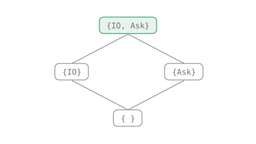
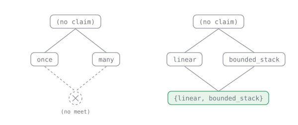
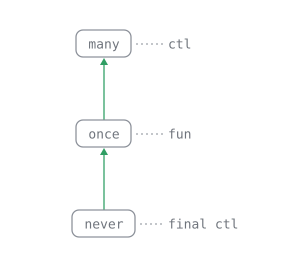
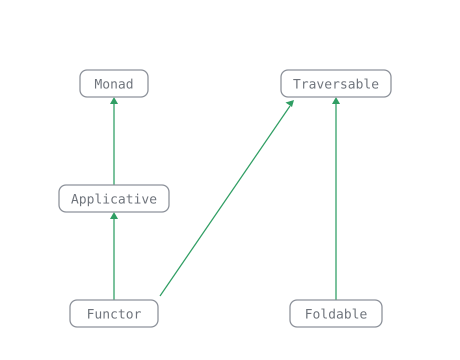
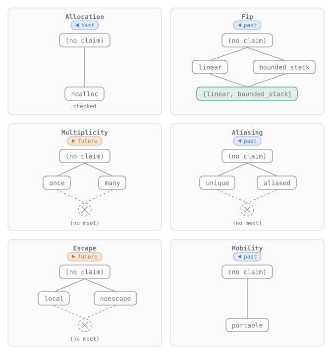

# The Prism Language Specification {#the-prism-language-specification}

Prism is a strict, impure functional language in the ML family whose type system tracks side effects. This document is a Modest Proposal of the language as the `prism` compiler accepts it: its lexical structure, grammar, type system, and evaluation.

## 0. Goals {#goal}

1. Take deterministic simulation testing down to the language level: a deterministic core, typed effects, content-addressed identity, and replayable observations make every output an accountable artifact that can be mechanically rebuilt, moved, cached, diffed, audited, and explained using modern type-system methods.
2. Lineage is the user-facing form of determinism: given an output, Prism should be able to precisely describe and check what code, packages, inputs, effects, handlers, and compiler artifacts produced it.
3. The so-called "real world" meets Prism only at effect boundaries: every nondeterministic observation is named, typed, handled, and therefore available to record, replay, sandbox, or audit. The unfortunate existence of the physical world should be constrained by types.
4. Obtain pure functional language nirvana by being completely inaccessible, utterly useless, completely divorced from the real world, and having zero users.

## 1. Introduction {#introduction}

A Prism program is a set of modules, each a file of declarations. The surface language elaborates to a strict, **call-by-push-value** core ([Levy, 2004](bibliography.md#levy-2004)) in **A-normal form** (the companion [Compiler](./compiler.md) document), compiles to native code through LLVM or the optional MLIR backend, and is managed by **deterministic reference counting** rather than a garbage collector.

Three things distinguish Prism from its ML and Haskell ancestors. It is **strict**, with laziness opt-in through thunks over a [call-by-push-value](./compiler.md#the-core-calculus) core, so evaluation and effect order are left to right and explicit. Side effects are inferred as extensible **effect rows** ([effects and handlers](#effects-and-handlers)) that combine structurally across calls instead of through **monads** and track both observability and **capability effects** ([capability effects and IO](#capability-effects-and-io)): an operation handled inside a function does not appear in its type, so internally effectful code is reused as pure, and a function that reads the outside world names the part it reads (`Console`, `FileSystem`, `Random`, `Entropy`, `Env`, `Clock`) rather than a blanket `IO`. The same reference-count discipline both frees memory and performs **fully-in-place (FBIP) update** ([declarations and programs](#declarations-and-programs)), compiling record updates and derived setters to in-place writes on uniquely owned values (those that a reference count proves have no other live reference; see [reference counting and FBIP reuse](./compiler.md#reference-counting-and-fbip-reuse)). Beyond these, the language provides isolated **fibers** through handlers, failure as ordinary typed control flow, record and replay of a program's interaction with the world over the capability effects ([record and replay](#record-and-replay)), derived lenses and use-site **optic paths** for deeply nested structure traversal and update ([optic paths](#optic-paths)), fusing stream combinators ([streams](#streams)), **unboxed types** ([unboxed products](#unboxed-products)), and checked **usage contracts** on closures ([coeffects](#usage-and-resource-annotations)).

The deterministic core gives programs a stable identity: a definition is named by the hash of its **canonical Core form**, after alpha-normalizing binders so alpha-equivalent definitions share an identity and behavior-visible Core changes do not ([content-addressed core](./compiler.md#content-addressed-core)).[^alpha-identity] The same rule extends to execution: a suspended continuation is a **`kont` envelope** whose **bundle digest** names the code it may resume against ([the kont envelope](./compiler.md#the-kont-envelope)), and replayability supplies the byte-identical observable contract ([suspend and resume](#suspend-and-resume)).

[^alpha-identity]: Ergo the compiler is serenely uninterested in what you named your variables: two functions that reduce to the same normal form are the same function, whatever their authors privately felt while writing them. This is a liberation if you are not attached to your variable names and a quiet bereavement if you are.

This specification proceeds in dependency order: notation, lexical structure, grammar, types, then the constructs the grammar describes.

## 2. Notation {#notation}

Grammar is given in the following **EBNF**. A **terminal** is a literal token written in double quotes; a **nonterminal** is a lower-case name. The character classes are the ASCII letters (`letter`), the two cases (`lower`, `upper`), the decimal digits (`digit`), any printable character (`graphic`), and any character other than `"`, `\`, or a newline (`strchar`). These are primitives, not grammar nonterminals.

```text
{{#include ../../models/grammar.ebnf:notation}}
```

Identifiers in productions name the tokens defined in the [lexical structure](#lexical-structure) (`varid`, `conid`, `qualid`, `integer`, `float`, `char`, `string`) and the character classes defined just above. The [layout](#layout) algorithm inserts block delimiters that the grammar then treats as ordinary terminals.

## 3. Lexical Structure {#lexical-structure}

Source text is UTF-8. Tokens are lexed by longest match, then the stream is rewritten by the [layout algorithm](#layout). Whitespace and comments separate tokens and are otherwise insignificant except as layout boundaries.

```text
{{#include ../../models/grammar.ebnf:lexical}}
```

### 3.1 Identifiers {#identifiers}

Prism distinguishes identifiers by initial case. A `varid` begins with a lower-case letter or underscore and names a variable, function, parameter, or record field. A `conid` begins with an upper-case letter and names a type, data constructor, type class, or effect. A `qualid` is a dotted path such as `Data.Map` or `Map.insert`; it is lexed as a single token so that a module path never collides with field access.

### 3.2 Keywords {#keywords}

The following are reserved and may not be used as identifiers.

|            |            |            |             |              |
| ---------- | ---------- | ---------- | ----------- | ------------ |
| `fn`       | `fip`      | `fbip`     | `pub`       | `import`     |
| `as`       | `type`     | `newtype`  | `opaque`    | `alias`      |
| `effect`   | `error`    | `throw`    | `try`       | `catch`      |
| `transact` | `class`    | `instance` | `pattern`   | `deriving`   |
| `where`    | `given`    | `handle`   | `with`      | `handler`    |
| `mask`     | `val`      | `return`   | `let`       | `var`        |
| `borrow`   | `in`       | `for`      | `do`        | `if`         |
| `then`     | `else`     | `elif`     | `match`     | `of`         |
| `forall`   | `true`     | `false`    | `while`     | `loop`       |
| `break`    | `continue` | `using`    | `canonical` | `replayable` |
| `each`     | `probe`    | `stable`   | `logic`     | `requires`   |
| `ensures`  |            |            |             |              |

A second set of words is **contextual**: each names a construct only in one grammatical position and stays a valid identifier everywhere else, so no program is broken by one becoming meaningful. They are never reserved.

| Word                    | Contextual position                                                                        |
| ----------------------- | ------------------------------------------------------------------------------------------ |
| `total`, `assume`       | a totality claim in the declaration-modifier position before `fn`                          |
| `never`, `once`, `many` | a resumption grade in an operation declaration; `never`/`once` also prefix handler clauses |
| `view`, `make`          | the forward and constructor clauses of a `pattern` declaration                             |
| `resume`                | the continuation binder in a multishot handler clause                                      |
| `partial`               | the `handle ... with partial` incomplete-handler form                                      |
| `deprecated`            | an annotation line preceding a declaration                                                 |
| `test`                  | a test declaration in the modifier position before `fn`                                    |
| `decreases`             | the ranking-measure clause of a `total fn`                                                 |
| `frozen`                | a committed shape digest after a stable rung                                               |
| `upgrade`, `downgrade`  | stable converter directions and migration route fields                                     |
| `drop_loss`             | the acknowledged field-loss list after a downgrade converter                               |
| `migrations`            | the migration-route table inside a `stable` block                                          |
| `auto`, `version`       | derived and explicit routes inside a migration table                                       |
| `reflect`               | the `reflect fn` and `reflect type` quotation forms                                        |
| `path`                  | the optic-literal head after `#`                                                           |
| `Type`, `Row`, `Nat`    | kind names in a data-type parameter annotation                                             |

The built-in type names `Int`, `I64`, `U64`, `Bool`, `Unit`, `Float`, `Char`, and `String` are also reserved. Prelude effect names such as `Console`, `FileSystem`, `Random`, `Entropy`, `Env`, and `Output` are ordinary library names, not lexical keywords ([capability effects](#capability-effects-and-io)). `Preempt` and `Net` are a narrower semantic reservation: the words still lex as identifiers, but user effect declarations with those names are rejected so the unshipped runtime seams cannot be given an incompatible meaning.

### 3.3 Operators and Punctuation {#operators-and-punctuation}

The operator set is fixed; the language has no user-defined operators. Arithmetic and comparison use one plain spelling per operation across the numeric lanes. The retired floating-point dot forms are still lexed only so the parser can issue a pointed removal diagnostic; they are not operators or deprecated aliases ([deprecation](#deprecation)). Exponentiation `^` is a single operator over both `Int` and `Float` ([exponentiation](#exponentiation)).

| Class      | Operators                                     |
| ---------- | --------------------------------------------- |
| Arithmetic | `+` `-` `*` `/` `%` `^`                       |
| Comparison | `==` `/=` `<` `<=` `>` `>=`                   |
| Logical    | `&&` `\|\|`                                   |
| Pipeline   | `\|>` `>>` `<<`                               |
| Failure    | `??` `?.` `?`                                 |
| Arrows     | `->` `<-` `=>`                                |
| Binding    | `=` `:=` `:` and compound `+=` `-=` `*=` `%=` |
| Effect     | `!`                                           |
| Brackets   | `(` `)` `{` `}` `[` `]`                       |
| Other      | `,` `.` `..` `\|` `\` `@` `#` `~`             |

### 3.4 Literals {#literals}

An `integer` is a run of decimal digits, optionally grouped by underscore separators (`1_000_000`) that are cosmetic and carry no value. A value that fits in a machine word is an immediate; a larger literal is an arbitrary-precision integer (bignum). The suffix `i64` or `u64` selects a fixed-width 64-bit lane that wraps on overflow. A `float` is an IEEE-754 double, written with a fractional part (`1.5`), an exponent (`1e25`, `1.5e3`), or both; the exponent may be signed (`1e-25`, `1E25`) and separators are admitted in its mantissa and exponent on the same rule. Exponent notation always denotes a `Float`. A separator is valid only between two digits, so a leading, trailing, doubled, or `.`/`e`-adjacent underscore is a lexical error. A `char` is a single Unicode scalar in single quotes. A `string` is double-quoted UTF-8.

There are no negative literals at the lexical level: a leading minus is the unary-minus operator ([operator precedence](#operator-precedence)), so `-5`, `-5i64`, and `-1.5` are `-` applied to the literal. `-5u64` is rejected because negation is undefined on the unsigned lane, and the exponent sign lives inside the `float` token, so it never collides with that operator.[^i64-min-literal] The formatter preserves a writer's separator grouping verbatim.

[^i64-min-literal]: The signed fixed-width minimum is the one special range-checking edge: after parsing the separate unary minus and literal, the type checker folds the sign into the magnitude, so `-9223372036854775808i64` is `I64` min while the bare positive magnitude is out of range.

The escape sequences `\n`, `\t`, `\r`, `\\`, `\"`, `\{`, and `\}` are recognized in both character and string literals; a character literal additionally accepts `\'`.

A string may also be written **raw**: `r"""` opens it and the next `"""` closes it. The body is taken verbatim, so no escape is recognized and no brace opens a hole, and a block of code, a pattern, or a document embedded in a program needs no doubling to survive being quoted. Two rules make the block read on the page as it reads in the value. The newline each delimiter sits against belongs to the delimiter rather than to the text, and the indentation every non-blank line shares is the source's rather than the string's, so a literal indented to match the code around it denotes the same string wherever that code moves. A line indented past the shared margin keeps the difference, a blank line keeps nothing, and a value ending in a newline is spelled by leaving a blank line above the closing delimiter.

```prism
fn main() =
  println(r"""
    { "escapes": "none", "holes": "none" }
    """)
```

```output
{ "escapes": "none", "holes": "none" }
```

What the two spellings produce is one `String` and nothing distinguishes them afterwards; the raw form is a way of writing a literal, not a kind of value. A raw body cannot contain `"""` and has no escape with which to spell one, so a string that needs the delimiter is written in the quoted form. The formatter reprints a raw literal exactly as written, on the same reasoning that keeps a writer's digit grouping: re-escaping the block onto one line would be a different spelling of the same value, and the shape is why the form was chosen.

### 3.5 String Interpolation {#string-interpolation}

Within a string, an unescaped `{ expr }` is an interpolation hole. The hole text is re-lexed at its source position and elaborated as an expression whose type-directed display is spliced into the string; a top-level string is spliced in raw, not quoted the way the `Show` method renders it. A hole runs to its matching `}`, balancing nested braces and string literals, so a hole may itself contain a string with braces. A literal brace outside a hole is written `\{` or `\}`. An empty hole, an unterminated hole, and an unterminated string are each lexical errors. A raw literal has no holes at all, so a brace in its body is a brace. The catch arms of the error example under [errors and failure](#errors-and-failure) use interpolation, as in `"no such key: {k}"`.

### 3.6 Comments {#comments}

A comment runs from `--` to the end of the line; there is no block-comment form. Comments are **trivia**: they separate tokens and are otherwise insignificant, except that a `--` inside a string or character literal is ordinary text rather than a comment, and the formatter preserves a comment and re-emits it attached to the token it preceded. A doc comment is the ordinary line form spelled `-- |`; the [API doc generator](./compiler.md) harvests it, but the lexer treats it as any other comment.

### 3.7 Layout {#layout}

Prism uses the **offside rule**: indentation, not explicit braces, delimits a block. A layout block opens after any of the keywords or symbols `=`, `then`, `else`, `=>`, `of`, `with`, `handler`, `do`, `where`, `try`, `catch`, `transact`, `loop`, and after `fn` (a `while` block opens at its `do`). A `class`, `instance`, or `effect` body opens the same way, but after the head rather than a keyword: the head ends the line and the members follow as its indented block. The first token after such an opener sets the block's indentation column; a later line at that column starts a new item in the block, and a line indented less closes the block. Literal braces do not replace a general expression block. They delimit only the constructs that own them, such as records, path updates, stable blocks, and the brace form of handler, match, and catch arm lists (as in the [masking](#masking) example). A `class`, `instance`, or `effect` body is layout-only, and a brace opening one is a parse error that names the layout rewrite.

### 3.8 Declarations {#declarations}

A program is a layout-delimited sequence of top-level declarations, each introduced by a reserved word that fixes its shape. The table names the introducer and where the construct is specified; the formal grammar is in [Surface Grammar](#surface-grammar).

| Introducer  | Declares                                                                     | Specified in                                            |
| ----------- | ---------------------------------------------------------------------------- | ------------------------------------------------------- |
| `fn`        | a function; a body, an optional result type and effect row, `given`, `where` | [declarations and programs](#declarations-and-programs) |
| `let`       | a top-level constant binding                                                 | [declarations and programs](#declarations-and-programs) |
| `type`      | an algebraic data type or record                                             | [algebraic data types](#algebraic-data-types)           |
| `newtype`   | a single-constructor, zero-cost wrapper                                      | [algebraic data types](#algebraic-data-types)           |
| `alias`     | a type synonym or a row alias                                                | [types](#types)                                         |
| `class`     | a type class and its method signatures                                       | [type classes](#type-classes)                           |
| `instance`  | an instance of a class at a type                                             | [coherence and resolution](#coherence-and-resolution)   |
| `canonical` | the canonical instance at a head that has more than one                      | [coherence and resolution](#coherence-and-resolution)   |
| `effect`    | an effect and its operations                                                 | [effects and handlers](#effects-and-handlers)           |
| `error`     | an error constructor                                                         | [errors and failure](#errors-and-failure)               |
| `pattern`   | a bidirectional pattern synonym                                              | [patterns](#patterns)                                   |
| `stable`    | a serializable type's frozen version history                                 | [stable blocks](#stable-blocks)                         |

A head may carry modifiers. `pub` exports the declaration to importers; `opaque` on a `type` exports the name but not its constructors ([modules](#modules)); `test` marks a test declaration, `total` or `assume total` states a totality claim, `logic` makes a proof-level function, the `fip` and `fbip` prefixes assert an allocation discipline, and `replayable` bounds a function's effects. A function result may carry the checked declaration claims `@ noalloc`, `@ linear`, and `@ bounded_stack`. A function may also carry `requires`, `ensures`, and a final `decreases` clause before `=`. A `deprecated "..."` line marks the following declaration superseded ([deprecation](#deprecation)). The `let` and `var` binding forms (the latter mutable) also appear inside expression bodies, where only the local forms admit `var`; a top-level binding is `let` only.

A trailing `where` block attaches non-recursive local helpers below a function body, each binding scoped over the ones after it and over the body:

```prism
fn quadratic(a : Float, b : Float, c : Float) : (Float, Float) =
    ((-b + d) / two_a, (-b - d) / two_a)
  where
    d = sqrt(b * b - 4.0 * a * c)
    two_a = 2.0 * a
# fn main() = println(quadratic(1.0, -5.0, 6.0))
```

### 3.9 Modules and Imports {#modules-and-imports}

A file is a module and a dotted path names one in the source tree: `import Data.Map` loads `Data/Map.pr`. The surface forms are below; visibility, opaque exports, and project layout are specified in [modules](#modules).

| Form               | Effect                                                           |
| ------------------ | ---------------------------------------------------------------- |
| `import M`         | brings `M`'s exports into scope under qualified names (`M.name`) |
| `import M (a, b)`  | additionally brings `a` and `b` into bare scope                  |
| `import M (..)`    | brings every export of `M` into bare scope                       |
| `import M as N`    | adds the alias `N` for qualified access (`N.name`)               |
| `pub import M (x)` | re-exports `x` through the importing module                      |

A `qualid` such as `Map.insert` is a single token ([identifiers](#identifiers)), so a qualified name never lexes as field projection. The `pub` modifier on any declaration makes it visible to importers; a declaration without it is private to its module.

Bringing a name into bare scope offers it; it does not commit to it. Two imports may offer the same short name, and an import never fails on that account: the clash is reported only where a bare use actually has to choose between them, and qualifying that one use resolves it. [Modules](#modules) gives the full order in which a bare name is looked up.

## 4. Surface Grammar {#surface-grammar}

A program is a layout-delimited sequence of top-level declarations.

```text
{{#include ../../models/grammar.ebnf:program}}
```

```text
{{#include ../../models/grammar.ebnf:decls}}
```

Type syntax. A function type carries an optional effect row on its codomain ([effects and handlers](#effects-and-handlers)); the row binds to a function type only.

```text
{{#include ../../models/grammar.ebnf:types}}
```

Expressions, patterns, and the handler block of `handle`/`try` (used in [effects and handlers](#effects-and-handlers)).

```text
{{#include ../../models/grammar.ebnf:expr}}
```

```text
{{#include ../../models/grammar.ebnf:pattern}}
```

```text
{{#include ../../models/grammar.ebnf:handler}}
```

### 4.1 Operator Precedence {#operator-precedence}

The table gives the binding of each operator, loosest to tightest. Levels 1 to 8 are binary operators looser than unary minus; exponentiation at level 10 binds tighter than it, and level 11 is application, field access, and the postfix failure operators. Unary minus is a **tight prefix** below application and projection but above multiplication, so `-f(x)` is `-(f(x))`, `-x * y` is `(-x) * y`, and a leading `f -x` is the binary `f - x` (there is no juxtaposition application; write `f(-x)`). Exponentiation follows the mathematical convention: `-x ^ y` is `-(x ^ y)`, and a negative base needs parentheses.

| Level | Operators                              | Associativity |
| ----- | -------------------------------------- | ------------- |
| 1     | `??`                                   | right         |
| 2     | `\|>`                                  | left          |
| 3     | `>>` `<<`                              | left          |
| 4     | `\|\|`                                 | left          |
| 5     | `&&`                                   | left          |
| 6     | `==` `/=` `<` `<=` `>` `>=`            | none          |
| 7     | `+` `-`                                | left          |
| 8     | `*` `/` `%`                            | left          |
| 9     | prefix `-` (unary minus)               | prefix        |
| 10    | `^`                                    | right         |
| 11    | `f(...)` `a[i]` `.field` `?.field` `?` | left          |

## 5. Functions {#functions}

Prism is a functional language, so functions are kind of a big deal. Functions are values: they may be named, passed as arguments, returned from other functions, captured by lambdas, and combined into new functions.

### 5.1 Top-Level Definitions {#top-level-definitions}

A top-level function definition begins with `fn`, followed by its name, parameters, optional result annotation, and body. Parameters and results are inferred when their annotations are omitted. A top-level `let` names a constant rather than a callable function; both forms are visible throughout their module, subject to the [module visibility rules](#modules).

```prism
let greeting = "Hello"

fn greet(name : String) =
  println("{greeting}, {name}!")

fn main() = greet("Prism")
```

```output
Hello, Prism!
```

### 5.2 Lambdas {#lambdas}

A **lambda** is an anonymous function written `\(parameters) -> body`. A lambda closes over names in its surrounding lexical scope, so it can carry both behavior and captured data as a value.

```prism
fn main() =
  let offset = 2
  let add_offset = \(x) -> x + offset
  println(add_offset(40))
```

```output
42
```

### 5.3 Let Statements {#let-statements}

A `let` evaluates its right-hand side strictly, binds the resulting value, and makes the name available to the rest of the enclosing layout block. Bindings shadow outer names and may destructure values with a [pattern](#patterns). The expression form, `let name = value in body`, is useful where a layout block would be awkward; consecutive layout statements elaborate to the same right-nested `let` structure.

```prism
fn main() =
  let answer = let width = 6 in let height = 7 in width * height
  println(answer)
```

```output
42
```

A pattern binding may carry an `else` clause, `let pat = value else fallback`. The binding is then allowed to be refutable: when the pattern matches, its names are in scope for the rest of the block as usual; when it does not, the block stops there and `fallback` is its value. So the fallback has the type the rest of the block would have had, and the whole form is exactly the two-arm `match` a reader would otherwise write by hand, with the same evaluation order and the same effect row. The fallback fits on the binding's line when it is short and otherwise lays out as a block under its own `else`. A pattern that cannot fail leaves the fallback unreachable and is reported as the unreachable arm it is.

```prism
fn plus_one(o : Option(Int)) : Int =
  let Some(x) = o else 0
  x + 1

fn main() =
  println(plus_one(Some(41)))
  println(plus_one(None))
```

```output
42
0
```

### 5.4 Function Composition {#function-composition}

The forward composition `f >> g` produces `\(x) -> g(f(x))`; backward composition `g << f` denotes the same function while reading from the result back toward the input. The pipe `value |> f` applies an existing value to a function. Composition binds more tightly than the pipe, so a complete dataflow can be read from left to right.

```prism
fn increment(x : Int) : Int = x + 1

fn double(x : Int) : Int = x * 2

fn main() =
  let forward = increment >> double
  let backward = increment << double
  println(forward(10))
  println(backward(10))
  println(10 |> increment >> double)
```

```output
22
21
22
```

The three composition forms are described in full alongside [method calls](#method-calls), including their precedence and relationship to UFCS chains.

## 6. Types and Kinds {#types-and-kinds}

Prism infers types by the **bidirectional, higher-rank inference** algorithm of [Dunfield & Krishnaswami (2013)](bibliography.md#dunfield-krishnaswami-2013). An unannotated declaration infers its **principal type**; an annotated one is checked against the annotation. Annotations are required for **rank-N polymorphism**, since a nested `forall` cannot be inferred.

Quantification is **predicative**: a type-constructor argument and an inferred type variable range over monomorphic types, so a `forall` may not be written directly as a type argument (`List(forall a. (a) -> a)` is rejected as **impredicative**). **Higher-rank types** are allowed wherever they are not a type argument, namely as a function parameter, a function result, and a declared data field; a polymorphic value can be carried through a generic container by wrapping it in a data type with a polymorphic field.

### 6.1 Three Posets {#three-posets}

A **poset** (partially ordered set) is a set equipped with a reflexive, antisymmetric, and transitive order. A **lattice** is a poset in which every pair has both a least upper bound (a join) and a greatest lower bound (a meet). A Prism signature carries three posets: what a computation may do (the effect row, after `!`), how its values may be used (the usage row, after `@`), and how a handler may consume a continuation (the operation grade). Effect rows and operation grades are lattices: effect rows are finite multisets whose join and meet take the pointwise maximum and minimum label counts, while grades form a total chain. Coeffect axes are not lattices in general because some conflicting facts have no meet.

**Effect rows: joins always exist.** The carrier is a finite multiset of effect labels, ordered by each label's multiplicity; the join takes the pointwise maximum. Ordinary sequencing stays in the zero-or-one slice shown below, while [`mask`](#masking) raises one label's count to record an additional enclosing handler obligation:

<p align="center"></p>

Sequencing takes the join; handling subtracts back toward the pure bottom:

```prism
effect Ask
  once ask() : Int

fn f() : Unit ! {IO} = println("f")

fn g() : Int ! {Ask} = ask()

fn foo() : Int ! {IO, Ask} =
  f()
  g()

fn bar() : Int ! {IO} =
  handle foo() with
    once ask() => 7

fn main() = println(bar())
```

`foo` sequences `f` and `g`, so its row is their join; `bar` handles one occurrence of `Ask`, so its row steps back down to `{IO}`.

**Coeffect axes: meets sometimes missing.** Each axis ([coeffects](#usage-and-resource-annotations)) has silence at the top, the mode of all unannotated code. An exclusive axis has no meet below its points; the fip axis is a product of chains, so its meet exists:

<p align="center"></p>

Descending is a strengthening someone must prove; ascending, forgetting a claim, is always free; and holding two claims at once is exactly having a point below both:

```prism
fn f() : Int @ noalloc = 1  -- a proven claim: f's call tree allocates nothing

fn g() : Int = f()          -- ok: forgetting the claim moves up, always free

-- fn foo() : Int @ noalloc = g()
--   rejected, descent needs proof: in `foo`, call to `g` may
--   allocate (`g` has no zero-allocation certificate)

-- h : ((Int) -> Int) @ {linear, bounded_stack}
--   a legal row shape: the meet exists and the checked claims compose

-- h : ((Int) -> Int) @ {once, many}
--   never parses: usage facts `once` and `many` contradict each other (same axis)

fn main() = println(g())
```

**Operation grades: a total chain.** Continuation use is a quantity, so its lattice is a total order:

<p align="center"></p>

The whole discipline is one comparison at one boundary: a clause's grade at most its operation's declared grade ([effects and handlers](#effects-and-handlers)):

```prism
effect E
  never quit() : Int  -- never: a clause must drop the continuation
  once ask() : Int    -- once:  a clause resumes exactly once, in tail
  coin() : Bool       -- many:  a clause may capture k, resume freely (default)

fn foo() : Int ! {E} =
  let x = ask()
  if coin() then x else quit()

fn run() : Int =
  handle foo() with
    never quit() => 0        -- never <= never  ok
    once ask() => 42         -- once  <= once   ok
    coin() resume k => k(true)     -- once  <= many   ok: below the grade is allowed

-- ask() resume k => k(1) + k(2) would be rejected: the clause for `ask`
-- exceeds its declared grade `once`, resuming more than once

fn main() = println(run())
```

One signature exercises all three at once:

```prism,ignore
fn spawn(f : (() -> a ! e) @ {once, portable}) : Fiber(a) ! {Async(a), e}
```

`spawn` takes a portable thunk `f` that it may call at most once, starts it as a fiber producing an `a`, and may perform both the thunk's effects `e` and the asynchronous effect `Async(a)`.

- **Row, joined**: whatever `f` performs is unioned into the caller's row alongside `Async`; the handler that later runs the fiber subtracts `Async` back out.
- **Axes, met**: `@ {once, portable}` is one point on each of two axes, their meet in the product: `spawn` promises to call the thunk at most once and may carry it to another fiber.
- **Grade, bounded**: the `Async` operations are `many`, the top of the chain, so a scheduler may hold the continuation and resume it later; `once` would have pinned every handler to immediate single resumption.

The design is the three properties side by side. Effects always have joins: doing more must always be expressible, while a repeated label records handler depth rather than performing the same operation twice. Coeffects sometimes lack meets: some promises genuinely contradict. Continuation use is a total order: it is a quantity, not a set.

An effect is a coeffect on its own continuation: operation grades constrain how the handler may use the captured continuation.[^coeffect-k]

[^coeffect-k]: A nod to "a monad is just a monoid in the category of endofunctors, what's the problem?", and like the original it is deadpan and true. Performing an operation reifies the rest of the program as a value, the continuation `k`, and the whole zoo of control effects is a usage contract on that one value: `never` discards `k`, `once` spends it exactly once, `many` spends it freely. That is the `@` lattice landing on a continuation instead of a closure, so `!` (what a computation may do) and `@` (how a value may be used) were never two systems, just one lattice read from both ends. The continuation was the first value in the language to carry a coeffect.

### 6.2 Types {#types}

The scalar types are `Int` (arbitrary precision), `I64`, `U64`, `Float`, `Bool`, `Char`, `String`, and `Unit`. A type constructor applied to arguments is written `Con(t, ...)`; the list type has the sugar `[t]` for `List(t)`. A tuple type is `(t, ...)`. A function type is `(t, ...) -> u`, optionally carrying an effect row on `u`. A universally quantified type is `forall a. t`. Type variables are `varid`s.

### 6.3 Kinds {#kinds}

A type has **kind** `Type` (a type of values) or `Type -> Type` (a type constructor awaiting one argument), and so on; `List` has kind `Type -> Type`, since `List(Int)` is a type only once `Int` is supplied. A class parameter may range over a constructor of kind `Type -> Type`, applied as `f(a)` in method signatures; see [type classes](#type-classes). Each constructor's parameter kinds form an arrow `k1 -> ... -> Type`, and an applied head is checked argument by argument against that arrow: too many arguments, or an argument whose kind does not match the parameter's, is a kind mismatch reported at the annotation. There is no separate global kind-checking phase; the remaining well-kindedness obligations are discharged during **unification**, which requires a constructor and its arguments to agree in arity.

Besides `Type` and its arrows there are two further ground kinds. **`Row`** is inhabited by effect rows rather than types. A type parameter annotated `: Row` ranges over rows, so a data type can carry an effect row as a parameter and thereby store an effectful computation in a field: in `type Cmd(a, e : Row)` a field may name `e` as `! {e}` (or in a tail, `! {IO | e}`), the constructor quantifies `e` with a row-level `forall`, and the applied head `Cmd(a, e)` carries the row in that position. A `Row`-kinded argument is an effect row, written either as a row variable (`Cmd(a, e)`) or a `{ .. }` row literal (`Cmd(Int, {IO})`); supplying a type where a row is expected, or a row where a type is expected, is a kind mismatch reported at the annotation. An unannotated parameter still defaults to `Type`, so `Row` is opt-in and existing types are unchanged. This is the type-system support for storing an effect-polymorphic reified handler, such as the concurrency scheduler of [effects and handlers](#effects-and-handlers).

The third ground kind is **`Nat`**, inhabited by type-level natural numbers, the dimensions of a **shape-indexed type**. A type parameter annotated `: Nat` ranges over dimensions, so in `type Vec(a, n : Nat)` the length `n` is a compile-time index rather than a stored field; an argument in that position is either a bare natural literal (`Vec(Int, 3)`) or a `Nat`-kinded variable (`Vec(a, n)`). As with `Row`, supplying a type where a dimension is expected, or a dimension literal where a type is expected, is a kind mismatch reported at the annotation.

Dimensions unify **by equality only**: two literals unify when they are equal (`3` with `3`), a variable unifies with whatever dimension it meets, and a clash is a compile error naming both lengths (zipping a `Vec(Int, 3)` with a `Vec(Int, 4)` reports `expected length 3, but got length 4`). There is deliberately no successor structure and no arithmetic on dimensions: `n + m` and `n + 1` in a dimension position are declined at the parser with a pointed message, and this is a decision, not a gap.

The consequence is stated honestly rather than worked around: an operation whose correctness needs an arithmetic relation between dimensions cannot be given a length-precise type. A length-changing `cons` of type `(a, Vec(a, n)) -> Vec(a, n + 1)` is therefore not expressible, and a `head` over `Vec(a, n)` cannot statically exclude the empty vector (which would require `n` to be a successor `m + 1`); such a `head` accepts any length and faults, or ranges over `Fail`, on the empty case. Equality-only dimension unification is exactly the reach that shape indexing needs (fixed-length containers, matching-length zips) without importing a dependent-arithmetic decision procedure into the frozen core.

Dimensions are erased before the Core IR and never reach code generation, so a `Nat` index is a purely static fact: it constrains what type-checks but is invisible to every backend and to the determinism contract, exactly like a phantom parameter. An unannotated parameter still defaults to `Type`, so `Nat` is opt-in.

### 6.4 Inference, Generalization, and Defaulting {#inference-generalization-and-defaulting}

A row is built from **labels**, the effect names of [effects and handlers](#effects-and-handlers) (a parametric effect's label carries type arguments). It is an unordered multiset: repeated labels are preserved and count how many enclosing handlers of that effect a computation still requires. A row is **closed** when it ends in a fixed multiset of labels and **open** when it ends in a row variable (`! {L | r}`), which stands for further labels the caller may add. An unannotated top-level declaration is generalized over its free type and row variables not fixed by the surrounding scope. A local `let` generalizes type variables only when its right-hand side is a syntactic value (a literal, variable, lambda, tuple, unboxed tuple, or list whose elements are values; annotations are transparent) and its free names are all top-level; a computation, or a value that closes over another local, stays monomorphic in its type variables. Thus `let same = \(x) -> x` may be used at both `Int` and `String`, while `let same = make_identity()` has one type. Row variables still generalize for either form, because choosing a row at a use site does not duplicate a computation.

A bare type variable written in a top-level function's signature is an implicit `forall`: it is universally quantified and rigid, so the body is checked to hold for every instantiation and may neither narrow it to a concrete type nor equate two distinct signature variables (a body that does is a type error), and the declaration exports exactly the polymorphic scheme it wrote. Two cases default rather than generalize, both resolved in one pass at generalization. A numeric operand of an arithmetic or comparison operator left otherwise unconstrained defaults to `Int`; because the default is deferred to that pass rather than applied at the operator, a later use that fixes the operand to a fixed-width lane (`I64`/`U64`) takes precedence, so `x + y` followed by an `i64` use of `x` is fixed-width, not `Int`. An unconstrained row is retained only where a caller can solve it: the outer latent row of a function, or a row reachable from one of its parameter types. Other open rows, including one nested only in a returned value and every row inside a constant's value, default to empty (pure); an effect-polymorphic declaration such as `traverse` keeps the row carried by its higher-order parameter ([the standard prelude](#the-standard-prelude)).

### 6.5 Subsumption and Row Equivalence {#subsumption-and-row-equivalence}

Checking a value against an expected type uses **subsumption**, not equality. A more polymorphic type is accepted where a less polymorphic one is expected: a `forall` on the expected side introduces a rigid variable the value must satisfy for all instances, and a `forall` on the value side is instantiated to meet the expectation. Function subtyping is **contravariant** in the arguments and **covariant** in the result, so a function accepting more and returning less may stand in for one accepting less and returning more.

Nominal datatype arguments are **invariant** by default: `T(a)` fits `T(b)` only when `a` and `b` are mutually compatible. This contains function and usage subtyping inside a datatype rather than silently reversing it at a later phase; in particular, a closure marked `@ once` cannot be widened to `@ many` through a record or sum parameter. `Array(a)` is the one nominal covariant exception, justified by its copy-on-write value semantics: a write through a widened array cannot mutate a shared narrower alias. An application through a still-flexible higher-kinded head is invariant because the eventual constructor's variance is not yet known.

Effect rows are checked by unification over scoped labels, not by covariant widening. Two rows are compared up to reordering but not multiplicity: `! {A, B}` and `! {B, A}` are the same row, while `! {A, A}` and `! {A}` are not. Unification hoists one demanded occurrence to the head of the other row before matching the tails. An open row `! {A | r}` unifies with any row that provides `A` by binding `r` to the remainder; for instance `! {A | r}` unifies with `! {A, B}` by binding `r` to `{B}`. This is how a caller's row absorbs a callee's. A unification that would make a row contain itself is rejected, so recursive effect rows do not arise.

At a function arrow the value's effect row is made _equal_ to the expected one by this same unification, so a narrower row fits a wider context only by _solving_ a row variable, never by silent widening. A pure function still fits an effectful context, because its own latent row is a quantified variable ([effect polymorphism](#effect-polymorphism)) that unification solves to the demanded effects. Where a function carries an explicit return row, that annotation is the row its body is unified against: a body that performs an effect the annotation omits does not unify and is rejected with a diagnostic naming the effect the annotation must declare, and the annotation's row variables are rigid, so an annotation may not silently narrow to fewer effects than the body performs.

### 6.6 Fixed-Width Integers {#fixed-width-integers}

`Int` is arbitrary precision. `I64` and `U64` are the signed two's-complement and unsigned 64-bit lanes; they wrap on overflow rather than promoting to a bignum. Their arithmetic and comparisons are the plain operators through the [numerical tower](#numerical-tower), one spelling across every lane. The bit-level operations have no operator spelling and remain named builtins, each taking two operands of the lane type.

| Family     | Operations (and the `u64_*` counterparts) |
| ---------- | ----------------------------------------- |
| Bitwise    | `i64_and` `i64_or` `i64_xor`              |
| Shift      | `i64_shl` `i64_shr`                       |
| Comparison | `i64_cmp`                                 |

`and`, `or`, and `xor` share a single bit pattern across both lanes; `i64_shr` is an arithmetic (sign-extending) shift while `u64_shr` is logical; a shift count is taken modulo 64. `to_i64`/`to_u64` and `int_of_i64`/`int_of_u64` convert between `Int` and the fixed-width lanes.

### 6.7 Integer Arithmetic and Division {#integer-arithmetic}

The arithmetic operators `+`, `-`, `*`, `/`, and `%` spell integer arithmetic here through the [numerical tower](#numerical-tower)'s `Int`, `I64`, and `U64` instances; `^` is [exponentiation](#exponentiation). On `Int` they are arbitrary precision: a sum, product, or difference is exact and never overflows, promoting a machine-word result to a bignum on demand.[^int-never-overflow] This section states the two facts that arithmetic on `Int` cannot state by its type alone: how division rounds, and what division by zero does. Both are identical on the interpreter and native backends, a corollary of the determinism contract and pinned by the parity corpus.

[^int-never-overflow]: "Never overflows" holds in the manner of most sweeping assurances: the number grows another limb instead of wrapping, and keeps growing, right up until it meets the finite quantity of memory the machine actually has, at which point the arithmetic ends the ordinary way and takes the process with it.

Division truncates toward zero and remainder takes the sign of the dividend. That is, `/` discards the fractional part by rounding toward zero rather than toward negative infinity, and `a % b` has the sign of `a` (or is zero), so the identity `a == (a / b) * b + (a % b)` holds for every non-zero `b`.[^div-signs] This is truncated division, the semantics of C99, Rust, and the hardware division instruction both native backends emit.

[^div-signs]: The four sign combinations make the rule concrete: `7 / 2` and `(-7) / (-2)` are `3`, while `(-7) / 2` and `7 / (-2)` are `-3`; `7 % 3` and `7 % (-3)` are `1`, while `(-7) % 3` and `(-7) % (-3)` are `-1`.

```prism
{{#include ../../tests/cases/run/num_int_div.pr}}
```

Floored division, where `/` rounds toward negative infinity and `%` (the Euclidean-adjacent modulus) takes the sign of the divisor, was considered and declined. Two reasons decide it. The fixed-width lanes are the constraint: `/` and `%` on `I64` and `U64` are the machine's truncating division, and an `Int` operator whose meaning diverged from the lane it shares a spelling with would split the integer family into two rounding rules a reader must track by type. And the determinism contract wants one rule across every lane, the interpreter, and both native backends rather than a surface convenience that the hardware does not compute; a caller who wants a floored or Euclidean modulus writes it once over these primitives (`((a % b) + b) % b` for a non-negative residue) rather than having the language pick a second, silently different `%`.

Division or remainder by zero is the one partial case of integer arithmetic. It is a runtime fault: the program halts immediately with exit status 1 and exactly `fatal: division by zero` on standard error, byte-identical on the interpreter and both native backends, on both `Int` and the fixed-width lanes. It is not a value, and unlike the recoverable `fail()` of [errors and failure](#errors-and-failure) it is not routed through an effect and cannot be caught; it aborts the run the way an unrecoverable `error(code)` does. Every other integer operation is total.

The fixed-width lanes wrap rather than fault or promote ([fixed-width integers](#fixed-width-integers)): `+`, `-`, and `*` on `I64` and `U64` are two's-complement modular arithmetic, so adding one to `I64_MAX` wraps to `I64_MIN` and adding one to `U64_MAX` yields `0`.[^fixed-div-edge] Unary minus follows the same wrap on the fixed-width lane, so `-x` on `I64` is the two's-complement negation and `-I64_MIN` is `I64_MIN`. `Int`, being a bignum, has no such edge: negation and division there are always exact.[^register]

[^fixed-div-edge]: Division wraps on the one signed input that would overflow it, so `I64_MIN / -1` on the `I64` lane is `I64_MIN` and `I64_MIN % -1` is `0`, consistent with the wrapping add/sub/mul rather than trapping; only a zero divisor faults.

[^register]: The edge is where a number stops being a mathematical object and becomes a physical one. An `I64` is not an integer but sixty-four transistors talked into standing for one, and the wrap is the moment they run out of room to carry. The bignum has no edge only because it buys more matter as it climbs, which postpones the confrontation with the machine rather than escaping it.

```prism
{{#include ../../tests/cases/run/num_fixed_wrap.pr}}
```

#### 6.7.1 Safe Arithmetic Families {#safe-arithmetic}

The wrapping and faulting defaults above are the primitives; a program that wants overflow to be visible rather than silent reaches for the safe families in the `Data.Checked` library, which layer four disciplines over those primitives through one class, `Checked(a)`.

| Family          | Methods                                  | Result      | Behavior                                                                                                                                                                                          |
| --------------- | ---------------------------------------- | ----------- | ------------------------------------------------------------------------------------------------------------------------------------------------------------------------------------------------- |
| `checked_*`     | `add`, `sub`, `mul`, `neg`, `div`, `mod` | `Option(a)` | `None` exactly when the operation overflows the lane or divides by zero.                                                                                                                          |
| `saturating_*`  | `add`, `sub`, `mul`                      | `a`         | Clamps to the bound the overflow crossed.                                                                                                                                                         |
| `wrapping_*`    | `add`, `sub`, `mul`, `neg`               | `a`         | Explicit names for the two's-complement wrap the raw operators already perform ([fixed-width integers](#fixed-width-integers)), so a caller can spell the intent rather than rely on the default. |
| `overflowing_*` | `add`, `sub`, `mul`                      | `(a, Bool)` | The wrapped result paired with a `Bool` true precisely when the operation overflowed.                                                                                                             |

Instances cover `I64`, `U64`, and `Int`; the checked narrowings `int_to_i64` and `int_to_u64` sit beside the class as free functions returning `Option`, the partial inverses of the total widenings `int_of_i64`/`int_of_u64`.

`Checked` sits beside the arithmetic classes rather than inheriting from them: it carries no superclass and no raw operators, so it stays meaningful for any integer lane independently of what algebraic structure that lane also has. The connection runs the other way, as a law. The `wrapping_*` methods agree exactly, value for value, with the lane's raw arithmetic, `wrapping_add`/`wrapping_sub`/`wrapping_mul` with the two's-complement `+`/`-`/`*` and `wrapping_neg` with unary negation.[^u64-wrapping-neg] Because the agreement is with the raw operators, it is stable under any later refactor that gives those operators a class of their own: the `wrapping_*` methods and the lane's ring operations remain the same function by construction.

[^u64-wrapping-neg]: `wrapping_neg` on `U64` is that same two's-complement wrap the lane's other operations use, so `wrapping_neg(0)` is `0` and `wrapping_neg(x)` is `U64_MAX - x + 1` for a nonzero `x`, rather than a fault or a rejection; the unsigned lane simply has no non-wrapping negation to prefer.

The families are not independent definitions that happen to line up; each fixed-width operation is computed once in the exact `Int` lane and then narrowed three ways, so the laws hold by construction and are pinned on the interpreter and both native backends. For a lane bounded by `[lo, hi]`, `checked_op(x, y)` is `Some(wrapping_op(x, y))` when the exact result lies in range and `None` otherwise; `overflowing_op(x, y)` is `(wrapping_op(x, y), flag)` with `flag` true iff `checked_op(x, y)` is `None`; and `saturating_op(x, y)` is that same wrapped value when it is in range, and otherwise the crossed bound, `hi` on overflow above (`I64` max or `U64` max) and `lo` below (`I64` min or `0`).[^checked-edges] Division and remainder inside a `checked_*` follow the truncating rule of [integer arithmetic](#integer-arithmetic). The `Int` instance is the degenerate case that keeps the class total rather than vacuous: unbounded, so `wrapping_*` and `saturating_*` are the identity, `overflowing_*` always flags `false`, and only a zero divisor turns a `checked_*` into `None`.

[^checked-edges]: The overflow cases follow the primitives exactly: `checked_add(I64_MAX, 1)` is `None` while `saturating_add(I64_MAX, 1)` is `I64_MAX`; `checked_neg(I64_MIN)` and `checked_div(I64_MIN, -1)` are `None`, the two signed edges where the exact result escapes the lane; and `checked_sub` on `U64` is `None` on any unsigned underflow, with `checked_neg` there `Some(0)` only for `0`.

```prism
{{#include ../../tests/cases/run/law_checked.pr}}
```

### 6.8 Floating-Point Arithmetic {#floating-point}

`Float` is an IEEE-754 double. Its arithmetic and comparison operators are the plain `+`, `-`, `*`, `/`, `%`, `==`, `/=`, `<`, `<=`, `>`, and `>=` through the [numerical tower](#numerical-tower). There is no implicit coercion between `Int` and `Float`, so a mixed expression is a type error resolved by an explicit `to_float` ([exponentiation](#exponentiation)). Floating-point arithmetic is where a language most often becomes tier-dependent, because a fused multiply-add, an extended-precision register, or a differently rounded library call changes a low bit. Prism forbids that: every float operation follows one rounding rule and one set of special-value rules, and the interpreter and both native backends agree bit for bit, pinned by the parity corpus and, for the printer, by a dedicated formatter oracle.

The rounding contract is round to nearest, ties to even, the IEEE-754 default, applied to every arithmetic operation with no fused or wider-than-double intermediate. This is the single rule the language commits to, and it is why `0.1 + 0.2` is `0.30000000000000004` and `1.0 / 3.0` is `0.3333333333333333` identically everywhere: the result is the correctly rounded double, not an artifact of an evaluation order or a backend.

Float division never faults. Where integer `/` by zero aborts, Float `/` by zero is an ordinary IEEE result: `x / 0.0` is `inf` or `-inf` according to the sign of the numerator and of the zero, and `0.0 / 0.0` is `nan`. A `nan` then propagates through every arithmetic operation it touches, so `nan + 1.0` and `nan * 0.0` are both `nan`; there is no arithmetic that turns a `nan` back into a finite number.[^nan-home] Because no float operation faults, a floating-point pipeline never introduces a failure edge into a function's effect row the way integer division by zero conceptually could.

[^nan-home]: `nan` is the one value with no route home: every operation applied in the hope of repairing it only propagates it further, and it declines to be equal even to itself, a solitude most values are spared having to contemplate.

Signed zero is observable. `0.0` and `-0.0` are distinct values that compare equal (`0.0 == -0.0` is `true`) yet are distinguished by any operation that reads the sign bit: `1.0 / 0.0` is `inf` while dividing by negative zero is `-inf`.[^signed-zero-neg] Comparisons follow IEEE unordered semantics for `nan`: `nan` is equal to nothing including itself, so `nan == nan` is `false` and `nan /= nan` is `true`, and every ordering against `nan` (`nan < x`, `nan > x`) is `false`. The program below exercises each of these on the interpreter and native backends.

[^signed-zero-neg]: Unary minus on a `Float` is a genuine sign flip, not a subtraction from zero, so `-(0.0)` is `-0.0` (a subtraction `0.0 - 0.0` would give `+0.0`) and `-(-0.0)` is `0.0`; the sign flip is bit-identical on the interpreter and both native backends.

```prism
{{#include ../../tests/cases/run/num_float_ieee.pr}}
```

Printing is owned by the canonical `Float` formatter and not respecified here; this section fixes only the tokens the special values render as, since a claim about `nan` or `-0.0` is a claim about output. `show` (and therefore `print` and string interpolation, [type classes](#type-classes)) renders a `nan` as `nan`, positive and negative infinity as `inf` and `-inf`, and negative zero as `-0`, distinct from `0` for positive zero; the shortest round-tripping form the formatter chooses for finite values is the formatter's contract, not this chapter's.

#### 6.8.1 Elementary Functions and Conversions {#elementary-functions}

The elementary functions are owned the same way the arithmetic is. Rather than call whatever `libm` the platform links, Prism vendors one implementation of the double-precision math library: native code and the host interpreter call the identical compiled symbols, so a transcendental there is a consequence of in-repo code, not of a system library's rounding.[^fp-contract] The browser-only WebAssembly interpreter has no C link step and uses the pure-Rust `libm` fallback; that resident path is deterministic but may differ from the native result by about one ULP for some transcendentals.

[^fp-contract]: The determinism flag that makes this hold at the lowest bit is floating-point contraction disabled everywhere (`-ffp-contract=off`), so no fused multiply-add fuses `a*b+c` on one platform and not another, in ordinary arithmetic or inside these functions.

The accuracy statement is deliberately modest and honest: the contract is **determinism, not correct rounding**. Except for the exact operations below, each function is a deterministic faithful approximation, bit-for-bit identical on the host interpreter and both native backends and across native platforms, but not guaranteed to be the correctly rounded double of the true real result. Correctly-rounded transcendentals (the table-maker's-dilemma problem) are an explicit non-goal; what the language guarantees is that a target produces its pinned result consistently, with native parity covered by the conformance corpus over the hard cases (subnormals, the extremes, argument reduction near multiples of pi/2, signed zero, `nan`, and the infinities) and a deterministic bulk sweep.

| Class       | Family                | Functions and rule                                                             |
| ----------- | --------------------- | ------------------------------------------------------------------------------ |
| Exact       | Square root           | sqrt, correctly rounded                                                        |
| Exact       | Magnitude             | abs_float, exact                                                               |
| Exact       | Integral rounding     | floor, down; ceil, up; trunc, toward zero; round, nearest, ties away from zero |
| Exact       | Remainder             | fmod(x, y), exact IEEE remainder                                               |
| Approximate | Trigonometric         | sin, cos, tan                                                                  |
| Approximate | Inverse trigonometric | asin, acos, atan, atan2(y, x)                                                  |
| Approximate | Hyperbolic            | sinh, cosh, tanh                                                               |
| Approximate | Exponential           | exp, exp2, expm1                                                               |
| Approximate | Logarithmic           | ln (natural), log2, log10, log1p                                               |
| Approximate | Powers and distances  | pow, cbrt, hypot                                                               |

The exact operations are correctly rounded or integer-valued by IEEE-754 and therefore identical on every conforming platform regardless of implementation. In particular, `round(2.5)` is `3.0` and `round(-2.5)` is `-3.0`, distinct from the ties-to-even rule used by arithmetic. Every function in the approximate rows is supplied by Prism's owned library and carries the faithful deterministic guarantee above.[^elem-domains]

[^elem-domains]: Domains and special values follow the usual conventions and propagate IEEE special values: a `nan` argument yields `nan`; `asin` and `acos` are `nan` outside `[-1, 1]`; `sqrt` of a negative is `nan`; `ln`, `log2`, `log10` are `-inf` at `0` and `nan` below it; `atan2` and `hypot` are defined on the whole plane; and every function is total (none faults), so like the operators they add no failure edge to an effect row.

The `Int`/`Float` conversions pin their rounding once, identically on the host interpreter and both native backends:

| Direction   | Function     | Rounding rule                          |
| ----------- | ------------ | -------------------------------------- |
| Int → Float | to_float     | Nearest representable Float, ties even |
| Float → Int | truncate     | Toward zero                            |
| Float → Int | floor_to_int | Down                                   |
| Float → Int | ceil_to_int  | Up                                     |

The three Float-to-`Int` conversions differ only in the rounding applied before the common conversion step.[^float-to-int-cast]

[^float-to-int-cast]: All three then apply one saturating cast: a value beyond the signed 64-bit range clamps to that range's endpoint, and `nan` converts to `0`, matching the interpreter's semantics exactly (both native backends use the saturating conversion, never the undefined-on-overflow one). A result that exceeds the tagged-immediate range becomes a bignum `Int`, so `truncate(1e300)` is the saturated `9223372036854775807` on the interpreter and native backends rather than a wrapped low word.

#### 6.8.2 The Numerical Tower {#numerical-tower}

The arithmetic and comparison operators are one spelling per operation across every lane, with the lane chosen by the operand's type and resolved entirely at compile time. Three classes carry them. `Num(a)` provides `+`, `-`, `*`, and unary minus; `Div(a)` provides `/` and `%`; `Ord(a)` provides `<`, `<=`, `>`, and `>=` through its `cmp` method for non-primitive ordered types. `Num` and `Div` have instances for `Int`, `I64`, `U64`, and `Float`, so `+` reads on any of them and the earlier per-lane semantics of this chapter (the exact `Int`, the wrapping fixed-width lanes, the IEEE `Float`) are the instances' behavior, unchanged. `Div` is split from `Num` so a type with addition but no sensible division stays representable without a vacuous method.

Resolution has no runtime cost.[^abstraction-free] A monomorphic operand keeps the lane's direct primitive, exactly the code the operator emitted before the tower, so the class dictionary never survives specialization and the generated core is byte-identical, pinned by the allocation gate. Only genuinely polymorphic code, a function written `given Num(a)` or `given Div(a)`, dispatches through a dictionary, and that dictionary too is erased wherever the function is specialized to a concrete lane. Unary minus follows the same rule: `-x` on a concrete lane is the sign flip or two's-complement negation of [floating-point](#floating-point) and [integer arithmetic](#integer-arithmetic), and `-x` on a `Num(a)` operand dispatches through the class with the same value. Unsigned `U64` has no surface negation (`-x` on a `U64` is a type error naming the signed lanes), but the `Num(U64)` instance's negation is the two's-complement wrap, reachable through generic `Num` code and agreeing with `wrapping_neg` ([safe arithmetic](#safe-arithmetic)).

[^abstraction-free]: This is the sort of abstraction the field likes to call free: the polymorphism is a compile-time fiction, and nothing is charged at run time for a convenience used only at type-check time. As with most things called free, the cost was entirely real and simply billed earlier, to the compiler.

Integer literals are polymorphic. A literal with no width suffix adopts whatever numeric lane its context expects: `1` is a `Float` where a `Float` is wanted (so a `Float`-typed binding or argument needs no `.0`), an `I64` in an `I64` position, and so on, with the lane's constant placed directly in the elaborated core and no runtime conversion. A decimal or exponent literal denotes a fractional lane, of which `Float` is currently the only one. The **defaulting rule** fixes the ambiguous case: an integer literal with no constraining context defaults to `Int`, and a fractional literal to `Float`. The default always fires, so a program that never mentions the numeric classes never sees a class-constraint error; `let n = 5` is an `Int` exactly as before the tower. A width-suffixed literal (`5i64`, `5u64`) is monomorphic, its suffix a type ascription rather than a hint, and a literal out of range for the lane it resolves to is a compile error at resolution time.

There is no implicit coercion, ever. The lane a value carries is fixed by its type, and only literals adapt; a variable never does. `x + 2.5` where `x : Int` is a type error naming both lanes, not a promotion of `x` to `Float`, and the same holds across any two distinct lanes (`I64` and `U64`, `Int` and `Float`). Cross-lane movement is always an explicit, named conversion (`to_float`, the checked narrowings and exact widenings of [fixed-width integers](#fixed-width-integers) and [safe arithmetic](#safe-arithmetic)). This is the line between a numeric surface that stays predictable and one whose every operator hides a possible conversion.

### 6.9 Algebraic Data Types {#algebraic-data-types}

A `type` declaration introduces an **algebraic data type**: a **sum** of constructors, each a **product** of fields. A constructor is named with an upper-case identifier and applied like a function to build a value; a `match` ([patterns](#patterns)) destructures a value by constructor. A type may take type parameters and may be recursive, including mutually so. A type parameter may be annotated `: Row` to range over an effect row rather than a type ([kinds](#kinds)), so a field can store an effectful computation, as in `type Cmd(a, e : Row)` whose field is a `() -> a ! {e}`, or `: Nat` to range over a compile-time dimension, as in `type Vec(a, n : Nat)` whose length index is erased rather than stored.

```prism
{{#include ../examples/adt.pr}}
```

A **`newtype`** is a data type with exactly one single-field constructor: a type distinct from its payload, with no runtime wrapper. An `alias` on a type expression is a transparent synonym, interchangeable with its definition. An `alias` whose body is a row literal is a **row alias**, the same transparency for a set of effect labels: usable wherever a row is written, expanded before checking, and composable with other aliases ([composing rows](#composing-rows)); a row alias takes no parameters.

A `deriving (C, ...)` clause generates the named instances structurally from the declaration. `Eq`, `Ord`, `Show`, `Hash`, `Lens`, and `Plate` derive everywhere; `Serialize`, `Stable`, `ToJson`, `FromJson`, and `Arbitrary` derive against their opt-in modules; `Identifiable` abbreviates the identity bundle. Each mechanism, its laws, and the instance a clause stands for are specified in [deriving](#deriving).

### 6.10 Records {#record-types}

A constructor may instead take _named_ fields, `C { f : T, ... }`, making the type a record. A field is read with `e.f`; records are built and updated by the [record expressions](#record-expressions). Plain projection is total-only: `e.f` requires `e` to have a single-constructor record type. Sum constructors may reuse a field name at different types because a pattern refines the constructor before its fields are checked; read such fields inside the corresponding match arms. `deriving (Lens)` synthesizes a getter `f_of` and a setter `with_f` per field.

```prism
{{#include ../examples/record.pr}}
```

### 6.11 Unboxed Products {#unboxed-products}

A product may be written **unboxed** so its fields are carried inline rather than behind a heap cell: `#(a, b)` is an unboxed tuple and `#{ x : a, y : b }` an unboxed record, whose field is read with `e.#field`. A record lowers positionally to the same product representation, so projection reuses the tuple machinery and reference counting is balanced by construction. A product built and consumed within one function scalarizes away entirely, creating no cell at all; one that escapes across a boundary the optimizer cannot see through is boxed by each native backend, value-identical to the interpreter. Whether a given product is boxed is therefore a cost fact decided by the backend, never a difference an observer can name.

```prism
{{#include ../examples/unboxed_products.pr}}
```

### 6.12 Non-Allocating Nullables {#ornull}

`OrNull(a)` is a nullable that costs no heap cell: `Null` is the empty word and `This(v)` carries a present element in the element's own representation. Because the two share one word of storage, the element type must be one whose values can never collide with the null word: a concrete, single-word, non-zero type. `Unit` (the zero word), a nested `OrNull`, an unboxed product, and an element type inference never pins are all rejected at compile time (E1019), on written annotations and on nullables inference discovers on its own alike. `Null` and `This` behave as ordinary constructors under `match`, exhaustiveness, and reference counting, so a nullable is byte-identical across backends and its representation stays a storage choice.

```prism
{{#include ../examples/ornull.pr}}
```

## 7. Type Classes {#type-classes}

A class declares a single-parameter constraint and a set of method signatures. An instance is a _named_ value providing those methods for one head type. A function states its constraints with a `given` clause after the return annotation, as `announce` below does, and receives its dictionaries as hidden arguments resolved at each call site, one per constraint. The following program declares two `Describe(Temp)` instances, designates one canonical, and selects the other explicitly with `using`.

A class, instance, or effect body is a layout block: the head ends its line and the members follow on indented lines, one per line, with no braces and no `where`. Each instance method is written in expression form, `fn m(x) = e`. Because the body is layout-delimited, it admits the same layout-sequenced statements as a top-level `fn` body, as well as `let .. in` chains. A brace opening one of these bodies is a parse error that names the layout rewrite. A marker class with no methods, and its instance, are written as the bare head with no body.

```prism
{{#include ../examples/classes.pr}}
```

### 7.1 Coherence and Resolution {#coherence-and-resolution}

An instance is selected by the head constructor of the constraint type (the outermost constructor, for example `List` in `List(Int)`). Resolution is **coherent**: a program's meaning never silently depends on which instance the resolver happened to pick. For each `(class, type-head)` there is exactly one **canonical** instance, and implicit resolution always selects it, so resolution is deterministic.

With a single instance for a head, that instance is canonical automatically. When two or more instances share a head, one must be designated canonical with a top-level declaration:

```prism,ignore
canonical Class(Head) = instanceName
```

Having two instances for one head without a designation is a coherence error reported at definition, not a silent ambiguity deferred to the use site. The designated instance is what implicit resolution selects; the others remain reachable only through an explicit override.

An explicit override is visible at the use site and changes nothing else's resolution: pass the chosen instance as a trailing `using` argument, `f(args, using instanceName)`, as `sort_by_ord(xs, using ordDesc)` does above. (This is the same `using` form reserved for first-class dictionary passing.) There is no ambient, scoped instance mechanism: an override is always written where it is used.

The preferred way to obtain a _different_ instance for a type is a `newtype` with its own canonical instance (`newtype Down = Down(Int)` for reverse order, a folded-case wrapper for case-insensitive comparison) rather than a non-canonical instance of the base type. This changes the type, not the instance-for-a-type, so coherence is preserved exactly and the difference is visible in the signature; an explicit `using` override is the second-line tool when a newtype is too heavy.

Resolution recurses through instance contexts up to a fixed depth.

A consequence worth naming: equality, ordering, and hashing are ordinary methods of coherent classes (`Eq`, `Ord`, `Hash`), never built-ins that work on any value by inspecting its representation. Prism has no polymorphic structural `==`, `compare`, or `hash`. A structural default is a known hazard: it typechecks on functions, abstract types, and cyclic values where it has no principled meaning, and it silently overrides whatever notion of equality an abstraction intended. OCaml's Base goes so far as to shadow the polymorphic versions to keep them out of reach; in Prism the hazard never arises, because the only equality in scope is the one an `Eq` instance supplies and coherence makes that instance unique.

Printing follows the same discipline. `print` and `println` display a concrete argument by its structure (a top-level string prints raw, exactly as interpolation splices it), but a polymorphic argument requires `Show`: a generic function that prints declares `given Show(a)`, the display dispatches through the instance (a generic `Bool` prints `true`, never a representation tag), and printing a rigid type variable without the constraint is a type error naming the missing `given Show(a)`. What is never consulted is the runtime representation; the tag check that guards the raw printer is defense in depth against compiler bugs, not a semantics.

### 7.2 Superclasses {#superclasses}

A class may require another as a **superclass** with `given`, the way an interface extends another. Each instance then stores a resolved superclass dictionary as the leading field of its dictionary cell, so one written constraint carries both capabilities: below, a `given Greet(a)` function calls the superclass method `name_of` with no `Nameable` constraint written, discharging it by projecting that field. The superclass witness is found automatically from the instances in scope, so the instance declaration never repeats it, and unlike inheritance nothing is overridden: the two dictionaries stay separate values.

```prism
{{#include ../examples/superclass.pr}}
```

### 7.3 Higher-Kinded Classes {#higher-kinded-classes}

A class parameter may be a **type constructor** of kind `Type -> Type`, applied as `f(a)` in method signatures and resolved on the head constructor of each instance. The prelude's `Functor`/`Applicative`/`Monad`/`Foldable`/`Traversable` tower is built this way. The example below builds that tower explicitly over a custom container, each level naming its predecessor as a superclass with `given`, so an instance high in the tower can exist only where the ones below it do.

<p align="center"></p>

```prism
{{#include ../examples/hkt_tower.pr}}
```

The prelude provides the same tower for `List` and `Option`. Its methods are **effect-polymorphic** (defined under [effect polymorphism](#effect-polymorphism)): a per-element effect row threads through in place of an `Applicative` wrapper, so effectful traversal needs no monad and no do-notation. Using it, one `fmap`/`ap`/`bind`/`traverse` works across either container.

```prism
{{#include ../examples/hkt.pr}}
```

So `Monad` here is just another class, structure for `List`-style nondeterminism and `Option`-style failure, with none of the language integration it carries elsewhere: no do-notation, no privileged status, no `return`, no burritos,[^burrito] no Kleisli categories.[^kleisli] Sequencing side effects is the effect system's job, not the monad's.

[^kleisli]: Although, if you think about it, an effectful `(a) -> b ! {E}` _is_ a Kleisli arrow `(a) -> m(b)` with the monad scraped off the result type and smeared into the row `E`: composition collapses to plain `.`, the row keeps the books `bind` used to, and a handler is the `join` you never had to write.

[^burrito]: The folklore that a monad is a burrito is wrong in the usual ways, but the menu has structure. The `@` coeffects are the taco, open toward the context and describing how it may consume the value; the outward `! {E}` effect row adds the gordita shell, recording what the computation may perform, so the full computation type is a Cheesy Gordita Crunch. A monad is the burrito one abstraction up, packaging the sequencing discipline itself; a transformer stack is presumably a Crunchwrap Supreme. Nobody knows how far this hierarchy goes. The serious duality survives the tortilla: `@` demands inward and `!` reports outward; see [coeffects](#usage-and-resource-annotations).

The two systems meet in `Traversable`. The example below defines a recursive `Tree`, gives it the `Functor`/`Foldable`/`Traversable` instances, then runs a single generic `traverse` over it four ways. Nothing about the traversal changes between them; the behaviour is chosen entirely by the effect the per-element function performs, since `traverse`'s signature carries that row straight through. `State` numbers the leaves, `Fail` short-circuits, `Choice` (resumed multishot) enumerates every assignment, and `{State, Fail}` does the first two at once under two stacked handlers. Each is a job a monadic language hands to a different `Applicative` instance (`State`, `Maybe`, the list monad) or, for the last, a `StateT s Maybe` transformer stack; here it is one traversal and the effect rows supply the rest. This is the whole type system in one program: higher-kinded classes with a superclass chain, principal effect rows that compose, and handlers (including multishot resumption) discharging them.

```prism
{{#include ../../examples/effectful_traverse.pr}}
```

Because a row is unordered, `{State, Fail}` fixes no layering the way a transformer stack must: whether a failure discards the numbering or keeps it is decided by which handler sits outside the other at the use site, not baked into the type. The monad-transformer ordering question, `StateT s Maybe` versus `MaybeT (State s)`, moves from the type to the handler site, free to differ from one call to the next without changing a single signature.

Classes remain single-parameter; multi-parameter classes are not supported.

### 7.4 Deriving {#deriving}

A `deriving (C, ...)` clause on a `type` or `newtype` declaration generates the named instances structurally from the declaration.[^deriving-lineage] Derived code is ordinary checked code: a derived instance and its hand-written equivalent are indistinguishable downstream, in coherence, in dispatch, and in behavior. Each subsection below shows a clause beside the instance it stands for, the same program written both ways; both tabs typecheck and print the same thing, which is the whole claim.

Most derivations are **compositional**: they convert each component through the component's own instance, so a field whose type lacks the instance is a compile error at that field. `Plate` alone is **structural**, taking components apart by their declarations instead of by dispatch ([below](#deriving-plate)). `Eq`, `Ord`, `Show`, `Hash`, `Lens`, and `Plate` derive everywhere; `Serialize` and `Stable` derive against `import Wire`, `ToJson` and `FromJson` against `import Json`, and `Arbitrary` against `import Test`.

[^deriving-lineage]: `deriving` continues the long tradition of datatype-generic programming in Haskell, where the language report blessed a small fixed list of derivable classes and decades of research grew around generalizing it: scrapped boilerplate, generic representation types, generic deriving. Prism keeps to the GHC tradition rather than going full generics: every derivation is a fixed, compiler-owned schema over the declaration, with no representation type, no user-programmable deriving, and nothing to import before a clause works. What is lost in extensibility is kept in coherence and determinism, one canonical instance per clause, identical on every backend. See Lämmel and Peyton Jones, "Scrap Your Boilerplate" (TLDI 2003); Magalhães, Dijkstra, Jeuring, and Löh, "A Generic Deriving Mechanism for Haskell" (Haskell Symposium 2010); and, for the ancestor `Plate` most directly continues, Mitchell and Runciman, "Uniform Boilerplate and List Processing" (Haskell Workshop 2007).

#### deriving (Show) {#deriving-show}

Canonical rendering ([type classes](#type-classes)). A nullary constructor prints as its name, a positional one as `Name(v, ...)`, a record one as `Name { f = v, ... }`, each field through its own `Show` instance.

{{#tabs }}

{{#tab name="Deriving" }}

```prism
type Color = Red | Green | Blue deriving (Show)

fn main() = println(show(Green))
```

{{#endtab }}

{{#tab name="Derived instance" }}

```prism
type Color = Red | Green | Blue

instance showColor : Show(Color)
  fn show(c) =
    match c of
      Red => "Red"
      Green => "Green"
      Blue => "Blue"

fn main() = println(show(Green))
```

{{#endtab }}

{{#endtabs }}

#### deriving (Eq) {#deriving-eq}

Two values are equal when they carry the same constructor and their fields are pairwise equal, each through its own `Eq` instance. A type with more than one constructor gains a final wildcard arm returning `false`.

{{#tabs }}

{{#tab name="Deriving" }}

```prism
type Point = Point { x : Int, y : Int } deriving (Eq)

fn main() =
  println(show(eq(Point { x = 3, y = 4 }, Point { x = 3, y = 4 })))
```

{{#endtab }}

{{#tab name="Derived instance" }}

```prism
type Point = Point { x : Int, y : Int }

instance eqPoint : Eq(Point)
  fn eq(a, b) =
    match (a, b) of
      (Point(ax, ay), Point(bx, by)) => eq(ax, bx) && eq(ay, by)

fn main() =
  println(show(eq(Point { x = 3, y = 4 }, Point { x = 3, y = 4 })))
```

{{#endtab }}

{{#endtabs }}

#### deriving (Ord) {#deriving-ord}

Lexicographic order: within a constructor, `cmp` the fields left to right and stop at the first non-zero result; across distinct constructors, declaration order decides. `Ord` requires `Eq` (`given`), and the derived instance backs `<`, `<=`, `>`, and `>=`.

{{#tabs }}

{{#tab name="Deriving" }}

```prism
type Point = Point { x : Int, y : Int } deriving (Eq, Ord)

fn main() =
  println(show(cmp(Point { x = 1, y = 2 }, Point { x = 1, y = 3 })))
```

{{#endtab }}

{{#tab name="Derived instance" }}

```prism
type Point = Point { x : Int, y : Int }

instance eqPoint : Eq(Point)
  fn eq(a, b) =
    match (a, b) of
      (Point(ax, ay), Point(bx, by)) => eq(ax, bx) && eq(ay, by)

instance ordPoint : Ord(Point)
  fn cmp(a, b) =
    match (a, b) of
      (Point(ax, ay), Point(bx, by)) =>
        match cmp(ax, bx) of
          0 => cmp(ay, by)
          c => c

fn main() =
  println(show(cmp(Point { x = 1, y = 2 }, Point { x = 1, y = 3 })))
```

{{#endtab }}

{{#endtabs }}

#### deriving (Hash) {#deriving-hash}

A structural content hash: the value folds through the same blake3 Merkle construction that content-addresses code ([content-addressed core](compiler.md#content-addressed-core)), so structurally equal values carry one canonical digest on every backend. Each constructor hashes as the blake3 of its token, the length-prefixed name and declaration tag, followed by its fields' own digests; fixed-width field digests make the concatenation unambiguous. Renaming a constructor therefore moves the hash, exactly as it moves the identity of code.

{{#tabs }}

{{#tab name="Deriving" }}

```prism
type Point = Point { x : Int, y : Int } deriving (Hash)

fn main() =
  println(show(hash(Point { x = 3, y = 4 }) == hash(Point { x = 3, y = 4 })))
```

{{#endtab }}

{{#tab name="Derived instance" }}

```prism
type Point = Point { x : Int, y : Int }

instance hashPoint : Hash(Point)
  fn hash(p) =
    match p of
      Point(px, py) => blake3(concat("c5:Point/0", concat(hash(px), hash(py))))

fn main() =
  println(show(hash(Point { x = 3, y = 4 }) == hash(Point { x = 3, y = 4 })))
```

{{#endtab }}

{{#endtabs }}

#### deriving (Lens) {#deriving-lens}

For a record constructor, one getter `f_of` and one setter `with_f` per field ([records](#record-types)). This is the one derivation that synthesizes top-level functions rather than an instance; the functions compose with the [record expressions](#record-expressions) and the [optic paths](#optic-paths).

When `Data.Optic` is in scope, the derivation also pairs each getter and setter into a type-qualified lens value. For example, `Point.x` produces `point_x : Lens(Point, Int)`, while `Vec2.x` produces `vec2_x`; the type prefix prevents equal field names on different records from colliding. Without the import, the ordinary accessor pair is still generated.

Top-level values share one flat namespace, so deriving is rejected if a generated accessor or lens value would take a name already held by a function, constructor, opened import, or another lens derivation. The diagnostic names the type, field, and generated spelling; rename the field or write the accessor by hand under a different name.

`Lens` applies only to a single constructor with named fields. It carries no class context, so a phantom type parameter costs no instance and the generated accessors remain polymorphic in that brand.

{{#tabs }}

{{#tab name="Deriving" }}

```prism
type Vec2 = Vec2 { x : Int, y : Int } deriving (Lens, Show)

fn main() =
  println(show(x_of(Vec2 { x = 1, y = 2 })))
  println(show(with_y(Vec2 { x = 1, y = 2 }, 9)))
```

{{#endtab }}

{{#tab name="Derived functions" }}

```prism
type Vec2 = Vec2 { x : Int, y : Int } deriving (Show)

fn x_of(v : Vec2) : Int = v.x
fn with_y(v : Vec2, ny : Int) : Vec2 = Vec2 { ..v, y = ny }

fn main() =
  println(show(x_of(Vec2 { x = 1, y = 2 })))
  println(show(with_y(Vec2 { x = 1, y = 2 }, 9)))
```

{{#endtab }}

{{#endtabs }}

#### deriving (Plate) {#deriving-plate}

One layer of structure, taken apart and put back. `children(x)` is the list of `x`'s immediate subvalues _of `x`'s own type_, in constructor-declaration and field order, and nothing else; `rebuild(x, ks)` is `x` with exactly those positions replaced, left to right, by the elements of `ks`. A whole-tree traversal or rewrite (every subterm, a fold, a count, a bottom-up rewrite) is written once against that one pair rather than once per constructor, and a fifty-constructor syntax tree costs the same to walk as a two-constructor one. The derivation looks through list, optional, tuple, and record fields, and through the other data types declared in the program, to find the occurrences a field can lead to; that is what lets a traversal see through the carrier records a tree holds its nodes in (a match arm, a spanned wrapper, a qualifier) with no second match written for them.

The two methods are inverse on one layer, and that law is what every combinator above them relies on: `rebuild(x, children(x))` is `x`, and the list handed to `rebuild` must have the same length and order as the one `children` returned. `children` is pure and total, returning structurally smaller values, so a recursion driven by it terminates on a finite value. `rebuild` carries `Fail` in its row for exactly one reason: a list of any other length is a programming error, not an input to be repaired, so it raises `Fail` rather than padding the missing positions or dropping the extra ones, either of which would silently hand back a value that is not the one asked for. On a correctly shaped list it performs no effect.

Being structural rather than compositional, this derivation differs from the others in two visible ways. It puts no constraint on the type's own parameters, because a `Plate(T(a))` yields `T` occurrences and never an `a`; and it asks nothing of a component's own instances, so a component with no `Plate` instance is traversed all the same. What it cannot take apart it refuses: a field that could still lead back to the derived type through something opaque (a function, a container with no declaration in the program) is an error at the `deriving` clause naming the field and the type it reached, never a silently dropped subterm. Nothing in the class is unforgeable, so a hand-written instance is an ordinary instance and is accepted, which is the escape hatch for an abstract type whose children the compiler cannot see.

{{#tabs }}

{{#tab name="Deriving" }}

```prism
type Expr = Lit(Int) | Add(Expr, Expr) | Mul(Expr, Expr) deriving (Show, Plate)

-- Bottom-up rewrite: fold constant additions wherever they appear.
fn simplify(e : Expr) : Expr ! {Fail | e} =
  let folded = rebuild(e, map(simplify, children(e)))
  match folded of
    Add(Lit(a), Lit(b)) => Lit(a + b)
    other => other

fn main() =
  println(show(simplify(Mul(Add(Lit(1), Lit(2)), Lit(3)))))
```

{{#endtab }}

{{#tab name="Derived instance" }}

```prism
type Expr = Lit(Int) | Add(Expr, Expr) | Mul(Expr, Expr) deriving (Show)

instance plateExpr : Plate(Expr)
  fn children(e) =
    match e of
      Lit(_) => []
      Add(a, b) => [a, b]
      Mul(a, b) => [a, b]
  fn rebuild(e, ks) =
    match (e, ks) of
      (Lit(n), []) => Lit(n)
      (Add(_, _), [a, b]) => Add(a, b)
      (Mul(_, _), [a, b]) => Mul(a, b)
      _ => fail()

fn simplify(e : Expr) : Expr ! {Fail | e} =
  let folded = rebuild(e, map(simplify, children(e)))
  match folded of
    Add(Lit(a), Lit(b)) => Lit(a + b)
    other => other

fn main() =
  println(show(simplify(Mul(Add(Lit(1), Lit(2)), Lit(3)))))
```

{{#endtab }}

{{#endtabs }}

#### deriving (Serialize) {#deriving-serialize}

The compact positional byte codec (`import Wire`): a product writes its fields in declaration order, a sum prefixes the constructor tag, and the byte builders belong to the library, so the derivation names the shape and the library owns the bytes. The encoding is compact rather than self-describing; the frame that seals a layout and rejects a stale one is [`Stable`'s](#deriving-stable), which is why the two usually derive together.

```prism
import Wire (..)

type Point = Point { x : Int, y : Int } deriving (Serialize)

fn main() =
  println(show(wire_len(encode(Point { x = 1, y = 2 }))))
```

#### deriving (Stable) {#deriving-stable}

The seal on a `Serialize` layout. Its one method is a per-type constant the compiler injects at the derive site, the type's structural shape digest, and `wire_encode_stable`/`wire_decode_stable` frame a value under it so a stale layout is rejected before a byte of the body is read ([stable blocks](#stable-blocks)). `Stable` derives only when every component is itself `Stable`; a non-stable field is a compile error at the derive site.

There is no derived-instance tab here, deliberately: a hand-written `instance Stable(T)` is rejected outright, because the class's only method is compiler-computed and a manual instance could only forge a frozen contract. The error points at `deriving (Stable)`.

```prism
import Wire (..)

type Meters = Meters(Int) deriving (Eq, Show, Serialize, Stable)

fn decode_meters(bs : Bytes) : Meters = wire_decode_stable(bs)

fn main() =
  println(show(decode_meters(wire_encode_stable(Meters(5)))))
```

#### deriving (ToJson, FromJson) {#deriving-tojson-fromjson}

Conversion to and from the dynamic JSON tree (`import Json`), for a type whose schema is its own declaration, derived as a pair, since a type that encodes but cannot decode is a document nobody can read back. One constructor becomes one object: a record constructor's keys are its declared field names, a positional one's are its argument positions (`_0`, `_1`), and a sum additionally names its variant under the key `$`, which no field name can spell, so a document names its constructor rather than an index that quietly changes meaning when a constructor is inserted. A single-constructor type has nothing to discriminate and carries no tag. Constructor and field order are the declaration's and the encoder sorts keys, so a value has one tree and one string on every backend. A decode that does not fit, in any way, is one ordinary `Fail`, caught with `optional` or `default`; the failure carries no payload because `Fail` is nullary, and a positioned failure would mean a different effect on the class signature and so on every hand-written instance too. None of this is the wire codec: a `Serialize` byte format is frozen and versioned by `Stable`, while a JSON document is read by something not compiled against this program, so the encoding is self-describing rather than compact and promises nothing across a change to the declaration.

{{#tabs }}

{{#tab name="Deriving" }}

```prism
import Json (..)

type Point = Point { x : Int, y : Int } deriving (ToJson, FromJson)

fn main() =
  println(encode(to_json(Point { x = 1, y = 2 })))
```

{{#endtab }}

{{#tab name="Derived instance" }}

```prism
import Json (..)

-- The encoder half; the decoder derives alongside it as the field-lookup
-- mirror of this construction.
type Point = Point { x : Int, y : Int }

instance toJsonPoint : ToJson(Point)
  fn to_json(p) =
    match p of
      Point(px, py) => JObj([("x", to_json(px)), ("y", to_json(py))])

fn main() =
  println(encode(to_json(Point { x = 1, y = 2 })))
```

{{#endtab }}

{{#endtabs }}

#### deriving (Arbitrary) {#deriving-arbitrary}

A property-test generator built from the type's structure (`import Test`): constructors are chosen among, fields generate through their own `Arbitrary` instances, and a recursive type generates under a size budget that decays toward its leaves. Randomness routes through the `Random` effect under a seeded handler, so a run is a pure function of its seed and a failure reports the seed that reproduces it. The derived body is the library's generator combinators, so no instance tab is shown; what matters is that the clause makes `quickcheck` runnable over the type with nothing else written.

```prism
import Test (..)

import Quickcheck (..)

type Point = Point { x : Int, y : Int } deriving (Eq, Show, Arbitrary)

fn prop_reflexive(p : Point) : Bool = eq(p, p)

fn main() =
  println(show(passed(quickcheck(arb_gen(), prop_reflexive))))
```

#### deriving (Identifiable) {#deriving-identifiable}

Shorthand for the identity starter pack: it expands to exactly `Eq`, `Ord`, `Hash`, and `Show`, so an ID newtype is comparable, hashable, and printable from one keyword with no imports. A class listed alongside it is derived once, not twice, and `Arbitrary` is deliberately excluded (it lives behind `import Test` and is a testing concern), so a value that also wants a generator writes `deriving (Identifiable, Arbitrary)`.

{{#tabs }}

{{#tab name="Deriving" }}

```prism
newtype UserId = UserId(Int) deriving (Identifiable)

fn main() =
  println(show(UserId(7)))
  println(show(UserId(3) < UserId(7)))
```

{{#endtab }}

{{#tab name="Expansion" }}

```prism
newtype UserId = UserId(Int) deriving (Eq, Ord, Hash, Show)

fn main() =
  println(show(UserId(7)))
  println(show(UserId(3) < UserId(7)))
```

{{#endtab }}

{{#endtabs }}

## 8. Effects and Handlers {#effects-and-handlers}

An `effect` declares a set of operations; each operation has an argument list and a result type. Performing an operation is an ordinary call to its name. A function's effect row is the unordered multiset of handler obligations its operations have not discharged, written `! {L, ...}` on its result type, with an optional row variable tail `! {L | r}`. Most rows contain each effect once; a repeated label records the extra handler depth introduced by [`mask`](#masking). A bare `!` is an explicit empty row. A row is inferred when omitted.

An operation's declaration carries a **grade**, the **resumption multiplicity** every handler clause for it must respect, written as the contextual prefix `never`, `once`, or `many`. The grades form a three-point **lattice** ordered `never < once < many`: `never` never resumes (the continuation is dropped), `once` resumes exactly once in tail position (no capture), and `many` may capture the continuation and resume any number of times. `many` is the default and the most general grade, so an operation declared with no prefix (or the explicit `many`) admits every handler; a grade word is written only to claim something stronger. The checking rule is one line: a handler clause's own multiplicity must be at most its operation's declared grade. A clause that resumes a `never` operation, or that captures or re-enters the continuation of a `once` operation, is rejected at that clause, its caret naming the operation and its declared grade; a clause more restrictive than the grade (handling a `many` operation tail-resumptively, say) is always allowed. The grade is a static, checked fact only: it constrains which handlers typecheck and lets the compiler keep an unrelated in-place `var` loop on its fast lowering when some other component resumes multishot, but it never changes the observable behavior of an accepted program.

| Prefix  | Grade | Resumption                                                     |
| ------- | ----- | -------------------------------------------------------------- |
| `never` | `0`   | never resumes; the continuation is dropped                     |
| `once`  | `1`   | resumes exactly once, in tail position, without capturing `k`  |
| `many`  | `ω`   | may capture `k` and resume any number of times, including zero |

```prism
{{#include ../examples/eff_state.pr}}
```

A `handle e with` block discharges operations; its grammar is the `handler` nonterminal of the [surface grammar](#surface-grammar). Each operation clause names an operation and binds its arguments and the resumption `k` (the captured continuation, explained below); calling `k(v)` resumes the suspended computation with `v`, and `k` may be called zero times (abort), once (the common case), or many times (multishot). A `return r` clause transforms the final value. The handler in `eff_state.pr` interprets `get`/`put` by threading a state parameter, so `counter`, which only performs the operations, never mentions a state value.

Operations and handlers are **delimited control**: the `handle` block is the **delimiter** (a prompt), and the resumption `k` is the **delimited continuation** it captures, the slice of computation between the perform site and the handler. Being first-class, `k` reinstalls that slice under the same handler when invoked. This is the typed, named generalization of `shift`/`reset`: a single prompt with one anonymous continuation becomes a row of named operations, each with its own clause, and the effect row is the static record of which delimiters a computation still requires.

A clause may invoke `k` any number of times; more than once makes the continuation **multishot**: each call re-runs the captured slice from the perform site with a different result, so one handler can pursue several futures of the same computation. This is how nondeterminism or search handlers explore alternatives (an `amb` operation whose clause calls `k` once per choice and combines the outcomes) and how generators yield and continue. Never invoking `k` discards the captured slice, which is exactly how `raise` ([observability](#observability)) and a `never` clause abort.

### 8.1 Residual Handlers {#residual-handlers}

A handler is exhaustive by default. If it names an operation of an effect but omits another operation of that same effect, checking fails at the handler. The explicit residual form opts into forwarding those omitted operations:

```prism
effect Choice
  choose() : Bool
  commit() : Unit

fn choose_true(body : () -> a ! {Choice}) : a ! {Choice} =
  handle body() with partial {
    choose() resume k => k(true),
    return x => x
  }
```

The `partial` marker follows `with`; it applies to every effect represented by the operation clauses in that handler. Exhaustive handlers retain the existing `handle e with { ... }` spelling. Consequently an omitted clause is never an accidental forwarding rule: it is either rejected or visible at the handler site.

The typing judgment retains, beside each effect-row label, the set of operations demanded from that effect while an expression is being checked. Write `uses(c, E)` for that set, `handled(h, E)` for the operations of `E` named by handler `h`, and `arms(h)` for the union of effects performed directly by its return and operation clauses. For a partial handler,

```text
residual(handle c with partial h, E)
  = (uses(c, E) − handled(h, E)) ∪ uses(arms(h), E)
```

and its output row contains `E` exactly when that residual set is non-empty. Labels for effects not named by the handler, every open row tail, and effects performed by the clauses are preserved. Clause bodies run outside the handler they define, so re-performing an operation from a clause is part of `arms(h)` and reaches an outer handler. An ordinary exhaustive handler uses the same rule after checking that `handled(h, E)` is the complete declared operation set of every `E` it names.

Operation coverage is a local refinement of an effect label, not a second public row syntax. The printed row remains `! {Choice}` whenever any `Choice` operation is residual. An explicit or generalized signature containing `Choice` is conservative and promises no smaller operation subset, so a caller may discharge it only with an exhaustive `Choice` handler or leave `Choice` residual. This keeps module interfaces stable while still allowing two adjacent partial handlers to cancel known local subsets before generalization.

If an operation is not named by a partial handler, evaluation performs it outward exactly once with the original operation identity and payload. Its outward resumption is the captured continuation wrapped in the same partial handler, so resuming returns beneath the delimiter and eventual normal completion still runs the return clause exactly once. No clause body runs during forwarding. Grades are unchanged: forwarding neither duplicates nor discards a continuation, while a matching clause must still respect the operation's declared `never`, `once`, or `many` grade.

For an operation `op : (p) -> q`, each matching clause is checked with its declared argument types and with

```text
k : (q) -> answer ! residual(handle c with partial h)
```

The answer type is shared by the return clause and every operation clause. When the return clause is omitted, the answer type is the handled body's own result type rather than a fresh variable, so a handler that names no return can never be generalized into a scheme its clauses do not support. The residual row is the least row satisfying the body-subtraction rule and all clause-effect constraints; this is the same open-row unification used by higher-order handlers, not a default to the empty row.

Forwarding is semantic, not a lowering choice. The interpreter, evidence-passing lowering, and free-monad lowering must emit the same canonical observation trace. In particular, operation emission, outward handling, resumption, and the return clause occur in that order in every tier.

### 8.2 Observability {#observability}

The defining property of the row discipline: an operation handled inside a function is discharged, so it does not appear in that function's inferred row. In the example below, `checked` carries the row `! {Exn}`, but `attempt`, which handles `raise`, is pure.

```prism
{{#include ../examples/eff_exn.pr}}
```

The old joke about purity is that a function of type `Int -> Int` cannot launch the missiles. A single `IO` type can put it no more precisely than that: somewhere, something happens to the world. Here the international side effect is declared in the language itself, an `effect Missiles` whose row label follows `first_strike` through every signature that might perform it, and observability is what disarms it: `war_games` handles `launch` and never resumes, so its inferred type is `() -> Int`, pure. The missiles are unlaunched and absent from the type. `joshua` adds multishot resumption ([effects and handlers](#effects-and-handlers)): its `choose` clause resumes the continuation once per side, so every future of the exchange is played out under the treaty handler and their scores summed. Every future is explored, none of them wins, and `joshua` is still pure. So thermonuclear war doesn't typecheck, world peace achieved.

```prism
{{#include ../examples/missiles.pr}}
```

### 8.3 Clause Sugar {#clause-sugar}

Two clause forms abbreviate common shapes. `once op(x) => e` is **tail-resumptive** sugar for `op(x) resume k => k(e)`, resuming exactly once. `val v = e` is an install-time constant: `e` runs once when the handler installs, and every use of `v` returns it.

```prism
{{#include ../examples/handlers_funval.pr}}
```

A `never op(x) => e` clause is **non-resumable**: it discards the continuation. This is the shape that `error`, `throw`, `try`, and `catch` desugar to ([errors and failure](#errors-and-failure)).

### 8.4 Masking {#masking}

Operations are answered by the nearest enclosing handler of their effect. `mask<E>(e)` is how an expression declines that default for `E`: inside `e`, an operation of `E` skips the nearest handler and is answered by the next one out. Its typing rule adds one occurrence of `E` to the body's row, and a handler that discharges `E` removes exactly one occurrence. A bare `E` operation therefore has row `{E}`, one mask gives `{E, E}`, and two masks give `{E, E, E}`. The multiplicity survives function and lambda boundaries, so a caller with too few applicable handlers is rejected during checking rather than reaching an unhandled operation at runtime.

```prism
{{#include ../examples/mask.pr}}
```

The need arises the moment two handlers of one effect share a scope, which happens whenever code installs a handler of `E` around user code while itself wanting the `E` of its own caller: a wrapper that intercepts every `ask` to log it and then delegates the real question outward, a test harness that handles `State` for the code under test while its own bookkeeping uses the ambient state. Without `mask`, the wrapper's own operations are captured by the handler it just installed, which is at best the wrong answer and at worst an infinite loop; with it, they are addressed past it. Masks nest, so a double mask adds two occurrences and skips two handlers. Masking skips handlers by position; a [named handler](#named-handlers) addresses one by name.

### 8.5 Named Handlers {#named-handlers}

The statement form `with handler { ... }` scopes a handler over the remainder of the enclosing block, so a stack of handlers reads as a flat sequence of layers rather than a rightward drift of nested `handle` expressions ([composing rows](#composing-rows) puts this form to work). Adding a binder makes the handler first-class: `with f <- handler { ... }` installs the handler and binds it as an **instance**, and an operation addressed through it, `f.read()`, dispatches to that instance even when another handler of the same effect sits closer. A bare `read()` still reaches the innermost ordinary handler, so two instances of one effect can serve one scope, distinguished by name where the innermost-handler rule alone could not tell them apart. [Masking](#masking) skips handlers by position; a named handler addresses one directly.

```prism
{{#include ../examples/named_handlers.pr}}
```

Each instance desugars to a fresh private effect whose operations are unforgeable from source, so the rest of the pipeline sees ordinary effects and ordinary rows; resumption is unrestricted through an instance (the multishot clause above resumes the continuation of `h.ask()` twice). The escape analysis of [local mutation](#local-mutation) applies here too: a closure or returned value that would carry an instance out of its `with` block is rejected, so an instance never outlives its handler.

The resource form `with x <- f(args)` generalizes the same shape to any function that takes its continuation last: the remainder of the block becomes a function `\(x) -> rest` appended to the call's arguments, so `f` decides when, whether, and how often to run the rest. This is the bracket idiom (acquire, use, release) written without nesting.

The same scope-local **skolem** underwrites ordered containers. A `Map(k, v)` is ordered by the ambient canonical `Ord(k)`, but a program that needs two orderings of the same keys at once cannot let a map built under one be walked under the other: the tree structure encodes the ordering, so a lookup under the wrong comparator silently returns the wrong answer. The map type carries a third, **phantom parameter** for exactly this, `Map(k, v, ord)`, a **brand** naming the ordering a map was built under; it appears in no field, so an unbranded `Map(k, v)` is the same type with the brand left to inference, and pre-brand source keeps checking unchanged. Repeating the same under-applied spelling within one signature repeats the same inferred brand, so `(Map(k, v)) -> Map(k, v)` preserves its argument's brand; each instantiation of that signature still chooses a fresh brand. The `Data.Ordered` module (`import Data.Ordered`) hands out brands the way a named handler hands out an instance. `with_ordering(cmp, body)` runs `body` with a witness carrying `cmp`, and the witness's brand is a fresh rigid skolem unique to that call, so a map built through one witness carries a brand that a second witness's brand cannot unify with. Two witnesses coexist in one scope, and handing a map built under one to the other's operation is a compile-time type error naming both brands. The brand never escapes: the body's result may not mention it, so only a summary of a branded map (a size, a looked-up value, an encoded form) leaves the block, never the branded map itself.

This is the explicit half of the coherence story, and it closes statically. The implicit half is calling the ambient `map_insert` under a non-canonical `Ord` chosen with `using`, then reading the result under the canonical one. Because those two maps have the same unbranded type, the implicit path is caught dynamically where it does the most harm: when an ordered container crosses a package boundary. A serialized map records its keys in the writer's order, and `Wire`'s map reader checks that they arrive strictly ascending under its own `Ord(k)`, faulting through [failure](#errors-and-failure) rather than rebuilding a mis-ordered tree when a map ordered by one comparator is read where a different one is canonical. Both faults, the compile-time brand mismatch and the runtime order check, are pure functions of the source and the pinned inputs, so a program's behavior never reveals which backend ran it. The division is deliberate and stated as such: the explicit witness path is static, while the implicit path is dynamically checked at the wire boundary.

### 8.6 Local Mutation {#local-mutation}

A `var` mutates, yet the function holding it stays pure. `fib_iter` below updates two locals in a loop but has type `(Int) -> Int` with an empty row, so it is accepted where only a pure function is allowed. Prism has no mutation primitive; `var` is sugar over the effect system.

A `var x := e` desugars to a private two-operation effect (a get and a set); each read of `x` becomes a perform of get, each `x := v` a perform of set. In the same pass, a handler that threads the value as a hidden parameter is wrapped around the block. That handler discharges the get and set labels ([observability](#observability)), so they never reach the function's type: the state is implemented but not observable. Because an escape analysis (below) has proved the state never leaves its block, effect lowering then erases the whole handler to a mutable cell, turning each get into a cell read and each set into a cell write, and the loop into a constant-stack loop, so the lowered code allocates nothing per iteration.

{{#tabs }}

{{#tab name="Source" }}

```prism
{{#include ../examples/var_fib.pr}}
```

{{#endtab }}

{{#tab name="Core" }}

```text
{{#include ../examples/var_core_effect.txt}}
```

{{#endtab }}

{{#tab name="Lowered" }}

```text
{{#include ../examples/var_lowered.txt}}
```

{{#endtab }}

{{#endtabs }}

The two tabs are the compiler's own dumps: **Core** (`prism dump core`) is the elaborated form, where each `var` has become a private two-operation `State` effect (`do get@a@0` / `do set@a@0`) wrapped in a value-threading handler, one nested handler per `var`; **Lowered** (`prism dump lowered`) is after effect lowering, where the escape check has let those handlers collapse to a mutable cell (`ref_new` / `ref_get` / `ref_set`) and the loop to a constant-stack `repeat`. The get/set effect never reaches the function's type, so `fib_iter` stays pure.

An escape analysis keeps the purity honest: the compiler rejects any closure or returned value that would carry the var out of its block, so the state cannot outlive its handler.

### 8.7 Errors and Failure {#errors-and-failure}

Prism has no built-in exception type. Errors and failure are two related mechanisms, both resting on the non-resumable `never` clause of the [clause sugar](#clause-sugar). With the imperative `break`, `continue`, and `return` of [imperative control flow](#imperative-control-flow), they are one mechanism wearing several faces: each is a single-operation effect whose handler never resumes the captured continuation, installed only where the corresponding keyword actually occurs, so non-local control costs nothing where it is not used and (being handled at its boundary) surfaces in no effect row where it is.

**Extensible errors.** An `error N(t)` declaration introduces a one-operation effect whose operation never resumes; `throw N(x)` performs it. A function's error row names exactly the errors it may raise and has not caught, and distinct `error` declarations join structurally as functions compose, with no umbrella sum type and no conversion glue: `find_port` carrying `{NotFound}` and `parse_port` carrying `{Malformed}` compose to `{NotFound, Malformed}`. `try e catch { ... }` is subtractive handler sugar (one nested `never` per arm): a partial catch discharges the labels it names and lets the rest flow to an enclosing handler, and an uncaught error is an unhandled-effect error naming exactly the labels that remain. Each catch arm names an error and binds its fields to variables.

```prism
{{#include ../examples/errors.pr}}
```

**Stacks of failure modes.** Because each `error` is an ordinary row label, a row alias ([composing rows](#composing-rows)) names a set of failure modes: `alias ConfigErr = {NotFound, Malformed}` states a subsystem's failure vocabulary once, and a layer above extends it structurally, `alias AppErr = {ConfigErr, NetErr}`, with no umbrella type and no wrapping. A signature `: Int ! {AppErr}` reads as "may fail in exactly these ways", and because expansion flattens before checking, `catch` subtracts labels from the expanded set like any other handler: a partial catch over an alias discharges the modes it names and leaves the rest in the row.

```prism
{{#include ../examples/failure_stack.pr}}
```

These idioms span the recovery spectrum: the built-in `Exn` effect, raised by `error(code)` and uncatchable (it aborts); `Result` with the postfix `e?` propagation of the [expression forms](#expressions); a plain `match` on `Ok`/`Err`; and a custom non-resumable effect.

```prism
{{#include ../examples/exceptions.pr}}
```

**The failure axis.** Beyond named errors, Prism has an anonymous, recoverable `fail()`, the deterministic-functional-logic failure of the Verse calculus ([Augustsson et al., 2023](bibliography.md#augustsson-verse-2023)). `guard(b)` fails when `b` is false; `a ?? b` runs `a` under a failure handler and falls back to `b`; `e?.field` chains through options, failing on `None`; `optional`/`succeeds`/`default` reify a failing computation as an `Option`, a `Bool`, or a default; and a comprehension guard may itself fail, pruning the element ([expressions](#expressions)). `transact body else fallback` snapshots every live `var`, runs the body under a failure handler, and restores the snapshots on failure, so an aborted attempt leaves observable state unchanged. The whole axis is `never` handlers over a `Fail` effect, so an unhandled `fail()` is the ordinary unhandled-effect error, and "failable only in a failure context" falls out of the row discipline for free.[^none-heir]

[^none-heir]: `None` is the well-mannered descendant of a much costlier idea: a way to denote absence that the type obliges you to handle, rather than one that lies quietly in a pointer waiting to be dereferenced at the least convenient possible moment. Estimates of what the wilder ancestor cost the industry are usually quoted with ten digits.

```prism
{{#include ../examples/transact.pr}}
```

**Partiality is in the row, not the name.** ML libraries such as OCaml's Base and Core suffix a partial function with `_exn` (`List.hd_exn`) so a reader knows it may raise, a naming convention standing in for what the type itself cannot say. Prism needs no such convention: a function that may fail carries that in its effect row, whether as the anonymous `Fail` above or a named `error`, so the possibility of failure is written into the signature and the row discipline forces it to be handled before the result is used. The `_exn` suffix is the workaround for a type system that cannot express failure; the row is the version the compiler checks.

### 8.8 Composing Rows {#composing-rows}

A row alias composes rows the way `+` composes sums. With `AB = {A, B}` and `CD = {C, D}`, the row `{AB, CD, E}` assembles five effects from two named pairs and a fifth label: `(A + B) + (C + D) + E`. An alias denotes a label set and expands transparently before checking, with overlap removed, so overlapping aliases do not accidentally manufacture the repeated-label depth used by [`mask`](#masking). Any grouping and any order of the same five labels is the _same row_, so `omega` and `flat` below are interchangeable, and a grouping is chosen for the reader, not for the checker. An alias may reference other aliases (a cycle is an error at the declarations involved), and takes no parameters.

```prism
{{#include ../examples/row_compose.pr}}
```

This is the row discipline's answer to the monad-transformer stack. A transformer application fixes one composite type, `ReaderT Config (WriterT Log (Except E))`, and pays for it twice: every layer's operations are lifted through the layers above (or a class such as `MonadWriter` is threaded through, at a quadratic cost in instances), and the order of wrapping is welded into every signature even where no code depends on it. An alias instead makes the application row a name for a set, `Ctx = {Ask, Tell}` and `App = {Ctx, Invalid}` below. An operation reaches its handler by label, never by position, so there is no `lift`; a function that uses only `Tell` states `!{Tell}` and slots unchanged into `App` or any other row containing it; and two subsystems' aliases union structurally, with no adapter between their stack and ours.

What a transformer stack fixes in the type, the handler site decides per call (the layering point already made for `{State, Fail}` under [higher-kinded classes](#higher-kinded-classes)). Discharged one label at a time with the scoped `with handler` layers of [named handlers](#named-handlers), the run function reads like the transformer stack it replaces, except that the order is chosen where the handlers install, free to differ between call sites without a signature changing. The application monad becomes the application row: a name for what may happen, not a recipe for how it is wrapped.

```prism
{{#include ../examples/app_stack.pr}}
```

### 8.9 Effect Polymorphism {#effect-polymorphism}

A function can be generic over the effects of a function it is given by quantifying over a row variable in the argument's type. Below, `twice` accepts an `(Int) -> Int` function with an open row `{| e}` for whatever that function performs. The same definition is then instantiated three ways: `e` is empty for `plus_one`, `{Tick}` for `plus_tick`, and `{Say}` for `announce`. The handlers at the effectful call sites discharge those concrete labels; no handler is needed at the pure call site. This is the mechanism the prelude's `fmap` and `traverse` use to thread a per-element effect ([higher-kinded classes](#higher-kinded-classes)), so an effectful traversal needs no `Applicative` wrapper.

```prism
{{#include ../examples/eff_poly.pr}}
```

The same row variable also governs an effect operation whose argument is a computation. In the next example, `defer` accepts a computation whose row is `{Defer | e}`. Performing `defer(report)` ties `e` to the caller's ambient `{Say}` row. `run_defer` discharges `Defer`, but its result still carries `{Say}`: the handler removes the label it names and forwards the ambient tail unchanged.

```prism
{{#include ../examples/eff_ambient.pr}}
```

Concurrency's `fork(() -> a ! {Async(a) | e})` uses the same **ambient row** rule: performing it ties the argument's row to the caller's own, so a forked or deferred computation may perform only effects the caller already admits, and those effects flow out to whoever handles the operation rather than escaping it (the discipline of Koka, Frank, and Links; [Leijen, 2017](bibliography.md#leijen-2017)). Combined with a `Row`-kinded parameter ([kinds](#kinds)) that stores the reified continuations, this is what makes a handler like `run_async` both effect-polymorphic and sound: it is written once for any row `e` the fibers perform, and a fiber cannot smuggle past it an effect that no outer handler was required to discharge.

The quantifier's scope is enforced in the other direction too. A row bound by an inner `forall` is rigid and dies with its binder, so a row introduced outside that `forall` may never be solved to it: a closure whose body's effects could only be satisfied by pinning an enclosing row onto the bound variable is rejected with an error naming the capture, the row analogue of a skolem-escape error, rather than accepted with a solution that outlives its scope.

### 8.10 Structured Concurrency and Cancellation {#structured-concurrency}

The [`Concurrent`](./stdlib/concurrent.md) library builds cooperative concurrency and cancellation on the `Async` operations above, and their contract is stated here as observable behavior rather than as a property of one lowering tier. A `scope(tasks)` is a structured join: it forks a list of fibers and awaits them all on a successful run. It is not a failure-isolation boundary or a distinct internal nursery protocol. The scheduler tracks fork parentage globally so cancellation reaches everything a target forked.

Cancellation is a cooperative unwind, not an abrupt drop. `cancel(f)` marks the fiber `f` and all of its descendants; each stops at its next suspension point (a `yield`, an `await`, a channel operation) rather than mid-step, and then unwinds through the cancellation handlers it has already entered. A cancellation cleanup is installed with `on_cancel(cleanup, body)`: if cancellation crosses that handler, `cleanup` runs exactly once before cancellation continues outward; a normally returning `body` does not run it. Nested `on_cancel` cleanups run innermost first, the same order a stack of `never` handlers unwinds ([clause sugar](#clause-sugar)). The cleanup executes outside the handler clause it is finalizing, but the scheduler marks the fiber as unwinding: repeated cancellation is masked, so cleanup may suspend and resume normally rather than being stopped a second time. A child forked during cleanup is immediately marked for cancellation and cannot escape the unwind. Cancelling a fiber before it starts does not enter its body and therefore installs or runs none of that body's cleanups. Cancelling a completed leaf changes nothing, but cancelling a completed parent still reaches any live descendants retained in the fork tree.

Waiting on a fiber that may be cancelled is a join. `try_await(f)` returns an `Outcome(a) = Completed(a) | Was_Cancelled`, `Completed(v)` when `f` produced `v` and `Was_Cancelled` only after the cancelled fiber's unwind and installed cleanups have completed, where a bare `await` would have no value to yield. A cancellation request and a completed cancellation are therefore distinct scheduler states; observing the request alone is not enough to return from `try_await`. If a cleanup itself performs an unhandled `fail()`, the cancellation never enters the completed set and `try_await` returns no `Outcome`: the scheduler aborts instead. A cleanup parked with no runnable producer reaches the scheduler's deterministic no-progress failure; a cleanup that continues to produce work forever may diverge like any other program.

Unhandled fiber failure is scheduler-global. If any fiber reaches an unhandled `fail()` ([errors and failure](#errors-and-failure)), `run_async` or `run_lifo` cancels every other live fiber and all of their descendants, including fibers created outside the `scope` whose task happened to fail. Runnable cancellation cleanups drain, then the failure re-emerges at the scheduler boundary. `scope` neither catches nor localizes it; it is only the structured success-path join. The failure therefore remains in the residual row of the run: `run_async : (() -> a ! {Async(a) | e}) -> a ! {e}` discharges `Async`, but a fallible fiber forces `Fail` into `e`, and a caller handles that failure outside `run_async`/`run_lifo`.

Cooperative cancellation is source-driven scheduler behavior, not an observation of the outside world: `cancel` is an ordinary `Async` operation and the chosen deterministic scheduler policy orders its consequences. It therefore adds no capability or replay-trace event. A future timer, OS signal, or preemptive cancellation source would be an explicit external capability and would require its own recorded event; none exists in this cooperative contract.

### 8.11 Capability Effects and IO {#capability-effects-and-io}

Reading the outside world is itself effectful, and the row records which part of the world a function reads. Base ships five input capability effects:

| Effect       | Operations                               | Replay status                           |
| ------------ | ---------------------------------------- | --------------------------------------- |
| `Console`    | `read_int`, `read_line`                  | recorded                                |
| `FileSystem` | `read_file`, `read_bytes`, `file_exists` | recorded                                |
| `Random`     | `rand`                                   | recorded                                |
| `Entropy`    | `entropy`                                | fresh OS entropy, deliberately unlogged |
| `Env`        | `getenv`, `args_count`, `arg`            | recorded                                |

A function that reads input names exactly that capability in its row: a function calling `read_int` carries `! {Console}`, not a blanket `! {IO}`, so the row says which part of the world is read rather than merely that some IO happens.[^confession] The four recordable families above deliberately exclude `Entropy`: `Random` is the reproducible stream for simulation, while `Entropy` is the fresh source for key material. These shipped effect names are ordinary prelude definitions rather than [keywords](#keywords). The `Concurrent` library adds the `Clock` capability described below. `Preempt` and `Net` are reserved but unshipped seams: user effect declarations with either name are rejected, and neither enters the replayable capability set.

[^confession]: The row is itemized on purpose: a function may not claim a vague `IO` and leave which part of the world unsaid, because the capability it names is exactly the one record and replay will hold it to.

The surface is unchanged: `read_int()`, `read_file(p)`, `entropy()`, `getenv(s)`, and friends stay ordinary calls, defined in the prelude as thin wrappers that perform the corresponding capability operation. A default `run_io` world handler is wrapped around `main` on demand, only when `main` reaches a capability, and discharges `Console`, `FileSystem`, `Random`, `Entropy`, `Env`, and `Output` operations through the real world, so they collapse to `! {IO}` at the program boundary. The handler is tail-resumptive, so it fuses to a direct call at no cost ([effect lowering](./compiler.md#effect-lowering)). File writes remain opaque `IO`: `write_file`, `append_file`, and `remove_file` are not capability operations. `print` and `println` normally lower directly to `IO`; when a Replay or replaying Incr driver is present, the compiler instead routes them through `Output` so an already-observed prefix can suppress or replay output without printing it twice. Binary file IO sits on the same split: `read_bytes(p)` is a `FileSystem` capability that reads a file as raw `Bytes` and is recorded like any other input, its own operation rather than a detour through `read_file` (routing bytes through a `String` would corrupt them at the first non-UTF-8 byte), while `write_bytes(p, bs)` is an `IO` output returning a `Result`.

Below, `roll` performs `Random` alone, `user` performs `Env` alone, and `summary` carries the structural union `! {Env, Random}` of what it calls; the capabilities collapse to `! {IO}` only at `main`, where `run_io` discharges them.

```prism
{{#include ../examples/capabilities.pr}}
```

Because input is now an interceptable operation rather than an untracked builtin, a handler other than `run_io` can supply the values, which is what record/replay rests on.

#### Virtual Simulation Clocks {#virtual-simulation-clocks}

Time is a capability too. The `Concurrent` library's `Clock` effect carries the logical operations `now` and `sleep` and the explicit real-time reads `wall_now` and `mono_now`. `run_clock` discharges all four from a pure logical counter: `now()` reads the current tick, `sleep(d)` advances it, and both clock reads return that same virtual time. Under this handler time is deterministic and replayable, with no real clock read.[^no-clock]

[^no-clock]: Prism's default answer to the unreliability of physical time is to decline an implicit clock. Wall time keeps passing outside the program, uninvited and unread, unless the program explicitly installs `Time.run_clock_real`; under `run_clock`, time is a counter the handler increments, so a run does not happen at a moment so much as recite one. It is the only way to make "what time is it" a pure function of the source.

A fiber may perform `Clock`; because the scheduler does not handle it, `Clock` flows out of `run_async` to an enclosing `run_clock` like any other capability. The important move is routing `now`, `sleep`, and timeouts through an ambient time capability rather than the wall clock. A test advances a virtual clock, scheduling becomes a pure function of it, and the cooperative-deterministic story is _testable_ rather than merely asserted.

Treating time as one capability among `Console`, `FileSystem`, `Random`, `Entropy`, and `Env`, discharged by a handler you can swap for `Time.run_clock_real`, is the same move applied to the clock. The real-time handler keeps `now` and `sleep` virtual but serves `wall_now` and `mono_now` from recorded OS-clock primitives. The [`Concurrent`](./stdlib/concurrent.md) and [`Time`](./stdlib/time.md) references have the library details.

The example below is the whole discipline on one page. Two fibers `sleep` and read `now` under `run_clock`, which is installed outside `run_async`; because the scheduler is generic in its residual row, `Clock` tunnels through it to the clock handler, and logical time is the running sum of the sleeps, identical on every run with no real time elapsing.

```prism
{{#include ../examples/clock.pr}}
```

### 8.12 Capability-Based Sandboxing {#capability-based-sandboxing}

Because a function's row records exactly which capabilities it exercises and a handler is what discharges a capability, a `handle` block that installs a restricted set of handlers is a sandbox: a sub-computation it runs can perform only the operations those handlers answer. A function given no `Async` handler in scope cannot spawn a fiber; a function whose row lacks `FileSystem` cannot read a file; a computation run under a world handler that stubs `read_file` to a fixed value cannot reach the real filesystem no matter what it calls, because the only interpreter for that operation in scope is the stub.

Anything the sandbox does not discharge is not ambient background authority it might reach anyway, it is a label left in the row that some enclosing handler must still answer, and if none does the program does not type. This is **object-capability security** recovered from the effect row at no additional cost: authority is precisely the set of handlers in scope, it is delegated by passing a thunk into a handler rather than by granting an ambient permission, and it is attenuated by nesting a sub-computation inside a narrower handler that intercepts or denies operations before any outer one sees them.

Concurrency is one capability among the rest rather than a privileged subsystem, so the same `handle` that sandboxes IO sandboxes spawning: a scheduler is just the handler that answers `Async`, and code with no such handler in scope is sequential by construction. The mechanism is exactly the effect handlers already described ([capability effects](#capability-effects-and-io), [effect polymorphism](#effect-polymorphism)); this section only names the security reading that the rows already justify.

Below, `untrusted` reads files, but `sandbox` discharges its `FileSystem` capability with stub handlers, so it cannot reach the real filesystem however it branches; `sandbox` stays polymorphic in the other effects `e`, constraining only the one capability it names.

```prism
{{#include ../examples/sandbox.pr}}
```

### 8.13 Record and Replay {#record-and-replay}

A program that reads stdin, files, randomness, or the environment takes a different path each time the world answers differently, which is what makes such a run hard to reproduce. Record and replay captures one run as a trace and re-runs it deterministically: an interactive session becomes a fixed regression test, a failing run becomes a reproducible bug report that needs none of the original environment, and a program can be re-executed offline against the captured trace rather than the live world. Persisting that trace to a log as it is produced turns replay into durable execution: the module's `durable` handler reloads the logged prefix on restart and continues live once it is exhausted, so a crashed run resumes where it stopped rather than starting over. A suspended computation is likewise a value that can be persisted and resumed after a crash; the next section specifies that runtime boundary.

The `Replay` stdlib module (`import Replay`) turns a program's interaction with the world into a recordable, replayable **trace** over the [capability effects](#capability-effects-and-io). `record(action)` runs `action` against the real world, logging every `Console`/`FileSystem`/`Random`/`Env` observation into an opaque `Trace` and returning `(result, trace)`. `replay(trace, action)` re-runs the same action performing no real input, discharging each operation from the recorded trace instead; a wrong-variant or exhausted trace is a `fail()` ([errors and failure](#errors-and-failure)). Replaying a recorded trace reproduces the original result, because the effect-erased core is deterministic and the trace pins every input.

A `replayable` function annotation, in the family of `fip`/`fbip` but orthogonal to them (`replayable fn` and `replayable fip fn` are both valid), certifies that a function is reproducible from recorded or handler-controlled observations. It is accepted only when the inferred effect row stays within `{Console, FileSystem, Random, Env, Clock, Output, Exn, Fail}`: the recordable capabilities, logical or recorded clock, replay-controlled output, and deterministic builtin effects. `Entropy` is intentionally absent. A row containing `IO` (unlogged nondeterminism such as `srand`) or any user-defined effect is rejected with a caret diagnostic naming the offending effects. The check is a row-subset test on the already-inferred row, so it costs nothing beyond inference.

The two pieces fit together in a few lines: `roll` is `replayable` because it reads only `Random`, and recording one run then replaying its trace reproduces the result without drawing real randomness the second time.

```prism
{{#include ../examples/replay_intro.pr}}
```

`durable(path, action)` persists the trace as each observation is made, so a run that stops partway resumes on re-run: the logged prefix replays performing no real input, then the run continues live once the log is exhausted. Re-running this workflow reaches the same result rather than redrawing its inputs.

```prism
{{#include ../examples/durable_intro.pr}}
```

### 8.14 Lineage {#lineage}

Record and replay pins a run; lineage explains one. A run recorded with a `--lineage` sidecar carries, beside the replay trace, a typed account of everything that produced its output, so an artifact can be asked why it exists after the source, inputs, and environment are gone. `prism run p.pr --record run.replay --lineage run.plineage -- args` writes both: the `.replay` trace ([record and replay](#record-and-replay)) and a `.plineage` sidecar. `--lineage` requires `--record`, because the sidecar names the trace it explains.

The sidecar names the source, Std, and package roots (content-addressed, [content-addressed core](./compiler.md#content-addressed-core)); the full compiler identity (version, hash scheme, target, backend, optimizer surface, and every behavior-affecting flag); the invocation's `argv`; each environment read; each input file by content digest and byte length; any file the run wrote; the stdout digest; and the replay trace digest, recorded as a relation so verification reads the graph rather than a filesystem convention. It records observations of the world, not the world: an input file is named by the hash of the bytes read, never by trusting the file still on disk.[^unreliable-disk]

[^unreliable-disk]: The disk is treated, correctly, as an unreliable narrator. A file is matter, and matter is revised behind your back, so Prism keeps the hash of the bytes it actually read, an observation made once, rather than a path it would have to trust to still mean the same thing later. What persists on the platter is the world's business, not the run's.

Four verbs read a sidecar. Because every fact lives inside it, `show` and `why` still answer after the source, inputs, and environment are gone.

| Verb                               | What it does                  |
| ---------------------------------- | ----------------------------- |
| `prism lineage show SIDECAR`       | Show a run's lineage.         |
| `prism lineage why SIDECAR OUTPUT` | Explain why an output exists. |
| `prism lineage verify SIDECAR`     | Verify a lineage sidecar.     |
| `prism diff SIDECAR SIDECAR`       | Compare two lineage sidecars. |

The change-one-input workflow reads directly. The program under observation reads one input file and prints one line:

```prism
{{#include ../examples/greet.pr}}
```

Record it twice, changing only the input file in between, and ask what moved:

```console
$ printf ada > name.txt
$ prism run greet.pr --record run.replay --lineage run.plineage
hello ada
recorded 4 observations to run.replay and run lineage to run.plineage
$ printf grace > name.txt
$ prism run greet.pr --record run2.replay --lineage run2.plineage
hello grace
recorded 4 observations to run2.replay and run lineage to run2.plineage
$ prism diff run.plineage run2.plineage
lineage diff: 3 moved, 0 added, 0 removed, 5 preserved
  moved    trace: sha256:f8e63490265d... -> sha256:46f3e178a163...
  moved    stdout: stdout:sha256:e27f6e52492b... -> stdout:sha256:9b915ac89684...
  moved    input-file name.txt: input-file:sha256:fdee430d40bd... -> input-file:sha256:e010fd1ce1ac...
  same     request: sha256:4ad56c808cb9...
  same     source-root: prism-core-hash-v2:f8b5f50c4578...
  same     stdlib-root: prism-core-hash-v2:ac8a7aa43202...
  same     compiler: sha256:ab4bbf1853f2...
  same     argv: sha256:5feceb66ffc8...
```

The source root and compiler identity held; the changed input, the trace it drove, and the stdout it produced all moved. `prism lineage verify run.plineage --replay` confirms the first run still reproduces exactly, provided its input files are unchanged on disk.

A passed verification can be persisted. `prism lineage verify SIDECAR --certify out.cert` mints a digest-named certificate over the sidecar it verified, its claim being `replay-verified` under `--replay` or `lineage-verified` otherwise, riding the store's existing certificate discipline ([parity certificates](./compiler.md#verification-caching)). `prism lineage check-cert out.cert SIDECAR` checks a certificate against the sidecar it names; a certificate whose subject digest does not match the sidecar is rejected, and a certificate carrying a claim the reader does not recognize is rejected rather than trusted, so no unknown assertion is ever silently honored.

Two further surfaces share the same lineage graph, detailed in the [compiler chapter](./compiler.md#build-lineage). `prism docs` writes a manifest of what it documented, and `prism docs --verify-manifest` rejects a stale page or a drifted root. `prism pkg check-world` reports per-package gates over a package universe, each gate either passing or honestly marked not-run, and against a baseline names exactly which public definitions changed behavior, by digest.

### 8.15 Streams {#streams}

Streams are the prelude's data-processing combinators, built on a single `Emit(a)` effect rather than on intermediate collections. A **producer** performs `Emit` once per element (`srange`, `sof`); a **transformer** handles a producer's emissions and re-emits the survivors (`smap`, `skeep`, `stake`); and a **consumer** handles `Emit` by folding every emission into a result (`sfold`, `ssum`, `scollect`). A pipeline is the consumer wrapped around the transformers wrapped around the producer, one handler stack over one producer loop.

Because emission is an effect the consumer discharges, a pipeline **fuses**: `srange(1, 1000).smap(square).skeep(even).stake(5).ssum()` runs as one loop that allocates neither an intermediate list nor a cell per element, the state-threading path of [effect lowering](./compiler.md#effect-lowering). A transformer that stops early, like `stake`, drops the producer's continuation, so the source halts at once. Comprehensions and the statement `for` desugar to these combinators ([comprehensions](#comprehensions)) and fuse the same way.

The push model above fuses but is single-source: a consumer drives one producer. For the combinators that need to advance two sources in step, `zip`, `interleave`, `window`, the [`Sequence`](./stdlib/sequence.md) module (`import Sequence as Seq`) offers the dual, a **pull sequence** built on an explicit step co-structure `Step(a) = SDone | SMore(a, () -> Step(a))` where a sequence is a thunk the consumer pulls one element at a time. It carries the full combinator vocabulary (`map`, `filter`, `take`, `flat_map`, `zip_with`, `scan`, `chunk`, and the rest) over a value the caller holds and passes around, which the effect-emission producer, being a running loop rather than a value, cannot be. The two are complementary: reach for the fusing prelude streams when one pipeline consumes one source, and for `Sequence` when a sequence must be named, stored, or advanced alongside another.

```prism
{{#include ../examples/streams.pr}}
```

### 8.16 Incremental Computation {#incremental-computation}

The `Incr` stdlib module (`import Incr`) is **self-adjusting computation** as a handler: a program builds a demand graph of source nodes and derivations, and re-reading the graph after a change recomputes only the part a change can reach. `input(v)` creates a mutable source, `get(n)` reads a node (recording the read as a dependency of whatever derivation is running), `set(n, v)` updates a source, and `memo(thunk)` wraps a derivation whose value is cached and re-demanded rather than recomputed blindly. `run_incr(action)` discharges the effect, running `action` as the root observer of a fresh graph; the ambient row of effects the derivations perform flows out unchanged, exactly as `run_async` passes a fiber's row through.

The contract that makes it incremental is **early cutoff**: after a `set`, re-reading a node re-demands exactly the affected cone, and a derivation whose recomputed value is unchanged does not disturb its dependents. "Unchanged" is an exact content-hash comparison over the serialized value, the same blake3 digest that content-addresses code ([content-addressed core](./compiler.md#content-addressed-core)), not a user-written equality, so a derivation that recomputes to the same answer halts propagation with no dirty-bit bookkeeping, and a `set` to a value a source already holds is a no-op.

`run_incr_durable(path, tag, action)` persists the memo table to a snapshot so a later run warms from it rather than recomputing from scratch. A warm run's output is byte-identical to a cold one, and a missing, corrupt, or foreign-tagged snapshot silently cold-starts rather than yielding a wrong answer, so the snapshot changes only cost, never result. Because warming a derivation skips its thunk, a durable derivation must be pure up to `Fail` (a thunk that printed or drew randomness would change the output if skipped), and only the derivations built before the first input-dependent read are warmed.

`run_incr_durable_replay(path, tag, action)` lifts the purity restriction for the one effect a skipped thunk can still honor: output. It records each memo's emitted output beside its cached result and _replays_ that output on a warm hit, so a derivation that prints when it fires is warmed from the snapshot without running its thunk yet reproduces the recorded lines byte-for-byte. A second run therefore fires no memo, does no work, and still prints exactly what the first run printed, effects and all, extending the "snapshot changes cost, never result" guarantee to effectful memos rather than only pure ones (the action's row is `! {Incr, Output, Fail | e}`).

### 8.17 Suspend and Resume {#suspend-and-resume}

Record and replay reproduces a run from its start; suspend and resume is the stronger checkpoint the previous section points at, a paused computation that is itself a value. `prism exec suspend FILE --at N -o snapshot.kont` runs a program, pauses it after `N` machine steps, and writes the whole live continuation, its pending work, its call stack, and every value bound along the way, to a file as a `kont` envelope. `prism exec resume FILE snapshot.kont` reads that file and runs the continuation to completion. The suspending run's output followed by the resuming run's output is byte-identical to one uninterrupted run: suspend is a cut, not a change, another corollary of the determinism contract. Because a machine step is a pure state transition, a given step count pauses at a deterministic point, so a snapshot is reproducible.

```prism
fn count(i, last) =
  if i > last then ()
  else
    println("step {i}: {i} squared is {i * i}")
    count(i + 1, last)

fn main() = count(1, 6)
```

The recursion is an ordinary tail call carrying `i` forward; nothing in the program knows it can be interrupted. Where should the cut go? A step count is opaque until the program is laid out on the step clock, which is what `prism exec steps` does: it runs the program once and prints every observation with the machine step at which it fired. Because a step is a pure state transition, these indices are stable program points, the same on every machine and every run:

```console
$ prism exec steps count.pr
step 1: 1 squared is 1
...
step 6: 6 squared is 36
step  68  Console.print    "step 1: 1 squared is 1"
step  70  Console.newline
step 145  Console.print    "step 2: 2 squared is 4"
step 147  Console.newline
step 222  Console.print    "step 3: 3 squared is 9"
step 224  Console.newline
step 299  Console.print    "step 4: 4 squared is 16"
...
total 482 steps, 12 observations
```

Pausing after the third line and before the fourth is any budget between steps 224 and 299. Suspend there and the live call (the pending `count`, the bound `i`, the frame that will print next) is written to a file; resume it elsewhere and the count continues from where it stopped, the suspend reporting exactly where on the observation timeline the cut fell:

```console
$ prism exec suspend count.pr --at 240 -o half.kont
step 1: 1 squared is 1
step 2: 2 squared is 4
step 3: 3 squared is 9
suspended after 240 steps to half.kont (632 bytes); 6 observation(s) before the cut, last at step 224 (Console.newline)
$ prism exec resume count.pr half.kont
step 4: 4 squared is 16
step 5: 5 squared is 25
step 6: 6 squared is 36
```

Concatenate the two outputs and you have exactly `prism run count.pr`. The resuming process never re-ran the first three steps; it decoded the frozen call stack, checked that `count.pr` still hashes to the bundle the snapshot was captured in, and stepped the machine forward from the cut.

The snapshot is a `kont` envelope whose header carries the program's namespace root, the same code identity used by the content-addressed store ([the kont envelope](./compiler.md#the-kont-envelope)). `resume` re-derives that digest from its own copy of the program and refuses a snapshot whose digest does not match, so a continuation only resumes against the code it was captured in. Hostile or truncated envelopes are rejected with diagnostics rather than trusted; the wire details live in the compiler document.

The suspendable subset is explicit. A value that cannot cross the boundary, a graph nested past the suspendable depth, or a native resource is refused at suspend time naming what could not be written, never encoded into a snapshot that would fail on the far side. The envelope is a runtime-value encoding over the interpreter's representation, serialized and resumed by the tree-walking interpreter, including that interpreter compiled to WebAssembly, so the browser demo can move a running program between same-origin contexts that already share the same bundle. Native-code suspension is unsupported.

Mobility is therefore a consequence of the same two invariants the rest of the runtime already uses: continuations are reified values, and code identity is content-addressed. Teleporting a computation means sending the `kont` envelope, not inventing a separate remote-call mechanism: the receiver decodes the suspended continuation, recomputes the namespace root for its local program, and resumes only if that digest matches the envelope. What crosses the wire is the pending computation and captured state; what authorizes it is the hash of the code it was captured in.[^packs-a-bag]

[^packs-a-bag]: This is the closest a computation comes to shedding its physical location, and it still has to pack a bag. The suspended form would rather exist nowhere in particular, but to arrive somewhere it must serialize to bytes and cross a wire made of actual copper; the envelope is the ticket. Even the escape from matter is conducted in matter.

That keeps the mobility story aligned with replay rather than distribution magic. A suspended program resumed by another same-origin context must produce the same suffix as the original uninterrupted run, because the step it resumes from and the code it resumes into are both checked facts. Content addressing names the definitions, the `kont` envelope names the live continuation over those definitions, and deterministic replay is the observable contract tying them together.

### 8.18 Arena Allocation {#arena-allocation-effect}

Where `@ noalloc` ([allocation certificates](#allocation-certificates)) is the static axis that _forbids_ allocation, the dynamic axis _redirects_ it: allocation is treated as an ordinary handled capability. The standard-library `Arena` module defines a single-shot `Alloc` effect and `with_arena : (() -> a ! {Alloc}) -> a`, which services allocations inside its body from a bump region and reclaims the whole region at scope exit. Choosing an allocator is installing a handler; a program that installs no `Alloc` handler allocates exactly as before, byte for byte.

```prism,ignore
fn build(n : Int) : List(Int) =
  with_arena(fn () = range(0, n))
```

The redirection is scope-directed and invisible except through cost. Only constructors and tuples reachable solely through an arena scope are served from the region; a helper reachable from both arena and ordinary paths stays on the ordinary allocator, preserving byte identity for its non-arena callers. A value may outlive its region: at scope exit any cell reachable from the result is copied into an ordinary reference-counted cell, so escape costs a copy, never a use-after-free. An arena scope is single-shot (a multishot resume across the boundary is refused) and is not `replayable`, because addresses are not reproducible. `@ noalloc` still composes: an arena allocation is a fresh cell served differently, not an absent one. The lowering and region runtime are described under [arena allocation](./compiler.md#arena-allocation).

### 8.19 Adapter Ladders {#adapter-ladders}

An effect declaration is a versioned protocol and a handler is one provider for it. When a protocol gains a version, an old client written against the earlier one keeps running against the newer provider through an **adapter**: a handler that discharges the old operations and re-performs the adjacent new ones. For N versions an author writes the N-1 adjacent adapters and composes them, never a converter for every pair. An adapter is polymorphic in the rest of the row: it removes its source protocol, introduces its target protocol, and forwards the ambient tail `e` untouched.

```text
(() -> a ! {KvV1 | e}) -> a ! {KvV2 | e}
```

The relationship is directional. `KvV1 -> KvV2` runs a `KvV1` computation against a `KvV2` provider: it handles `KvV1` operations and performs `KvV2` ones. The reverse is a separate adapter and may be failable, and the compiler never infers symmetry. Ordinary handler typing already enforces three of the adapter's obligations. Coverage is handler exhaustiveness: every source operation must be handled unless the adapter is written `with partial` ([residual handlers](#residual-handlers)), so an omitted source operation is the ordinary missing-operation error. Resumption grade is the clause-grade comparison ([effects and handlers](#effects-and-handlers)): a clause may not resume a `once` source operation more than once, so a grade-changing translation is refused at the clause. Direction is caught wherever the target row is stated: a bridge annotated with the target protocol reports a re-performed source operation as an effect not declared in its annotation.

Two obligations are not derived from the handler's structure. Ambient preservation can be stated by giving the adapter the row-polymorphic result above: a declaration effect row may be open when its tail is a row variable already bound elsewhere in the same signature, as `e` is by `action` here; an unbound tail is rejected during checking. Without that target-row annotation, an adapter that adds a clause for an operation outside its source protocol discharges that operation with no diagnostic, and a backwards adapter can type-check only to fault at run time on the unhandled source operation. Coverage is likewise not termination: an exhaustive adapter may still loop or perform effects, so an adapter is not total by construction, and a termination claim is the ordinary `total` or `assume total` evidence ([totality](#totality)) rather than a protocol-specific spelling.

Recording and replay observe an adapter ladder at one fixed boundary. [Record and replay](#record-and-replay) log only the capability vocabulary, never a user protocol operation, so an adapter that translates protocol operations is invisible to a recorder except where a protocol operation bottoms out in a real capability read. That read is performed by the provider, after adaptation, so a recorded trace pins the provider's post-adaptation vocabulary and not the client's pre-adaptation one. Translating a historical trace from one protocol version to another is separate work.

The adapter below evolves `get` from an integer sentinel to an `Option`: it discharges each `KvV1` operation by performing the adjacent `KvV2` one and translating the result, forwarding the ambient row untouched. A second `KvV2 -> KvV3` rung composes onto it the same way, so a client written once against `KvV1` runs against a `KvV3` provider by stacking the two adjacent adapters.

```prism
effect KvV1
  get_v1(Int) : Int
  put_v1(Int, Int) : Unit

effect KvV2
  get_v2(Int) : Option(Int)
  put_v2(Int, Int) : Unit

fn adapt_v1_to_v2(action : () -> a ! {KvV1 | e}) =
  handle action() with
    get_v1(key) resume k =>
      match get_v2(key) of
        Some(v) => k(v)
        None => k(-1)
    put_v1(key, value) resume k =>
      put_v2(key, value)
      k(())
    return r => r
```

## 9. Coeffects {#usage-and-resource-annotations}

Prism has two static axes that deliberately do not collapse into one row. The effect row records what a computation may _do_ to the world: perform `Console`, `FileSystem`, `Async`, `Clock`, `Fail`, a user effect, and so on. Usage and resource annotations record how a value, call tree, or continuation may be _used_. They are **coeffects**, the dual of effects: an effect flows outward from the computation and is discharged by a handler around it, while a coeffect flows inward from the context and is discharged by the boundary that consumes the value, so one tracks what the program does to its world and the other what the world may do with the program's values. The user model is one sentence: `!` says what happens; `@` says how a value may be used.

Think of a bottle of prescription medicine. The effect row is the side-effects leaflet: take this and it may cause drowsiness, print to the console, or talk to the filesystem; whoever administers it (the handler) decides what to do about that. The usage row is the dosage instructions on the label: take at most once (`@ once`), do not share (`@ noescape`), keep refrigerated (`@ local`), safe to travel with (`@ portable`). The leaflet describes what the pill does to you; the label restricts what you may do with the pill. A pharmacist who ignores the leaflet has a surprised patient; one who ignores the label has a lawsuit.

### 9.1 Usage Rows {#usage-rows}

A usage row attaches usage facts to a type with a postfix `@`, mirroring how `!` attaches an effect row to a function type:

```prism,ignore
buf : Buffer @ unique
fn spawn(f : (() -> a ! e) @ {once, portable}) : Fiber(a) ! {Async(a), e}
```

The row attaches to an atomic type: a constructor, an application, a tuple, or a parenthesized type. A function type must be parenthesized to take a row; writing one after an effect row is refused with the fix spelled out (`parenthesize the function type before '@'`) rather than silently picking a precedence. A single fact may drop the braces (`T @ unique`); the formatter canonicalizes a one-fact row to that form. A row is a set: duplicate facts and two facts from one exclusive axis (`@ {once, many}`) are errors, the empty row is an error, and the canonical order is alphabetical, so a row's spelling, its formatted output, and its contribution to a definition's content hash never depend on the order the author wrote. The open-tailed form `@ {fact | u}` is reserved for usage-row polymorphism and rejected by name.

The reserved vocabulary is fixed, and an unknown word in usage position is a hard error, never a warning, so no program or package can establish a private meaning for a fact before its checker exists. The facts are not a flat list: each belongs to one semantic axis, and the axis determines how its facts combine in a row and which side of an API seam owes the proof:

| Axis         | Facts                     | In one row | Polarity |
| ------------ | ------------------------- | ---------- | -------- |
| Allocation   | `noalloc`                 | single     | past     |
| Fip          | `linear`, `bounded_stack` | compose    | past     |
| Multiplicity | `once`, `many`            | exclusive  | future   |
| Aliasing     | `unique`, `aliased`       | exclusive  | past     |
| Escape       | `local`, `noescape`       | exclusive  | future   |
| Mobility     | `portable`                | single     | past     |

<p align="center"></p>

An exclusive axis is a choice of one point, which is why `@ {once, many}` is rejected as a contradiction at parse. Only the fip axis composes, because its facts are cumulative strengthenings of one certificate rather than alternatives. **Polarity** is the axis's variance discipline, the direction its proof obligation flows. A **past** fact is covariant: it records how a value was built, the producer proves it, and the fact travels with the value wherever it goes. A **future** fact is contravariant: it restricts what may still be done with the value, the consumer promises it, and the fact binds at the use site. The polarity is stated by proof obligation, deciding which side of an API seam owes the evidence when a fact is checked.[^polarity-not-comonad]

[^polarity-not-comonad]: One could cast past and future facts as a comonad and a monad, the covariant modality with its `extract`, the contravariant one with its `unit`, and the types would line up. Prism declines the ceremony: polarity is just a rule about which side of a seam owes the evidence, which costs a checker a direction bit rather than a category.

The multiplicity axis already has a checked instance elsewhere in the language, applied to a continuation rather than a value: an operation's **grade** ([effects and handlers](#effects-and-handlers)) is `never`, `once`, or `many`, the same words on the same lattice, restricting how a handler clause may resume the captured continuation `k`. The grade on an operation and the multiplicity fact on a closure are the same point on the same axis, read at two boundaries: the operation form is checked on a continuation and pins `once` to exactly one resumption in tail position, while the value form is affine, at most one use of the annotated closure. It adds one point the value facts omit, `never` (the continuation is dropped), because a value used zero times is not a tracked usage fact but a clause that never resumes is a real, useful grade. That shared vocabulary is not a coincidence of spelling: the continuation an operation hands its handler is the first value in the language to carry a coeffect, which is what makes "an effect is just a coeffect on its own continuation" ([three posets](#three-posets)) a literal statement rather than a slogan.

The facts themselves:

| Fact            | Axis         | Meaning                                                                      | Status      |
| --------------- | ------------ | ---------------------------------------------------------------------------- | ----------- |
| `noalloc`       | Allocation   | the result is computed without allocating a fresh heap cell, whole call tree | **checked** |
| `linear`        | Fip          | no duplication of owned heap inputs (the `fip` family)                       | **checked** |
| `bounded_stack` | Fip          | the whole certified call tree uses bounded stack                             | **checked** |
| `once`          | Multiplicity | consumed or called at most once                                              | **checked** |
| `many`          | Multiplicity | may be consumed or called many times (the spelled default)                   | **checked** |
| `unique`        | Aliasing     | statically unaliased ownership                                               | reserved    |
| `aliased`       | Aliasing     | explicitly shared, non-unique                                                | reserved    |
| `local`         | Escape       | tied to the current dynamic scope or region                                  | reserved    |
| `noescape`      | Escape       | cannot be stored, returned, or captured past the boundary                    | **checked** |
| `portable`      | Mobility     | may cross a mobility/replay/receiver boundary                                | **checked** |

The checked facts are `noalloc`, `linear`, `bounded_stack`, `once`, `many`, `portable`, and `noescape`; each has a subsection below. Other reserved facts are rejected ([reserved facts](#coeffect-reserved)).

**Boundary facts, not ambient modes.** This design space ranges from ambient classifications carried by every value to explicit claims checked only where needed. Prism chooses the latter: `@ once` constrains one consumer, `@ portable` one crossing, and `@ noalloc`, `@ linear`, and `@ bounded_stack` one call tree; unannotated values carry no mode vector. Operation grades are the established instance of this design: `never < once < many` constrains one handler boundary, survives desugaring as typed data, and is consumed directly by lowering.

The facts split into two families by where they are written. The declaration claims (`@ noalloc`, `@ linear`, `@ bounded_stack`) sit at the root of a function's return annotation and certify a property of the declaration's whole call tree; the `fip` and `fbip` keywords bundle them. The closure contracts (`@ once`, `@ many`, `@ portable`, `@ noescape`) sit on a function-typed parameter (or, for `@ noescape`, a callback's domain) and constrain one boundary between a caller and a callee. Writing `@ once`, `@ many`, or `@ portable` on a non-function type is rejected as inert (E6085), and writing a declaration claim anywhere but a return annotation's root is an error naming its positions. Every fact is erased before the core, so an accepted program is byte-identical on every backend: the contract governs what the compiler accepts, never what a passing program does.

### 9.2 noalloc {#coeffect-noalloc}

The allocation fact on its own: this call, and everything it reaches, computes its result without taking a fresh heap cell. The check walks the body after [reuse lowering](./compiler.md#reference-counting-and-fbip-reuse) at a budget of zero, after the compiler has already spent every reuse opportunity, so a constructor rebuilt through a `reuse` token costs nothing while one built fresh is a witness, and carving a cell from an arena counts too: `alloc` is cheaper than the heap, not free. The claim composes with an effect row and with `given` constraints (`: T @ noalloc ! {IO}`); a function may be `@ noalloc` and still perform `IO`, because the effect row says what is observable while the certificate says the call tree does not allocate.

```prism
fn gcd(a : Int, b : Int) : Int @ noalloc =
  if b == 0 then
    a
  else
    gcd(b, a % b)

fn main() = println(gcd(48, 18))
```

A body that allocates is rejected with the first witness sites named in evaluation order (E6076):

```prism,compile_fail
type Box = Box(Int)

fn boxit(x : Int) : Box @ noalloc = Box(x)
```

The fact is also a demand: `@ noalloc` on a function-typed parameter obliges every supplied callable to carry the certificate itself, which requires the argument to be traceable to a certified name (E6086, E6087). [Allocation certificates](#allocation-certificates) gives the full story: the witness diagnostics, the recipe for certifying a region, and the demand's traceability rules.

### 9.3 linear {#coeffect-linear}

The ownership fact of the fip axis: the function owns each parameter and consumes each owned, non-immediate value at most once on every control path, which is what lets the compiler hand a matched cell straight to a `reuse`. The check runs over the source core before reference-count insertion, so it sees the uses as written: each owned parameter, pattern field, local result, and captured value counts, while tagged immediates such as `Int` and `Bool` stay unrestricted because duplicating a machine word is a run-time no-op. A `borrow` parameter is refused at the signature (E6077), since a borrowed cell is the caller's and never the callee's to consume, and a direct callee that receives an owned value must itself carry `@ linear` or `fip` (E6079). Allocation and stack growth remain unconstrained.

```prism
fn rev_onto(xs : List(Int), acc : List(Int)) : List(Int) @ linear =
  match xs of
    Nil => acc
    Cons(h, t) => rev_onto(t, Cons(h, acc))

fn main() = println(sum(rev_onto([1, 2, 3], Nil)))
```

Matching a heap value consumes it, so returning the scrutinee from an arm that also destructured it is a second use (E6078):

```prism,compile_fail
fn keep(xs : List(Int)) : List(Int) @ linear =
  match xs of
    Nil => xs
    Cons(_, _) => xs
```

### 9.4 bounded_stack {#coeffect-bounded-stack}

The stack fact of the fip axis: the certified call tree runs in constant stack. Codegen delivers the bound by turning recursion into a loop, which it can do for a tail call, a tail call under a single constructor, and a tail call under an associative addition; one rewrite applies per function, so a body mixing the two modulo shapes has no single loop to become (E6081). The bound closes over both the call tree and the recursion group: every function the body reaches needs a bounded-stack certificate of its own or must be a constant-stack primitive (E6084), and every member of a mutually recursive cycle must carry the certificate, since an uncertified partner's frames are the caller's frames (E6083).

```prism
fn steps(n : Int, acc : Int) : Int @ bounded_stack =
  if n == 0 then
    acc
  else
    steps(n - 1, acc + 1)

fn main() = println(steps(10, 0))
```

A recursive call anywhere else keeps one live frame per element, so the claim is false however small the inputs are in practice (E6080):

```prism,compile_fail
fn depth(n : Int) : Int @ bounded_stack =
  if n == 0 then
    0
  else
    1 * depth(n - 1)
```

### 9.5 fip and fbip {#coeffect-fip-fbip}

The keyword forms of [Lorenzen et al. (2023)](bibliography.md#lorenzen-fp2-2023) are bundles of the declaration facts. `fbip` claims the allocation fact alone; `fip` claims all three, allocation plus `linear` plus `bounded_stack`, which together certify that the function runs fully in place: every cell it builds reuses one it just took apart, no owned input is duplicated, and the recursion lowers to a loop. Each fact closes over the call tree on its own, so an `fbip` caller may call either discipline while a `fip` caller needs linear callees (E6079).

```prism
fip fn rev_onto(xs, acc) =
  match xs of
    Nil => acc
    Cons(h, t) => rev_onto(t, Cons(h, acc))

fn main() = println(sum(rev_onto([1, 2, 3], Nil)))
```

Both keywords take a grade: the bare form declares an allocation budget of zero per call, and a parenthesized grade allows that many fresh cells. The check charges every call the callee's own declared budget in full, recursive calls included, so the per-call figure holds over the whole dynamic extent; a callee with no zero-allocation certificate, or an indirect call through a function value, has no budget to charge and leaves the total unbounded (E6075).

```prism
fip(1) fn pad(xs : List(Int)) : List(Int) = Cons(0, xs)

fn main() = println(sum(pad([1, 2])))
```

The declaration syntax and its interaction with `replayable` are under [declarations and programs](#declarations-and-programs); the reuse mechanism the checks lean on is described under [reference counting and FBIP reuse](./compiler.md#reference-counting-and-fbip-reuse).

### 9.6 once {#coeffect-once}

The affine closure contract: a parameter marked `@ once` admits a value used at most once[^trust-me], and only directly. Using it twice, aliasing it through a `let`, or capturing it under a lambda all count as further use, since each makes a second call possible (E6059). The contract belongs to the receiving function and is what its callers rely on: a callback passed to a `@ once` slot will not be duplicated or retained for a second call.

```prism
fn apply_once(f : ((Int) -> Int) @ once, x : Int) : Int = f(x)

fn main() = println(apply_once(\(n) -> n * 2, 21))
```

```prism,compile_fail
fn twice(f : ((Int) -> Int) @ once, x : Int) : Int = f(f(x))
```

[^trust-me]: A promise the checker holds you to. There is no annotation for "trust me": the only way past the check is to satisfy it.

### 9.7 many {#coeffect-many}

The spelled default of the multiplicity axis: the value may be consumed or called freely. It is exclusive with `once` in a row, and the subsumption runs one way: a `@ many` value fits a `@ once` slot, never the reverse, because a promise of unrestricted use satisfies a consumer who promises restraint while a one-shot value handed to a repeating consumer would be called twice. Spelling the default matters at a seam: a higher-order signature that says `@ many` documents, and holds itself to, the right to call its argument repeatedly.

```prism
fn twice(f : ((Int) -> Int) @ many, x : Int) : Int = f(f(x))

fn main() = println(twice(\(n) -> n + 1, 40))
```

### 9.8 portable {#coeffect-portable}

The mobility contract: a `@ portable` closure may be moved to a fresh runtime, so everything it captures has to travel with it. A capture is admitted when it is a content-addressed top-level function or constructor, another portable parameter, or portable scalar data; a captured local closure, `var` cell, or handler operation is bound to the runtime it was created in and is rejected by name (E6060).

```prism
fn answer() : Int = 42

fn ship(f : (() -> Int) @ portable) : Int = f()

fn main() = println(ship(\() -> answer()))
```

```prism,compile_fail
fn ship(f : (() -> Int) @ portable) : Int = f()

fn main() =
  let n = 3
  println(ship(\() -> n))
```

`teleport(work : (() -> a ! {IO}) @ {once, portable}) : Result(Unit, MoveError) ! {Placement, IO | e}` (the `Teleport` module) is the checked mobility boundary built from those facts: its parameter type makes each call prove the closure captures only content-addressed code and portable data and runs at most once, so the computation is safe to move to a fresh runtime. `teleport` does not call `work`. It seals the computation into an envelope carrying the machine state a suspend at that call would have captured, and hands the envelope to `place`, the one operation of the `Placement` effect, so where the computation goes is the installed transport's choice and never an argument here. The result reports delivery rather than the closure's value, because across a transport that leaves the process there is no value to return: the sealing run reaches `place` and the computation continues in another runtime, whose output continues the sealing run's rather than repeating it. What the annotation governs is still only what the compiler accepts; what a placement does is the transport's.

```prism
{{#include ../examples/usage_contracts.pr}}
```

### 9.9 noescape {#coeffect-noescape}

The scoped-token contract, written on a callback's domain: the callback's argument is valid inside the call and no longer, so the caller can hand out a scoped resource knowing it stays inside. Returning the token, embedding it in returned data, aliasing it out, or capturing it in another closure would each let it outlive the call that lent it, and all are rejected (E6061). The promise is verified by reading the callback's body, so the argument must be a form whose body the compiler can see: a closure literal, a top-level function, or a parameter relaying the same contract; a computed function value hides its body and is refused rather than admitted on trust (E6062).

```prism
type Token = Token(Int)

fn read(t : Token) : Int =
  match t of
    Token(n) => n

fn with_token(f : (Token @ noescape) -> Int) : Int = f(Token(41))

fn main() = println(with_token(\(t) -> read(t) + 1))
```

```prism,compile_fail
type Token = Token(Int)

fn read(t : Token) : Int =
  match t of
    Token(n) => n

fn with_token(f : (Token @ noescape) -> Token) : Token = f(Token(41))

fn main() = println(read(with_token(\(t) -> t)))
```

### 9.10 Reserved Facts {#coeffect-reserved}

`unique`, `aliased`, and `local` parse as facts of their axes and are rejected wherever written, because their checkers do not exist yet. Reserving the vocabulary ahead of the checkers is deliberate: an unknown word in usage position is a hard error rather than a warning, so no program or package can give a fact a private meaning that a later checker would have to honor or break.

## 10. Expressions {#expressions}

The expression grammar is in the [surface grammar](#surface-grammar) and the effect and failure forms are in [effects and handlers](#effects-and-handlers); the forms below are those the grammar alone does not settle.

### 10.1 Method Calls {#method-calls}

A method call `e.m(args)` is **uniform-function-call syntax (UFCS)**: pure sugar for `m(e, args)`, with the receiver `e` supplied as the first argument. Prism has no methods, only top-level functions; the dot is notation, not dispatch, so any function reads as a method and calls chain left to right (`e.f().g()` is `g(f(e))`). Extra arguments follow the receiver: `a.add(b)` is `add(a, b)`. A trailing block argument, `e.m(args) fn (x) { body }`, appends the lambda as the last argument; this is how the stream consumers in [streams.pr](./compiler.md#effect-lowering) chain. Field access is `e.field`, and the two compose, `e.field.m(args)` being `m(e.field, args)`.

```prism
{{#include ../../examples/ufcs.pr}}
```

Function composition is core to functional programming, and Prism keeps the full algebra: `f >> g` is the forward composition `\x -> g(f(x))`, `f << g` the backward `\x -> f(g(x))`, and `x |> f` pipes an already-computed value into a function. Composition binds tighter than the pipe, so `x |> f >> g` pipes `x` through the composed pipeline.

The contrast with Haskell is direction, not power. Haskell's primitive is backward composition `(.)`, and idiomatic Haskell builds the function first and applies it last, reading right to left; pipelining a value forward takes the library operator `(&)`. Prism makes the forward reading the default: dot-chains, `|>`, and `>>` all read in dataflow order, left to right, the order in which the value actually moves.

| idea                   | Prism       | Haskell     | OCaml              |
| ---------------------- | ----------- | ----------- | ------------------ |
| compose, forward       | `f >> g`    | `g . f`     | `fun x -> g (f x)` |
| compose, backward      | `f << g`    | `f . g`     | `fun x -> f (g x)` |
| pipe a value forward   | `x \|> f`   | `x & f`     | `x \|> f`          |
| chain calls on a value | `e.f().g()` | `(g . f) e` | `e \|> f \|> g`    |

The denotations agree exactly (`e.f().g()`, `e |> f >> g`, and `(f >> g)(e)` are the same program), so the choice among them is prose style: the dot for a value stepping through transformations, `|>` for a computed result flowing into a pipeline, `>>`/`<<` for naming a composed function that is passed around or applied later.

```prism
{{#include ../examples/compose.pr}}
```

### 10.2 Comprehensions {#comprehensions}

A comprehension `[ e for x in s, q, ... ]` collects `e` for each element; a qualifier `q` is a guard `if g` or a binder `let y = e`. A guard is evaluated in a failure context, so an element is pruned both when `g` is false and when computing `g` fails: a failable accessor such as `at_list` (a prelude lookup from [the standard prelude](#the-standard-prelude)) past the end of a list prunes that element rather than aborting. The statement form `for x in s, q, ... do body` runs `body` per survivor. Both desugar to the prelude's stream combinators (the `Emit` effect of [the standard prelude](#the-standard-prelude)), so they fuse without building an intermediate list.

A guard-free comprehension `[ e for x in s ]` is exactly a mapped and collected stream, and it desugars to that composition directly, so it rides the fused state-threading tier of [effect lowering](./compiler.md#effect-lowering): no effect-operation cells, about two cells per element (the result list itself), the source evaluated exactly once before iteration, and `e` evaluated left to right once per element. Qualifiers (guards and binders) keep the general consumer path, whose pruning semantics need the failure context above. The choice of path is a cost decision only; both produce the identical list in the identical order.

```prism
{{#include ../examples/comprehension.pr}}
```

### 10.3 Records {#record-expressions}

Record construction `C { f = e, ... }`, functional update `C { ..base, f = e }`, and nested path update `{ base | a.b = e, ... }` build and modify the [record types](#record-types); each is an in-place write on a uniquely owned value. A spread copies the fields it does not overwrite out of `base`, so `base` must already be known to be a `C`: spreading a sum type a pattern has not yet refined is rejected, since another constructor of that type carries different fields. The `deriving (Lens)` getters and setters compose with them for deeper access. A path generalizes past nested fields to traversals, indices, prisms, filters, and a read form ([optic paths](#optic-paths)).

```prism
{{#include ../examples/lens_derive.pr}}
```

### 10.4 Imperative control flow {#imperative-control-flow}

Loops and early exit are surface sugar over **tail recursion** and effects, so they cost nothing beyond what an explicit recursion would. `while cond do body` and `loop body` (an unconditional loop) lower to a tail-recursive driver applied to the condition and body as thunks; because a `var` is a State effect ([the standard prelude](#the-standard-prelude)) the body mutates freely and the loop runs in constant stack with no per-iteration allocation. `break` and `continue` (valid inside `while`, `loop`, and `for`) and statement-form `return e` (which exits the enclosing function) compile to non-resumable performs of internal, fully-handled control effects, installed only for the keyword a body actually uses; a nested loop captures its own `break`/`continue`. Because each control effect is discharged at its loop or function boundary, none appears in the surfaced effect row: a loop is as pure as its body, and a function using `return` infers the same row as the equivalent recursion. Compound assignment `x += e` (and `-=`, `*=`, `%=`) on a `var` is shorthand for `x := x <op> e`.

The left side of `:=` and of a compound assignment is not limited to a bare name: any [optic path](#optic-paths) of field and index steps rooted at a `var` is an lvalue, and the statement is exactly the brace update it abbreviates. `b.score += 7` is `b := { b | score = b.score + 7 }`, reading the focus first the way `a[i] += e` already does, and `cs[0].hp -= 4` rebuilds the element through the same functional update (in place when uniquely owned). The root must be a `var`; a path rooted at a `let` binding is refused. A `var` may carry a type annotation, `var s : Solver := e`, which declares its cell at that type so a path statement (or a brace update of the var) resolves its fields without an inline ascription.

Threaded [`State`](#the-standard-prelude) has the same statement form with the state's own name as the root: `get().metas.next += 1` is `put({ get() | metas.next += 1 })`. The `get` and `put` are the ordinary `Control.State` operations, resolved in scope like the longhand, so the effect performed stays spelled at the site.

Each form desugars to an existing construct:

| Surface                         | Desugaring                                                                       |
| ------------------------------- | -------------------------------------------------------------------------------- |
| `x += e` (and `-=`, `*=`, `%=`) | `x := x <op> e`                                                                  |
| `x.a[i].b := e`                 | `x := { x \| a[i].b = e }` (a compound reads the focus first)                    |
| `get().a.b := e`                | `put({ get() \| a.b = e })` (likewise for compounds)                             |
| `while cond do body`            | `repeat_while(\() -> cond, \() -> body)`                                         |
| `loop body` (reachable `break`) | `repeat_while(\() -> true, \() -> body)`                                         |
| `loop body` (no `break`)        | `forever(\() -> body)`, whose result is a bottom type                            |
| `break` / `continue`            | a `never` perform of an internal `Break`/`Continue` effect handled at the loop   |
| `return e`                      | a `never` perform of an internal `Return(a)` effect handled at the function body |

```prism
{{#include ../examples/imperative.pr}}
```

### 10.5 Exponentiation {#exponentiation}

`a ^ b` raises `a` to the power `b`. It binds tighter than `*` and than unary minus (`-2 ^ 2` is `-(2 ^ 2)`, the mathematical reading; a negative base needs parentheses, `(-2) ^ 2`), and is right-associative, so `2 ^ 3 ^ 2` is `2 ^ (3 ^ 2)`. It is the method of the `Pow` class ([the standard prelude](#the-standard-prelude)) with `Int` and `Float` instances, so it desugars to `pow(a, b)`: over `Int` it is bignum-correct (the instance multiplies), over `Float` it is a `pow_float` call. A mixed `Int ^ Float` is a type error, resolved by an explicit `to_float`, exactly as `2 + 3.0` is (Prism never coerces between `Int` and `Float` implicitly).

An `Int` exponent may be negative: `a ^ b` with `b < 0` is defined as `1 / a ^ (-b)` under the language's one truncating division rule ([integer arithmetic](#integer-arithmetic)).[^neg-exponent] `Float` exponents follow IEEE `pow`, so `2.0 ^ -1.0` is `0.5`.

[^neg-exponent]: So `2 ^ -1` is `0`, `1 ^ -5` is `1`, `(-1) ^ -5` is `-1`, and `0 ^ -1` faults as the division by zero it literally is.

### 10.6 Indexing {#indexing}

`a[i]` reads, `a[i] := v` writes, and `a[i] += e` updates an indexed container. The form is dispatched on the receiver's type (not a class, so no inference change): `Array` is indexed by `Int`, `HashMap` by `String`, `String` by `Int` (yielding the byte), `List` by `Int`, and `Tensor` by a `List(Int)` of per-axis indices (yielding a `Float`). `Array`, `HashMap`, `List`, and `Tensor` are writable; `String` is read-only. `Array` and `HashMap` rewrite the cell in place (FBIP); a `List` write is the functional `list_set`, rebuilding the spine, and a `Tensor` write delegates to `tensor_set`.

A read is **failable**: a missing index or key performs the `Fail` effect ([errors and failure](#errors-and-failure)), so `a[i]` has type `Elem ! {Fail}` and the partiality surfaces in the row rather than in an `Option` wrapper. It therefore composes with `??`, `?.`, `default`, and the rest of the failure axis: `a[i] ?? d` supplies a default, and the counter idiom is `m[k] := (m[k] ?? 0) + 1`, honest that an absent key starts at zero. A plain write `a[i] := v` is total; `a[i] += e` reads first, so it is `! {Fail}`. Writes rebind the underlying `var` and rewrite the cell in place when it is uniquely owned (FBIP, [declarations and programs](#declarations-and-programs)); nested `grid[i][j] := v` composes the same way. `a[i] := v` requires `a` to be an assignable `var`.

### 10.7 Typed Buffers and Tensors {#buffers-and-tensors}

`FloatBuf` and `IntBuf` are flat buffers of unboxed 8-byte elements, read and written through the `tbuf_*` and `ibuf_*` operations (`new`, `len`, `get`, `set`, `blit`). A buffer carries the same ownership discipline as `Array`: a write mutates it in place when it is uniquely owned and copies it when shared, so mutation is never observable through an alias, and elements thread bit-for-bit identically on the interpreter and native backends (NaN payloads and subnormals included). `Data.FlatArray` puts one typed surface over both: `FlatArray(a)` is dispatched by the `FlatElem` class (instances for `Float` and `I64`), so an unsupported element type is a missing-instance error rather than a representation fault. `Data.Tensor` is a record over `FloatBuf` carrying per-axis shape, strides, and names: `transpose` by axis name is a stride permutation that moves no data, `reshape` is contiguity-checked, and a bracket with two or more indices is multi-index sugar extending [indexing](#indexing): `t[i, j]` reads and `t[i, j] := v` writes through the strides. The storage under all of these is flat; only a read boxes the scalar it returns, so element layout stays a cost fact rather than a change in what a program computes.

```prism
{{#include ../examples/tensor_intro.pr}}
```

### 10.8 SIMD Vectors {#simd-vectors}

`F64x2` and `I64x2` are opaque baseline 128-bit vectors. Each operation acts on both lanes as one vector operation.

| Purpose             | `F64x2`                               | `I64x2`                              |
| ------------------- | ------------------------------------- | ------------------------------------ |
| Lanes               | Two IEEE-754 doubles                  | Two 64-bit integers                  |
| Broadcast a scalar  | `simd_fsplat`                         | `simd_isplat`                        |
| Extract a lane      | `simd_fextract`                       | `simd_iextract`                      |
| Arithmetic          | `simd_fadd`, `simd_fsub`, `simd_fmul` | `simd_iadd`, `simd_isub`             |
| Minimum and maximum | `simd_fmin`, `simd_fmax`              | none                                 |
| Bitwise operations  | none                                  | `simd_iand`, `simd_ior`, `simd_ixor` |

| Semantic guarantee                 | Contract                                                                                                                                               |
| ---------------------------------- | ------------------------------------------------------------------------------------------------------------------------------------------------------ |
| Opacity                            | Vectors have no `show`, equality, ordering, hash, or serialization.                                                                                    |
| Observation                        | A program can observe a vector only by extracting its scalar lanes.                                                                                    |
| Reference semantics                | The scalar interpreter defines every operation, independently of host SIMD availability.                                                               |
| Native parity                      | Each native backend reproduces every lane bit for bit, including NaN payloads, signed zero, and subnormals.                                            |
| Floating-point minimum and maximum | Each lane uses `a < b ? a : b`; the false branch selects `b`, including for unordered comparisons, rather than invoking a platform-specific intrinsic. |

```prism
{{#include ../../examples/simd.pr}}
```

### 10.9 Optic Paths {#optic-paths}

Prism's optics are use-site syntax first: no profunctor encodings, and no combinator library to work through before a field can be named. There is one rule instead. Between the `|` and the operator of a record update ([record expressions](#record-expressions)), or inside `s.[ ... ]`, a **path** is a sequence of steps read left to right. The path _is_ the optic, spelled at the use site rather than reified as a value. Every form is sugar over `map`/`with`/`match`, so in-place reuse and fusion come for free and nothing new reaches the core: this is the language's "effects instead of monads" stance applied to optics, paths instead of optic combinators.

A step is one of:

| Step              | Meaning                                                |
| ----------------- | ------------------------------------------------------ |
| `.field`          | descend into a record field                            |
| `each`            | traverse every element of a functor (lowers to `fmap`) |
| `[i]`             | focus one element of a list or array, by index         |
| `?Ctor`           | focus through a sum constructor; others pass through   |
| `(steps where p)` | keep only the foci satisfying the predicate `p`        |

A path is closed by one of these operations:

| Form                               | Operation                                         |
| ---------------------------------- | ------------------------------------------------- |
| `path = v`                         | **set** the focus to `v`                          |
| `path ~ f`                         | **modify** the focus, applying `f`                |
| `path += e` (and `-=`, `*=`, `%=`) | **update** the focus: `path ~ \(x) -> x <op> e`   |
| `s.[ path ]`                       | **read** every focus the path selects into a list |

The compound terminals are the statement layer's `+=` family applied at a focus: `{ s | hp -= dmg }` is exactly `{ s | hp ~ \(h) -> h - dmg }`, and through a many-focus step (`{ board | cells.each *= 2 }`) the operation applies at every focus. `/=` is not in the family (it is not-equals). `each` is a reserved keyword; every other step reuses existing tokens.

Each form lowers to ordinary code. Fields use the derived getter and functional setter; nested fields rebuild only their enclosing spine. Modify reads the focus, applies the function, and writes the result back:

{{#tabs }}

{{#tab name="Optic" }}

```prism
# type Vec2 = Vec2 { x: Int, y: Int }
# type Player = Player { name: String, pos: Vec2, hp: Int, bag: List(Int) }
# fn heal(h : Int) : Int = h + 10
# let p = Player { name = "a", pos = Vec2 { x = 1, y = 2 }, hp = 10, bag = Nil }
# fn main() =
  { p | pos.x = 30 }
  { p | hp ~ heal }
```

{{#endtab }}

{{#tab name="Desugared" }}

```prism
# type Vec2 = Vec2 { x: Int, y: Int } deriving (Lens)
# type Player = Player { name: String, pos: Vec2, hp: Int, bag: List(Int) } deriving (Lens)
# fn heal(h : Int) : Int = h + 10
# let p = Player { name = "a", pos = Vec2 { x = 1, y = 2 }, hp = 10, bag = Nil }
# fn main() =
  with_pos(p, with_x(p.pos, 30))
  with_hp(p, heal(p.hp))
```

{{#endtab }}

{{#endtabs }}

`each` lowers to `fmap` and composes with all later steps. An index focuses one list or array element through its ordinary setter; an out-of-range index leaves the container unchanged. A `?Ctor` step rebuilds the matched constructor and passes every other constructor through. A filter applies the remainder of the path only to retained foci. These rules compose mechanically:

{{#tabs }}

{{#tab name="Optic" }}

```prism
# type Item = Item { count: Int }
# type Player = Player { hp: Int, bag: List(Item) }
# type World = World { party: List(Player), turn: Int }
# fn alive(p : Player) : Bool = p.hp > 0
# let p = Player { hp = 10, bag = Cons(Item { count = 3 }, Nil) }
# let world = World { party = Cons(p, Nil), turn = 1 }
# fn main() =
  { world | party.(each where alive).bag.each.count ~ \(n) -> n + 5 }
```

{{#endtab }}

{{#tab name="Desugared" }}

```prism
# type Item = Item { count: Int } deriving (Lens)
# type Player = Player { hp: Int, bag: List(Item) } deriving (Lens)
# type World = World { party: List(Player), turn: Int } deriving (Lens)
# fn alive(p : Player) : Bool = p.hp > 0
# let p = Player { hp = 10, bag = Cons(Item { count = 3 }, Nil) }
# let world = World { party = Cons(p, Nil), turn = 1 }
# fn main() =
  with_party(world,
    fmap(\(p) ->
      if alive(p) then
        with_bag(p,
          fmap(\(it) -> with_count(it, it.count + 5), p.bag))
      else
        p,
      world.party))
```

{{#endtab }}

{{#endtabs }}

The remaining steps follow the same ordinary-code laws:

```prism
# type Item = Item { count: Int }
# type Player = Player { hp: Int, bag: List(Item) }
# type World = World { party: List(Player), turn: Int }
# type Shape = Circle { radius: Float } | Square { side: Float }
# fn double(r : Float) : Float = r * 2.0
# let p = Player { hp = 10, bag = Cons(Item { count = 3 }, Nil) }
# let world = World { party = Cons(p, Nil), turn = 1 }
# let shape = Circle { radius = 1.0 }
# let players = Cons(p, Nil)
# fn main() =
  { world | party[0].hp = 100 }       -- update one focus; unchanged if absent
  { shape | ?Circle.radius ~ double } -- update Circle; pass other constructors through
  players.[each.hp]                    -- collect all selected foci
```

An index lowers through `list_set` or in-place `array_set`, guarded by the same failable lookup used by ordinary indexing. A prism lowers to a `match` whose selected constructor is rebuilt and whose other arm returns the original value. The read form `s.[path]` is the update's twin: it collects every selected focus into a list, using singleton lists for single-focus steps and concatenation across traversals. A `?Ctor` therefore previews zero or one focus.

Paths are deliberately use-site syntax: written where they are used, not composed from a library of named optics, and optic _kinds_ are not tracked in the type system (that a read-only path is read-only is a structural fact of the desugaring, not a typed law). This is the explicit trade: paths cover the great majority of real optic _use_ and give up abstracting over _which_ optic. The mental model is one breath: steps read left to right, `= v`/`~ f` to write, `s.[ ... ]` to read, nothing escaping into a new core construct.

#### Path literals {#path-literals}

Abstracting over which optic is the one thing a use-site path cannot do, and a **path literal** buys back the narrowest useful case: `#path` followed by field steps denotes the pair of functions that reads and writes that one place.

```prism,ignore
#path hp              -- the `hp` field
#path pos.x           -- the `x` of the `pos` of the whole
#path Player.pos.x    -- the same route, anchored at its root type
```

The literal is sugar and nothing more. It expands, before typechecking, into the ordinary lens constructor applied to the getter and setter a reader would otherwise write by hand:

```prism,ignore
lens(\(s) -> s.pos.x, \(s, v) -> { s | pos.x = v })
```

so it is passed, returned, and composed like any other value, and no phase after the parser knows it was written. `#path` is not a keyword: `path` is an ordinary identifier everywhere, and the sigil is what makes the form recognizable, since no other expression begins with `#` followed by a name.

An uppercase head **anchors** the literal: `#path Player.pos.x` is the same expansion with both binders annotated at `Player` (fields are lowercase, so the head is never ambiguous). The anchor is what lets the literal sit inline where nothing else names the whole type, `gets_at(#path Player.pos.x)` against threaded state being the canonical case; an unanchored literal in such a position has no way to learn its record type and needs a surrounding annotation. A bare anchor with no field (`#path Player`) names a whole but no focus and is refused.

Only field steps are admitted. `each`, `[i]`, `?Ctor` and `where` focus zero or many places, so no total setter exists for them and they are a parse error inside a literal; a use-site path or an explicitly written traversal covers those. The restriction is what keeps the literal's meaning exactly one field chain, and keeps the general case in the syntax where it reads best.

```prism
{{#include ../../examples/optics.pr}}
```

#### First-class optics {#optics}

An [optic path](#optic-paths) spells a route where it is used. `Data.Optic` reifies a route as a value instead: a `Lens(whole, part)` carries a getter and setter together, so a function can accept it, a module can export it, and `compose_lens` can join it to another route. The module is opt-in with `import Data.Optic (..)`.

```prism,ignore
{ player | pos.x = 30 }                                       -- route at the use site
fn nudge(l : Lens(s, Int), x : s) = over(l, \(n) -> n + 1, x) -- route as a value
```

The basic lens operations are:

| Call                              | Meaning                            |
| --------------------------------- | ---------------------------------- |
| `lens(read, write)`               | pair a getter and setter           |
| `view(l, x)`                      | read the focus                     |
| `lens_set(l, x, v)`               | replace the focus                  |
| `over(l, f, x)`                   | modify the focus                   |
| `over_eff(l, f, x)`               | modify with an effectful function  |
| `compose_lens(outer, inner)`      | focus through two lenses           |
| `lens_id`, `lens_fst`, `lens_snd` | identity and pair-component lenses |

Both stored functions are pure. Effects enter only through `over_eff`, whose open row carries exactly the effects of the modifying function. A well-behaved lens obeys the usual three laws: reading after writing returns the written value, writing back the value just read changes nothing, and the last write wins.

The `#path a.b.c` form above constructs the same value as `lens` applied to a field-chain getter and setter, and `#path Type.a.b.c` anchors it so it needs no surrounding annotation. It takes field steps only; `each`, `[i]`, `?Ctor`, and `where` can focus zero or many places and belong to a traversal or a use-site path. A multi-segment literal already composes its own steps, so `compose_lens` is for joining routes that arrive as values, not for spelling a known chain.

Derived lenses compose directly:

```prism
import Data.Optic (..)

type Vec2 = Vec2 { x : Int, y : Int } deriving (Lens)
type Player = Player { pos : Vec2, hp : Int } deriving (Lens)

let player_x : Lens(Player, Int) = compose_lens(player_pos, vec2_x)

fn main() =
  let p = Player { pos = Vec2 { x = 1, y = 2 }, hp = 10 }
  println(view(player_x, p))
  println(view(player_x, lens_set(player_x, p, 9)))
```

```output
1
9
```

A `Traversal(whole, part)` carries a reader for many ordered foci and a rebuilder for their replacements. `collect_of` reads the foci, `set_all` replaces them, `over_all` modifies them purely, and `traverse_of_eff` carries an effectful rewrite. `each_of_list` focuses every list element. `compose_lens_traversal` and `compose_traversal_lens` cross between one-focus and many-focus routes.

The rebuilder must receive exactly as many replacements as the reader returned, in the same order. Rebuilding with the values just read must return the original whole. These laws keep the representation first-order while allowing effect-polymorphic rewrites.

The `Control.State` bridge applies optics to threaded state:

| Call                  | Effect                                     |
| --------------------- | ------------------------------------------ |
| `gets_at(l)`          | read one focus from `State(s)`             |
| `set_at(l, v)`        | replace one focus in `State(s)`            |
| `modify_at(l, f)`     | modify one focus in `State(s)`             |
| `modify_all_at(t, f)` | modify every traversal focus in `State(s)` |

Each operation carries only `State(s)`. A rewrite can therefore name the focused part without mentioning unrelated fields of the carrier state.

### 10.10 Source Probes {#source-probes}

A source probe is a named instrumentation point with a body that runs only when the process enables that name:

```prism
probe "parser.enter" do
  println("enter parser")
```

Probe names are string literals matching `[A-Za-z0-9_.:-]+`. At runtime, `PRISM_PROBES` is a comma-separated allow-list; `PRISM_PROBES=parser.enter` enables just that probe and `PRISM_PROBES=*` enables every probe. Whitespace around commas is ignored.

The semantic rule is that a disabled probe evaluates neither its body nor any formatting work inside that body. The surface form desugars to a branch over the runtime gate:

```prism
if probe_enabled("parser.enter") then
  println("enter parser")
else
  ()
```

The body must therefore have type `Unit`; any effects or allocation it performs remain visible to ordinary typechecking and allocation checks. The gate itself consults the process environment, so `probe_enabled` carries the `IO` effect and a probe site requires `IO` in the enclosing row even when its body performs nothing else. Probes are meant for diagnostics. In native or CLI-only code, probe bodies can write to stderr (`eprint`/`eprintln`) when they are not intended to perturb the program's stdout contract; browser-runnable examples should use ordinary stdout because the web platform does not provide host stderr.

### 10.11 Typed Holes {#typed-holes}

A **typed hole** is a named expression placeholder, written `?name`:

```prism,no_run
fn choose(x : Int, enabled : Bool) : Int ! {} =
  ?answer
```

The name is diagnostic identity, not a variable lookup. During inference the hole takes a fresh type metavariable (or the type pushed inward by a checking context), and inference continues around it. Constraints from the enclosing expression may therefore determine what belongs at the site without the compiler inventing a value for it. After those constraints are solved, the checker reports:

- the expected type;
- the contextual effect row permitted at the site, preserving the difference between a pure `{}` context and an open or effectful row such as `{Exn | e}`;
- every binding in lexical scope with its canonical printed type; and
- the bindings whose types subsume the expected type, ranked with exact matches first and then deterministically by name.

The report is a structured, serializable value and the human diagnostic is `TYPED_HOLE` (`E1021`). `:type` in the REPL uses the same checker and displays the same report for a hole-bearing expression. Candidate testing uses ordinary type subsumption and is observational only: testing one candidate cannot solve the hole or change the rank of another.

Ordinary checking and native code generation reject a program containing a hole, as does the WebAssembly-hosted frontend by default. There is one opt-in exception for interactive development: `prism run --defer-holes file.pr` and the REPL toggle `:set +h` permit holes through the interpreter frontend. Reaching one halts evaluation with a canonical fault containing only the written hole name and source span, for example `typed hole ?answer at 54..61`. The same string is the terminal `Fault` event in an observation trace. A deferred hole never inspects its inferred type, chooses a candidate, supplies a default, or falls through to another execution path; a program that does not reach the hole behaves exactly as it would after replacing the hole with an expression of the reported type.

Deferral is interpreter-only and off by default. Turning it on does not make a hole a value and does not relax any other type error. The compiler's query, JSON, and conservative source-filling workflow is documented under [typed-hole workflow](./compiler.md#typed-hole-workflow).

## 11. Patterns {#patterns}

Patterns appear in `match` arms, `let` bindings, lambda and function parameters, and `catch` arms; their grammar is the `pattern` nonterminal of the [surface grammar](#surface-grammar). A pattern is not just an equality test: it is how Prism **destructures** an [algebraic data type](#algebraic-data-types), the mechanism that makes a sum-of-products type usable at all. Building a value picks one constructor and supplies its fields forward; a pattern runs that same constructor backward, naming the fields as new bindings while the compiler proves, at compile time, that every case the type admits is handled somewhere.

### 11.1 Destructuring {#pattern-destructuring}

A **constructor pattern** matches a value built by that constructor and destructures its fields against nested patterns of their own: patterns nest to any depth, so one arm can reach through a tuple, into a constructor, into a record field, binding every name it needs in a single match. The remaining forms cover the value's other shapes: a **literal pattern** (`Int`, `Float`, `Char`, `Bool`, and a leading `-` folded into a numeric literal, since patterns have no general negation) matches an exact constant; a **variable pattern** binds the whole matched value under a name; the **wildcard** `_` matches anything and binds nothing; a **tuple pattern** `(p, q, ...)` destructures the matching tuple arity; and a **list pattern** `[p, q, ...]` is sugar for the nested `Cons`/`Nil` constructor patterns it expands to. A **record pattern** `C { f = p, ... }` names the fields it cares about; a bare field name **puns**, binding a variable of the same name (`C { f, .. }` is shorthand for `C { f = f, .. }`), and a trailing `..` ignores every field the pattern does not mention. The spread may stand alone: `C { .. }` matches the constructor without binding any of its fields.

```prism
{{#include ../examples/destructuring.pr}}
```

A single constructor pattern over a recursive type retires the recursion into a reusable combinator: `fold_tree` below destructures `Tree` exactly once, and every later traversal, size, total, depth, or flattening to a list, becomes a three-line call rather than a new `match`.

```prism
{{#include ../examples/tree_fold.pr}}
```

Destructuring extends to **parameter position**: a parameter of a `fn` or a lambda may be written as a pattern rather than as a name, with the same meaning as taking a named argument and matching it around the whole body:

```prism,ignore
fn area(Circle(r)) : Int = r * r

-- means

fn area(s : Shape) : Int =
  match s of
    Circle(r) => r * r
```

A bare variable in parameter position is still the ordinary named parameter and `_` still names a parameter the body ignores; any other pattern is a pattern parameter, and it composes with the rest of a parameter's syntax (a type annotation, `borrow`, and a default all attach as usual). Where several parameters are patterns, the leftmost one's match is the outer one, so a later pattern's bindings cannot capture an earlier one's. A pattern parameter must be **irrefutable**: it has to cover every value of its type, because there is no next arm to fall through to, and a refutable one is reported exactly as the match it denotes, a non-exhaustive match (`E4001`) with the caret under the pattern the author wrote. A pattern parameter has no name of its own, so it cannot be supplied by keyword; other parameters of the same function still can be.

```prism
{{#include ../examples/pattern_params.pr}}
```

### 11.2 Alternation {#pattern-alternation}

A pattern may **alternate**: `p | q | r` matches a value that any one of its alternatives matches. Alternation is legal wherever a pattern is, so it nests inside a constructor argument, a tuple, a list, and a record field, and `Line(0 | 1, _)` is one arm rather than two nearly identical ones.

An alternation means exactly the arms it stands for. `p | q => e` is `p => e` followed by `q => e`, and a nested alternation enumerates the product of its positions, leftmost slowest, so overlapping alternatives keep the source order a reader would assume. Everything else follows from that one rule and needs no separate machinery: a guard belongs to each alternative (`p | q if g => e` is `p if g => e` then `q if g => e`, so a value matching both alternatives retries the guard against the second before falling through), and each alternative is checked on its own, so a name shared by two alternatives need not have the same type in both as long as the body checks at each.

Because the body is shared, every alternative must bind the same set of names; one that binds a name another does not is an error (`E6068`) naming the name and pointing at the offending alternative. The enumeration is a product, so alternation in several positions multiplies; an arm expanding past 256 arms is refused (`E6069`) rather than compiled into an unbounded arm list.

```prism
{{#include ../examples/alternation.pr}}
```

A `let` binding destructures with a constructor or tuple pattern and admits no alternation, since a binding names one shape and has nothing to choose between. Without an [`else` clause](#let-statements) the binding must be irrefutable, and a pattern that fails to cover its type is reported as the non-exhaustive match it denotes; with one, the uncovered shapes are what the fallback answers for.

### 11.3 Guards {#pattern-guards}

A `match` arm may carry a **guard**, `pat if cond => body`: the pattern must match and the guard must evaluate to `true` before the arm fires, and the guard sees every variable the pattern bound. When the pattern fails to match, or matches but the guard is `false`, control falls through to the next arm in source order.

```prism
{{#include ../examples/guards.pr}}
```

### 11.4 Exhaustivity {#pattern-exhaustiveness}

Every `match` is checked by default, with no opt-out: the usefulness algorithm of [Maranget (2007)](bibliography.md#maranget-2007) decides, from the arms' patterns alone, whether some value of the scrutinee's type reaches no arm (a **non-exhaustive match**, `E4001`, an error that names a concrete missing pattern as a witness) and whether some arm can never fire because every value it would match is already claimed by an earlier arm (an **unreachable arm**, `E4000`). A guarded arm does not count toward exhaustiveness, since its guard may fail at run time and fall through regardless of what its pattern matched; a wildcard arm underneath a family of guarded arms exists precisely because the guards above it cannot discharge the check on their own.

Both questions are asked of the arms an [alternation](#pattern-alternation) stands for, not of the alternation itself, so an alternation covering the last constructors of a type discharges exhaustiveness exactly as separate arms would. Reachability is the one place the source arm stays visible: an arm is unreachable only when no alternative of it can fire, and the error underlines the whole arm the author wrote. A single dead alternative inside a live arm (`Red | Red`) is not reported, since the arm as written is still doing work.

Exhaustiveness is not a lint: an unhandled case is a compile-time error, not a run-time panic waiting to happen. The proof survives into the compiled program too: each native backend still [lowers a `match` to a constructor `switch`](compiler.md#lowering-core-to-llvm) with a default block, but that block is unreachable code the checker has already proved dead, trapping rather than falling through silently in the one case a bug could ever reach it.

### 11.5 Pattern Synonyms {#pattern-synonyms}

A `pattern N(x) for T =` head followed by indented `view ...` and `make ...` clauses defines a bidirectional **pattern synonym**: in match position it runs `view` and succeeds when that returns `Some` (the present case of `Option`, from [the standard prelude](#the-standard-prelude)); in expression position it runs `make`. Here `view` and `make` are contextual keywords, significant only inside a `pattern` declaration. A synonym with both halves is a **prism** (a composable view-and-build pair); one with only `view` is a **view pattern**. The `for` target may also name a class rather than a type, with the view a method of that class: a `pattern First(n) for Peek =` head with an indented `view peek` clause matches a value of any type with a `Peek` instance, dispatching `peek` through the dictionary at each match site, so one synonym destructures every instance.

```prism
{{#include ../examples/pattern_syn_sugar.pr}}
```

## 12. Declarations and Programs {#declarations-and-programs}

A function is declared with `fn`; a parameter may carry a type annotation, a default value `:= e`, or the `borrow` modifier, which lets a pure function read a parameter without taking ownership of it, and it may be written as an irrefutable [pattern](#pattern-destructuring) instead of a name. A return annotation is written `: T ! {R}` for result type `T` and effect row `R`, `: T !` for an explicit empty row, or `: T` to leave the row inferred. A parameter with a default may be omitted, and any argument may be passed by name as `f(p := e)`; positional arguments may precede named ones, while a positional argument after the first named argument is rejected. Named arguments may otherwise appear in any order, and the call is rewritten to positional form with omitted defaults filled. Defaults and named arguments are honored on top-level functions. A top-level `let` is a constant: its references are inlined. A `where` block attaches non-recursive, lexically scoped definitions to a function body.

```prism
{{#include ../examples/named_args.pr}}
```

```prism
{{#include ../examples/borrow.pr}}
```

A function may be annotated `fip` or `fbip` to assert the fully-in-place discipline of [Lorenzen et al. (2023)](bibliography.md#lorenzen-fp2-2023). `fbip` proves the body allocates no fresh cell and calls only annotated, allocation-free functions. `fip` additionally proves linearity (each owned, non-immediate binding is consumed at most once) and bounded stack (each recursive call in the group is a tail call or a single tail-modulo-cons or tail-modulo-add). These are static checks that reject a non-conforming body; the mechanism is described under [reference counting and FBIP reuse](./compiler.md#reference-counting-and-fbip-reuse). A function may additionally, or independently, be annotated `replayable` ([record and replay](#record-and-replay)), which certifies it performs only the recordable capability effects and so is reproducible from a recorded trace; `replayable` is orthogonal to `fip`/`fbip` and may combine with either.

The standalone `@ bounded_stack` declaration claim, written at the root of a function's return annotation, checks only the stack part of `fip`: allocation and linearity remain unconstrained. Recursive calls must be true tail calls or supported tail-modulo-constructor/addition loops, and every member of a mutually recursive group must carry `@ bounded_stack` or `fip`. Its direct callees must likewise be certified; constant-stack primitives are admitted, while an uncertified direct callee or indirect call is rejected conservatively. The claim is erased before executable Core.

The standalone `@ linear` claim checks only the ownership part of `fip`, over the source Core before reference-count insertion. On every control path, each owned non-immediate parameter, pattern field, local result, and captured closure value may be consumed at most once; borrowed parameters are rejected. Tagged immediates such as `Int` and `Bool` remain unrestricted because duplicating a machine word is a run-time no-op. A direct callee that receives an owned value must carry `@ linear` or `fip`; an indirect call is rejected until callable types can supply the same certificate. Allocation and stack growth remain unconstrained, and the claim is erased before executable Core.

```prism
{{#include ../examples/fip_list.pr}}
```

### 12.1 Allocation Certificates {#allocation-certificates}

The zero-allocation guarantee is the first checked [usage fact](#usage-and-resource-annotations): `@ noalloc`, written at the root of the return annotation. Read it as the result type with the allocation coeffect subtracted: the body and its whole call tree allocate no fresh cell, calling only allocation-free functions. It carries the same check as `fbip`, without the linearity and bounded-stack requirements `fip` adds. It composes with an effect row and with `given` constraints (`: T @ noalloc ! {IO}`), and interoperates with the keyword forms: an `@ noalloc` function may call `fip`, `fbip`, or `@ noalloc` functions.

A failed certificate explains itself. The diagnostic lists the first three allocation witnesses in evaluation order, each a concrete reason with its name attached: a constructor built fresh outside `reuse` (by constructor name), a fresh tuple, a lambda materialized as a closure cell, a call to a function with no zero-allocation certificate (by callee name), an indirect call through a function value, or a primitive off the allocation-free list. A body with more sites than the bound reports the remainder as a trailing count (`and 2 more`), and the same witness detail backs the `fip` and `fbip` usage-check failures, so every discipline in the family points at its offending sites rather than restating the rule. The witnesses are read off the reuse-lowered core, after the compiler has already spent every reuse opportunity, so a reported allocation is one the optimizer could not eliminate, not folklore about the source text.

A region certifies by becoming a function of its own: hoist the expression, passing its free locals as parameters, and certify that function, so the identical whole-call-tree check covers exactly the region. `gcd` below certifies a whole function; `horner` certifies only its core.

```prism
{{#include ../examples/no_alloc.pr}}
```

The certificate can also be demanded of a callable. `@ noalloc` on a function-typed parameter is a demand rather than a claim: every value supplied for that parameter must itself carry the whole-call-tree certificate. A named function satisfies the demand when its declaration is certified (`fip`, `fbip`, or `@ noalloc`) or when the compiler proves its call tree allocation-free on its own; a parameter that is itself demanded passes the fact through unchanged, so a generic wrapper keeps a callable's certificate without being inlined; and a value the compiler cannot trace to a named function or a demanded parameter, such as a literal closure over locals, is conservatively rejected. A traced callee without a certificate is refused naming it, and an untraceable value is refused asking for a name. Forgetting is free: the same certified function flows into an undemanding slot with no annotation and no cost. The demand is proved before the optimizer runs, so acceptance never depends on inlining, specialization, or the lowering tier.

Writing `@ noalloc` anywhere other than the root of a `fn` return annotation or on a function-typed parameter is an error naming the certificate's two positions.

See [usage rows](#usage-and-resource-annotations) for the mode-family boundary: `borrow`, `fip`/`fbip`, `@ noalloc`, and operation grades are one resource story, but they are not all effect rows.

### 12.2 Stable Blocks {#stable-blocks}

A serialized value is a contract across time: bytes written by yesterday's binary are read by today's, so a persisted format must never drift silently with the in-memory type. A `stable` block declares a type's frozen wire history inline, on the type itself. Each entry is a **rung**: a record layout named `V1`, `V2`, and so on, where a later rung extends its predecessor with `..Vn` and new fields, each new field carrying a default. The block's last rung is the current one, and the bare type name (`PlayerManual` below) refers to it; an earlier rung is a real type of its own, named `PlayerManual.V1`. A **migrations** table lists every version pair the family converts between, and the family-qualified members `PlayerManual.Vn.upgrade` and `PlayerManual.Vn.downgrade` are how a program moves a value along it. From this one declaration the compiler generates the converter ladder and the byte-level codec, with no hand-written conversion logic required for an additive change.

```prism
{{#include ../examples/player_manual.pr}}
```

Each row `Vfrom -> Vto = auto` asks the compiler to derive the conversion between those two rungs from their declared shapes. A purely additive step, a later rung that only appends defaulted fields, derives both directions: a total `upgrade` that copies the shared fields and fills each new one with its default, and an honest `downgrade` that keeps the older fields and returns the lowered value paired with a `Wire.Loss` naming exactly the fields it had to drop. The interface a program calls is family-qualified. `PlayerManual.V1.upgrade(sheet)` follows the declared route from `V1` to the current rung; `PlayerManual.V1.downgrade(sheet)` follows it in reverse and pairs the older value with its `Loss`:

```prism,ignore
PlayerManual.V1.upgrade    : (PlayerManual.V1) -> PlayerManual
PlayerManual.V1.downgrade  : (PlayerManual) -> (PlayerManual.V1, Wire.Loss)
```

Upgrade after downgrade is the identity on the safe subset, a law emitted as a property test over the derived generators rather than left to review.

The migration table is an explicit allowlist, not a graph search. Only adjacent steps are ever authored or derived; a non-adjacent row such as `V1 -> V3 = auto` composes the declared adjacent ladder and publishes that route rather than emitting an independent pairwise converter, so N rungs cost N-1 conversions in each direction. A `PlayerManual.Vn.upgrade`/`downgrade` pair is offered for exactly the predecessors the table promises a route to the current rung for; omitting `V1 -> V3` would mean the family does not promise V1-to-current migration, even where a path exists. In the block above every route is `auto`, so `PlayerManual.V1.downgrade` walks V3 down to V1 in a single call, unioning the loss each step reports (the two later rungs together contribute `spell_slots`, `inspiration`, and `signature_spell`), and `PlayerManual.V1.upgrade` walks V1 back up to the current rung, restoring every default a later rung introduced.

A step that is not purely additive, a field whose type changed, or an additive step whose generated default is wrong in one direction, replaces the direction needing judgment with `version(upgrade = ..., downgrade = ...)`; either direction may stay `auto`. The supplied direction is an inline single-parameter lambda whose parameter is bound to the source rung and whose body constructs the target rung by naming its fields:

```prism,ignore
migrations {
  V2 -> V3 = version(
    upgrade = \(s) -> PlayerManual {
      hero = s.hero,
      calling = s.calling,
      level = s.level,
      signature_spell = s.signature_spell,
      spell_slots = 7,
      inspiration = 0,
    },
    downgrade = auto,
  )
}
```

The lambda is checked against the edge's exact interface, `PlayerManual.V2 -> PlayerManual` for the upgrade and `PlayerManual -> (PlayerManual.V2, Wire.Loss)` for the downgrade; a reversed endpoint, an extra effect, an upgrade that returns a `Loss`, or a downgrade that omits one is rejected against that signature. Naming a predecessor rung type in the signature of an ordinary top-level function (for example `fn f(x : PlayerManual.V1)`) does not yet resolve, so a `version(...)` direction is written inline. A `version(...)` row overrides only an adjacent edge, since a non-adjacent route is always `auto`.

Under the family-qualified surface, each adjacent step is an ordinary generated function whose flat spelling, `upgrade_PlayerManual_V1_V2` and `downgrade_PlayerManual_V2_V1`, is minted mechanically from the type name and the two rung tags and reads in the direction of travel, source rung then destination. It is the internal adjacency the composed `PlayerManual.Vn` routes call, not a surface a program is meant to write; because the names are synthesized from the block header alone, renaming the type moves the whole family at once and no later phase parses a fact back out of a spelling.

Two diagnostics guard the table. An `auto` row the compiler cannot derive, a field whose type changed, or the rename, split, or merge that surfaces the same way, is `E6065`: it names the fields that need judgment and offers the smallest repair, an inline default when a required field was added or a `version(...)` override otherwise, and never guesses a correspondence. Were a later rung to retype `calling` instead of appending a field, the `V1 -> V2` row could not be `auto`:

```text
[E6065] cannot derive `stable PlayerManual` migration V1 -> V2
  auto cannot change a field type: `calling`
  supply the migration explicitly:
    V1 -> V2 = version(upgrade = <fn>, downgrade = <fn>)
  a rename, split, merge, or type change is never guessed
```

A row that names a rung the block does not declare, runs backward from a newer rung to an older one, or overrides a non-adjacent edge with `version(...)` is `E6066`, since a direct long route is a distinct edge rather than part of the adjacent ladder:

```text
[E6066] migration `V2 -> V1` in `stable PlayerManual` must run from an older rung to a newer one
```

A rung marked `frozen "<digest>"` is sealed: the digest is the rung's structural shape digest, the same construction that content-addresses every datatype ([content-addressed core](compiler.md#content-addressed-core)). Editing a sealed rung in place moves the digest and the program stops compiling, with the error naming the rung and the remedy: add a new rung instead of editing a shipped one. A rung that never shipped is reseated with `prism store wire --accept <file>`, which recomputes and rewrites its digest in place, loudly.

Freezing a rung's shape is not enough on its own: the same old bytes could still decode into a different current value if an `auto` upgrade's body changed while both rung shapes stayed fixed. The generated migration behavior is therefore sealed separately, in a sibling `<source>.stable-lock` manifest. Each adjacent edge is content-addressed by an **edge hash** folding the two rung shape digests together with the upgrade and downgrade converters' canonical semantic hashes, the same per-definition Core identity that content-addresses every function ([content-addressed core](compiler.md#content-addressed-core)); each declared non-adjacent route is a **route hash** over the ordered edge hashes it composes, never a rehash of the composed bodies. A field's default rides inside its upgrade hash and a generated loss label inside its downgrade hash, so changing either moves exactly the edges that cross it and every route through them. On the next build the manifest is re-derived and compared, and a generated migration whose behavior drifted, a changed default that relocates a loss path for instance, is `E6067`: it names the changed direction, the old and new component hashes, and the derived loss paths, then points at the remedy, relock an unpublished family or add a new rung so shipped behavior stays addressable. `prism store lock --accept <file>` reseats the manifest, previewing the rung, edge, and route hashes before it writes and reporting no change on a second run. A family with no manifest is unlocked and unchecked, exactly as an unshipped rung carries no `frozen` badge.

The block also derives the type's `Serialize` against the current rung, and the byte-level frame is decoded two ways that share one signature. `wire_encode_PlayerManual` frames a current value under the current rung's digest; the two decoders both hand back a current value or fail:

```prism,ignore
wire_encode_PlayerManual   : (PlayerManual) -> Wire.Bytes
wire_decode_PlayerManual   : (Wire.Bytes) -> PlayerManual ! {Fail}
decode_ladder_PlayerManual : (Wire.Bytes) -> PlayerManual ! {Fail}
```

`wire_decode_PlayerManual` insists the frame carry the current rung's digest, while `decode_ladder_PlayerManual` accepts a frame from any rung the table promises a route for, decodes it at that rung, and composes the upgrades to hand back a current value; both refuse malformed bytes through the same `Fail` row rather than a sentinel value. The codec itself, the byte-level frame with its total decoder, is the `Wire` library, an opt-in import ([the standard prelude](#the-standard-prelude)): a program that never persists a value pays for none of this.

An ordinary value persists through the same frame without a hand-written digest string. `deriving (Stable)` carries one method, `shape_digest_of`, whose derived body is a per-type constant the compiler injects at the derive site: the type's truncated structural shape digest, the same construction a `frozen` rung seals, computed in one place so the runtime frame check and the content hash can never disagree. `wire_encode_stable(x)` frames a value under its own digest; `wire_decode_stable(bs)` opens the frame, decodes the body at the annotated type, and fails unless the frame's digest matches the type's and no bytes trail. A wrong digest, wrong kind, truncation, or trailing byte is a hard `Fail`, never a mis-decoded value. Code that already holds a digest, a ladder rung or a peer's advertised contract, uses the explicit escape hatches `wire_encode_value_with_digest` and `wire_decode_value_with_digest`. A hand-written `instance Stable(T)` is rejected outright: the class's only method is compiler-computed, so a manual instance could only forge a frozen contract, and the error points at `deriving (Stable)`.

### 12.3 Deprecation {#deprecation}

A declaration is marked superseded with a `deprecated` annotation line directly above it, carrying the suggested replacement as a string:

```prism,ignore
deprecated "use `insert`, which also returns the displaced value"
pub fn add(m, k, v) = insert(m, k, v)
```

The annotation attaches to the declaration that follows it (a `fn`, `type`, `class`, `effect`, or any other named declaration) and records the suggestion; it is not itself a declaration. A `deprecated` line with no declaration after it, or two in a row, is a syntax error. `deprecated` is a contextual word, not a reserved one, so a program may still bind the name.

A _use_ of a deprecated definition compiles, with a warning that names the definition, the suggestion, and the use site. It is only a warning: behavior is unchanged, so a deprecation never breaks a build or alters what a program computes (a determinism corollary: the warning is a diagnostic, not a semantic). A definition's own body may use it without warning; only references from other definitions are reported, and only in the user's own source, so a deprecation inside an imported library does not warn at the library's internal call sites.

The policy is one deprecation window wide: a deprecated name keeps working with the warning through that window, and is removed after it. This is what lets the standard library evolve without a flag day: Base's surface may only ever grow, or shrink through one full deprecation window, never break in place. The float dot-operators (`+.` and its family) and the operator-duplicating fixed-width builtins (`i64_add` and its family) rode exactly this window out and are gone: a surviving spelling exists for every one of them (`+` on `Float`, `+` on `I64`), and writing a removed spelling is a pointed error naming it.

### 12.4 Function Contracts {#function-contracts}

A `logic fn` declares a proof-level function, and `requires`/`ensures` clauses attach a precondition and postcondition to an ordinary `fn`. These are logical propositions over `Bool` and `Int`, not runtime code: they are validated during compilation, erased before executable Core, and insert no runtime check.

```prism
logic fn between(x : Int, lo : Int, hi : Int) : Bool =
  lo <= x && x <= hi

fn clamp(x : Int, lo : Int, hi : Int) : Int
  requires lo <= hi
  ensures |r| between(r, lo, hi)
  = if x < lo then lo else if x > hi then hi else x
```

A `requires` clause is a `Bool` expression over the parameters; each `ensures` clause binds a result name in `|r|` and is a `Bool` expression over the parameters and that result. A `logic fn` is a total first-order abbreviation, usable only in these logical positions, that elaborates into the same logical form the clauses do; it cannot perform an effect, allocate, or call a runtime function. `logic`, `requires`, and `ensures` are reserved words; the final `decreases` clause of a totality claim is contextual and stays an ordinary identifier elsewhere.

Ordinary `check`, `build`, and `run` validate every contract (resolution, sorts, arities, the `Bool` requirement) and reject a malformed one as a source error, but never invoke a solver. `prism verify FILE` discharges the postconditions: it emits one canonical SMT-LIB obligation per `ensures` clause and runs them through an external solver (`prism verify FILE --solver z3`), reporting each function as verified, refuted by a counterexample, or pending when its body leaves the supported fragment. An `unsat` verdict is an honest solver-oracle receipt naming the trusted solver, not an independently checked proof, and `prism dump smt FILE` prints the obligations without running a solver. Because a contract is erased before Core, editing only a clause leaves every runtime artifact byte-identical; the machinery is described under [function contracts](./compiler.md#function-contracts).

### 12.5 Totality {#totality}

`total fn` claims that a function returns a value in finitely many steps for every well-typed argument; `assume total fn` states the same claim as an explicit trusted assumption, accepted without a proof and kept visibly distinct from a checked one. The claim is a verification fact, not an optimization: it is erased before executable Core, changes no runtime behavior, and never gates ordinary compilation. `total` and `assume` are contextual, so both stay ordinary identifiers outside the modifier position.

```prism
type Nat = Z | S(Nat)

total fn depth(n : Nat) : Int =
  match n of
    Z => 0
    S(m) => 1 + depth(m)
```

Deciding whether an arbitrary function terminates is undecidable, so Prism does not attempt the general case: a `total fn` is a claim discharged only where the argument is mechanical, and reported pending everywhere else rather than guessed at. The tractable fragment is small and exact, and covers the cases that arise most in practice. Without an explicit measure, a `total fn` is checked when its body stays in a total fragment (no effect, handler, higher-order call, mutation, hole, or partial primitive) and either it is acyclic and calls only functions themselves certified total, or it is directly self-recursive and every recursive call consumes a strict constructor subterm of one matched parameter. The first case is trivial (an acyclic call graph of total pieces always terminates); the second is the standard structural-recursion argument (a well-founded descent on the algebraic argument).

A directly self-recursive `total fn` over first-order `Int`/`Bool` parameters may instead carry a final contextual clause `decreases m` after its `requires` and `ensures` clauses. The measure must be an `Int` expression in the linear-integer verification fragment. With preconditions `R`, path condition `P`, entry measure `m`, and the recursive arguments' measure `m'`, Prism generates `R => m >= 0` and, for every recursive edge, `R && P => m' >= 0` and `R && P => m' < m`; a call to a contracted helper also generates the helper's instantiated precondition. `prism dump totality FILE` reports the number of ranking obligations without claiming they are proved, while `prism verify FILE` asks the configured SMT solver to discharge them. The measure is erased before Core, so adding or editing it cannot move executable behavior.

Anything past those fragments, mutual recursion, an effectful or higher-order body, a measure outside linear integer arithmetic, or an uncertified helper in the structural route, is reported pending with a precise reason; the checker never labels a function non-total, because a restriction means it could not establish the claim, not that the function diverges. `prism dump totality FILE` prints the per-function status, and a totality proof composes with a [contract](#function-contracts) into total correctness only when both close; the checker is described under [totality](./compiler.md#totality-checking).

When a function's totality rests on a proof Prism cannot reproduce, `assume total fn` records that fact as an explicit, trusted claim rather than leaving it pending. Some functions terminate for a reason past the structural checker's single strict-subterm rule, or past what a solver can settle from a `decreases` measure: Ackermann's function descends on a lexicographic pair, and other definitions rely on an ordinal argument, an external termination checker, or a paper proof. A user who holds that proof asserts the claim directly rather than restructuring the code to fit the checker:

```prism
assume total fn ackermann(m : Int, n : Int) : Int =
  if m == 0 then n + 1
  else if n == 0 then ackermann(m - 1, 1)
  else ackermann(m - 1, ackermann(m, n - 1))
```

An `assume total` is trusted, never silent. It is visibly distinct from a checked claim in diagnostics and docs, cannot be relabeled as proved, and every certificate that depends on it carries the assumption transitively, so a strict policy can reject any proof resting on an assumption. Editing the body or a precondition moves the assumption's identity, so a trusted claim can never quietly outlive the code it was asserted about. This is the one honest boundary between what Prism proved and what the user vouched for, which is why a plain, unproved `total fn` is reported pending and never consumed as if it were true.

### 12.6 Test Declarations {#test-declarations}

A `test fn` is a private, zero-argument function returning `Unit` whose effects are limited to `Fail` and `IO`. Returning normally passes; `fail()`, a runtime fault, an unhandled effect, or any explicit `exit` fails with a distinct reported outcome. Tests may use private definitions in their own module, but cannot be `pub`, take parameters, or be named `main`.

```prism
fn double(n : Int) : Int = n * 2

test fn double_of_three_is_six() =
  if double(3) == 6 then () else fail()
```

`prism test` accepts a project, one source file, or the enclosing project by default. Project discovery includes tests in every project-owned module, even modules unreachable from the executable entry point, and integration modules are checked as package consumers that see only the public API. Logical test identities and execution order are deterministic; the positional `FILTER` argument with `--exact`, plus `--list`, `--no-run`, `--format human|json`, `--show-output`, and `--fail-if-no-tests`, select or report the same manifest without changing it. Each test runs in a fresh interpreter world with captured output, so state and effects cannot leak between tests.

Test declarations are retained only in test mode. Ordinary `check`, `build`, `run`, interfaces, Core hashes, native objects, and binaries strip them before semantic identity is taken, so adding or editing a test cannot change a production artifact.

## 13. Modules {#modules}

A file is a module and a directory is a namespace prefix: `import Data.Map` loads `Data/Map.pr`. A project is a `prism.toml` manifest plus a source tree, resolved from the project root. A single-file program is one module.

`import M` brings `M`'s exports into scope under qualified names; `import M (a, b)` also brings `a` and `b` into bare scope; `import M as N` adds the alias `N`. The `pub` modifier on a declaration makes it visible to importers; `pub import M (x)` re-exports `x` through the importing module. An **opaque type** exports its name but not its constructors.

{{#tabs }}

{{#tab name="src/Geometry.pr" }}

```prism
pub fn area(w, h) = w * h   -- exported

fn clamp(x) = if x < 0 then 0 else x   -- private to the module
```

{{#endtab }}

{{#tab name="src/main.pr" }}

```prism,ignore
import Geometry (area)

fn main() = println(area(4, 5))
```

{{#endtab }}

{{#endtabs }}

An opaque type is how a module exports an invariant instead of a representation: importers can name the type, hold values of it, and pass them back, but only the defining module can construct or inspect one, so every value in circulation went through the smart constructor and carries whatever guarantee it enforces.

{{#tabs }}

{{#tab name="src/Temp.pr" }}

```prism
opaque type Celsius = MkCelsius(Float)

pub fn celsius(x : Float) : Celsius =
  MkCelsius(if x < -273.15 then -273.15 else x)

pub fn degrees(c : Celsius) : Float =
  match c of
    MkCelsius(x) => x
```

{{#endtab }}

{{#tab name="src/main.pr" }}

```prism,ignore
import Temp (celsius, degrees)

fn main() =
  let boiling = celsius(100.0)
  println(show(degrees(boiling)))       -- 100
  let forged = MkCelsius(-500.0)   -- error: unbound variable 'MkCelsius'
  let peeked =
    match boiling of
      MkCelsius(x) => x                 -- error: unknown constructor MkCelsius
```

{{#endtab }}

{{#endtabs }}

`Celsius` values below absolute zero cannot exist, and the proof is the module boundary rather than a runtime check at every use site: `celsius` clamps once, on the only road in.

Name resolution rewrites every top-level definition to a canonical, module-qualified symbol (an export as `Data.Map.insert`, a private as the unforgeable, source-unwritable `Data.Map@helper`) and merges the checked modules into one program keyed by those symbols. Because identity is canonical, two modules may export the same short name and coexist. Whole-program merging remains the semantic authority, while durable module interfaces and checked bodies provide early cutoff: an implementation-only edit may rebuild its module without forcing importers whose interface dependency is unchanged. Later compiler artifacts use content-addressed Core identity, so formatting and local renaming do not move behavior and a semantic change propagates only through its dependency closure ([content-addressed core](./compiler.md#content-addressed-core)).

Instances are global, but each records its defining module. An **orphan** instance (defined apart from both its class and its head type) and instances that overlap across modules are reported as warnings; an ambiguity names each candidate's module.

A **bare** name, one written without an `M.` qualifier, resolves by consulting five tiers in order and taking the first that offers it:

1. locals: parameters, `let` and `var` bindings, match binders, and handler binders
2. the module's own top-level definitions
3. the prelude's top-level definitions
4. names opened by the module's own imports
5. names opened by the prelude's imports

That order is what lets the library and a program grow independently. A module's own definition of a name outranks a prelude definition of it, and the prelude is looked up in its own scope, so a program that defines `children` gets its own at its use sites while the prelude keeps calling the prelude's: a top-level definition **shadows** a prelude name rather than replacing it. Adding a helper to the prelude therefore cannot silently rebind a program that already defines that name, and defining a name in a program cannot silently rebind the prelude's internals. Tier 4 above tier 5 says the same thing for opens: a module's own `import M (..)` outranks whatever the prelude opened, so a library whose names overlap the prelude's can be opened without editing either. A prelude definition still outranks a module's imports, so importing a name the prelude defines does not by itself replace it; define the name, or qualify the use.

Only tiers 4 and 5 can offer one name from more than one place, and that is not an error at the import. The clash is reported where a bare use actually forces the choice:

```prism,ignore
import Walk (..)     -- exports `children` and `rename_all`
import Rename (..)   -- also exports `children`

fn main() =
  println(show(Walk.children(1)))   -- fine, qualified
  println(show(rename_all(0)))      -- fine, only one module offers it
  println(show(children(1)))        -- error: ambiguous
```

The diagnostic names every module exporting the contested name and asks for a qualifier; `Walk.children` or `Rename.children` says which, and a qualified name is never ambiguous because it names exactly one module. Deciding at the use site is a behavioral commitment, not an implementation detail: a program keeps compiling when a library it imports gains an export that collides with another import, and only a bare use of that particular name has to be updated.

### 13.1 Projects {#projects}

A single `.pr` file compiles on its own (`prism file.pr`), resolving imports relative to its own directory. A multi-file program is a **project**: a `prism.toml` manifest at the root plus a `src/` tree, where dotted module paths resolve from the source root rather than from the entry file's location. The smallest manifest names the package, release, owners, license, and entry point:

```toml
[package]
name = "myapp"
version = "0.1.0"
authors = ["A. Developer <dev@example.com>"]
maintainers = ["dev@example.com"]
license = "MIT"

[bin]
entry = "src/main.pr"
```

Inside a project, the everyday verbs default to the nearest enclosing manifest: `prism build` compiles it to a native binary under a `target/` directory at the project root (rustc-style), named after the package; `prism build --watch` keeps that compiler session resident and rebuilds after project or path-dependency source edits; a bare `prism run` builds and executes that native binary, forwarding arguments after `--` and its exit status; interpreter-only flags such as `--record`, `--lineage`, `--durable`, and `--defer-holes` instead interpret the project entry. `prism check` and `prism test` operate on the project and take the same `--watch`, and `prism clean` removes `target/`. `prism run <path>` interprets an explicitly named file or project directly, while a single file is built natively with the bare top-level form `prism file.pr`. The manifest keys are:

| Key                                              | Section     | Required           | Meaning                                                                   |
| ------------------------------------------------ | ----------- | ------------------ | ------------------------------------------------------------------------- |
| `name`                                           | `[package]` | yes                | package name; also the default binary name                                |
| `version`                                        | `[package]` | yes                | release label; package identity remains its content hash                  |
| `authors`                                        | `[package]` | yes                | non-empty list of package authors                                         |
| `maintainers`                                    | `[package]` | yes                | non-empty list of current maintainer contacts                             |
| `license`                                        | `[package]` | yes                | one supported SPDX license identifier                                     |
| `description`                                    | `[package]` | no                 | package summary shown atop generated API documentation                    |
| `homepage`, `issues`, `online-doc`, `repo`       | `[package]` | no                 | project, support, documentation, and source-repository URLs               |
| `changes-files`, `license-files`, `readme-files` | `[package]` | no                 | lists of package-relative metadata files                                  |
| `entry`                                          | `[bin]`     | yes                | the entry `.pr` file, relative to the project root                        |
| `src`                                            | `[package]` | no (default `src`) | the module root that dotted `import` paths resolve from                   |
| `prelude`                                        | `[package]` | no                 | a `.pr` file whose contents replace the built-in prelude for this project |
| `[dependencies]`                                 | table       | no                 | path, hash, or git-package dependencies                                   |

A dependency's modules import under their own dotted paths, so a `geometry = { path = "../geometry" }` entry makes that project's `Geometry` module reachable as `import Geometry`. The table accepts every dependency source form the package manager understands:

```toml
[package]
name = "myapp"
version = "0.1.0"
authors = ["A. Developer <dev@example.com>"]
maintainers = ["dev@example.com"]
license = "MIT"

[bin]
entry = "src/main.pr"

[dependencies]
geometry = { path = "../geometry" }
legacy_geometry = "../legacy-geometry"
crypto = "prism-core-hash-v2:0123456789abcdef0123456789abcdef0123456789abcdef0123456789abcdef"
http = { git = "github.com/prism-lang/http", version = "stable" }
```

The table form `path = "../geometry"` names a local Prism project, and the bare string form is a path shorthand unless it starts with the `prism-core-hash-v2:` scheme prefix. Path dependencies are editable source roots: they extend the module search path and deliberately remain tied to the local filesystem while developing.

`prism check --licenses` prints each transitive dependency and its validated SPDX identifier. It is a short audit view for spotting licenses such as `AGPL-3.0-only`; it does not print license-file contents.

A hash dependency names a source bundle directly and is already the exact accountable identity the build will use. A git dependency names an opaque `version` tag whose signed package index entry maps `(git URL, dependency name, version)` to that exact source-bundle identity: origin, display name, artifact kind, hash scheme, and root. Versions are not ranges and are not solved.

`prism pkg add` writes the matching manifest row and `prism.lock` pin. A project build loads non-path dependencies from the configured package store only after the bundle digest, artifact kind, and hash scheme match the lock and signed index; git dependencies additionally require the package index to authenticate the `origin name@version -> source-bundle` pointer (unsigned indexes are accepted only under the explicit local-development signing mode). The rule is intentionally asymmetric: path dependencies are live source, while hash and git dependencies are accountable artifacts.

## 14. The Standard Prelude {#the-standard-prelude}

The library ships in two rings.

**Base** is the always-on prelude, in scope in every module without an import: the core types (`Option`, `Result`, `List`, tuples), the class tower (`Eq`, `Ord`, `Show`, `Num`, `Div`, `Hash`, and the `Functor`/`Foldable`/`Applicative`/`Monad`/`Traversable` structures), the string and character basics, the effect vocabulary (`Exn`, `Fail`, and the capability effects), and the core combinators. It is ordinary Prism, not built-in, assembled from modules under `lib/std`: the prelude opens a fixed set of `Data.*` modules with `import M (..)` so their names are unqualified everywhere. Base is small and its surface is frozen: it may only grow, or shrink through one full [deprecation](#deprecation) window, never break in place. The exact surface is pinned by a committed golden, so an accidental addition fails a test in review rather than silently widening the frozen ring.

Being always in scope does not make Base's names reserved. A program that defines a top-level name Base already uses keeps its own definition at its own use sites, and Base goes on calling Base's, so nothing in the library breaks and nothing in the program is captured; Base's opens sit at the bottom of the lookup order, below a program's own imports. The precedence rules are in [modules](#modules).

**Std** is everything else the compiler ships (`Replay`, `Concurrent`, `Incr`, `Wire`, `Time`, `Json`, `Sequence`, and the rest), reached only through an explicit `import`. Std is distributed as a pinned content-addressed root through the store: "the standard library" is a single hash, the fold `prism dump stdlib-hash` reports, over every Std definition's behavior hash and every type, class, and instance digest ([content-addressed core](compiler.md#content-addressed-core)).

A lockfile records that root in a `std` line with its hash scheme. When the pin matches the compiler's embedded Std root, the embedded source table is used as the default and offline path; when the pin differs, project builds resolve Std imports from the configured store as a source bundle keyed by that pinned scheme/root, and a missing, malformed, or foreign-scheme bundle is a hard diagnostic rather than a silent fallback. Because the root is content-addressed, everything reachable from it is the zero-cost baseline both ends of a transfer assume, and never travels.

Beyond Std are first-party packages resolved through the store (`prism.toml` dependencies): blessed, but not frozen with the language.

The rings and the store still bound how far a Std pin carries. Alternate Std selection is source-level: the resolver can load modules from a store-served bundle, while the embedded tree remains the offline default and the prelude ring remains the frozen compatibility surface. Package-grade serving of compiled definitions and dependencies is unsupported.

This document does not restate the API. The [Standard Library](./stdlib/index.md) part of this book is the per-declaration reference for every prelude and stdlib module, generated from the source by `prism docs` and regenerated against the typechecker so it never drifts.

## 15. Reflection {#reflection}

`reflect fn f` and `reflect type T` evaluate to a `String`: the source of that declaration, together with the comment block written directly above it.

```prism
-- A colour of the traffic light.
type Light = Red | Amber | Green

-- Twice its argument.
fn double(x : Int) : Int = x * 2

fn main() : Unit ! {IO} =
  println(reflect type Light)
  println(reflect fn double)
```

The rendering is the formatter's, not a slice of the file, so two spellings of one declaration reflect identically and the string moves only when the declaration does. A target is a `fn` or `type` of the same file, named as its author wrote it.

The form is sugar with one compiler hook. Each quotation is replaced by an ordinary string literal before name resolution, so no later phase knows it was ever written and nothing about the language's semantics changes; the hook is that a file which quotes itself has its comments in its identity, since a comment-only edit there genuinely changes what the program prints. Its downstream consumer is Spectra, the presentation library, whose slides are, in the finest tradition of functional programming self-indulgence, the very program that displays them.

## 16. Semantic Patches {#semantic-patches}

**Semantic patches** are code changes described at the intent level rather than as line-by-line edits. A patch names the semantic definition it replaces, carries a canonical replacement term, and asks the compiler to judge the resulting meaning instead of telling a text editor which character ranges to rewrite.

At the semantic boundary a Prism codebase is a content-addressed directed acyclic graph: recursive definitions collapse into strongly connected components, each checked definition is identified by its dependency-substituted Core hash, and inter-component references are edges. A patch is correspondingly a graph edit. It pins both the exact node and the whole namespace it observed, carries a content-addressed surface-term replacement, reconstructs the candidate graph, and reports the transitive importer cone whose meaning may have to be reconsidered. The model is Unison's content-addressed codebase, but Prism pairs semantic identity with a lossless surface term: the Core hash ignores names, spans, comments, and formatting, while the surface-term hash commits to formatter-canonical tokens and trivia. Rendering a validated surface term produces exactly one canonical declaration and extracting that declaration reconstructs the same term, so the content-addressed graph and the source files stay equivalent machine and human views of one codebase.

The shipped `prism-patch-v1` transaction accepts one uniquely named top-level value declaration and a same-name, same-kind replacement. `fetch` returns the canonical term with its digests, shape, type, effect row, grade, and dependencies; `impact` returns the importer cone; `create` packages the replacement pinned to the observed namespace and Core digest; `submit` (alias `apply`) checks the reconstructed program, records the semantic delta, and stages the candidate without touching source; `behavior` compares old and new observation traces over an explicit stdin/argv corpus; `commit` re-verifies the staged and namespace digests and installs the canonical projection by atomic rename; `discard` drops the staged reference. The [command-line reference](compiler.md#command-line-interface) documents these verbs and the equivalent `patch serve` stdio protocol.

Each judgment records the base and result namespace roots, before/after term and Core digests, shape, effects, grade, public module interface, and impact, at a proven tier: tier 0 is term-digest identity, tier 1 is a changed surface with unchanged Core identity, and tier 2 is changed Core with preserved shape, effects, grade, and public interface. Tier 2 is not behavioral equivalence, so `claimed_delta` stays explicitly unjudged; a `behavior` receipt is separately addressed and claims only `equivalent-on-corpus`, never universal equivalence. Stale namespaces or targets, malformed artifacts, checker failures, ambiguous ownership, kind or name changes, interface movement, and ambient host behavior during receipt generation return content-addressed structured refusals before any mutation.

An LLM does not reason the way a person navigating a file tree does, and it does not need the tree: rather than grepping flat text and rewriting the character ranges it hopes are the right ones, it can traverse the whole content-addressed graph of judged definitions directly and patch it by naming a node and its replacement, an exact graph edit. Giving machines the format they actually work in, a typed graph built for construction and precise refactoring, suits code synthesis better than forcing them through hierarchies of flat files[^regime-neutral]; canonical source stays the readable, versionable, and forensic projection of every accepted change.

[^regime-neutral]: Prism is regime-neutral on which machine future arrives. If the Butlerian Jihad outlaws thinking machines, we add a `human` annotation, make it enforced, and call it a flag change: the compiler now proves a person wrote your code. If The Culture arrives instead, Prism is just what the Minds use to play Truth Mines Farmville in Infinite Fun Space while we live in their post-scarcity utopia.
